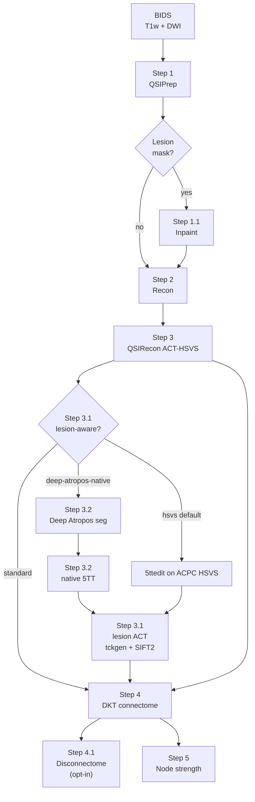

# dwi_pipeline — QSIPrep → Inpaint → Recon → QSIRecon → connectome → node strength

[](https://dkt-connectome.readthedocs.io/en/latest/)
[](https://dkt-connectome.readthedocs.io/en/latest/bids_app/)

**📖 Documentation (hosted):** [**dkt-connectome.readthedocs.io**](https://dkt-connectome.readthedocs.io/en/latest/) · [Tutorial](docs/tutorial.md) · [Usage](docs/usage.md) · [Installation](docs/installation.md) · [Architecture](docs/architecture.md)

**GitHub entry point:** [../README.md](../README.md) (same quick start, links back here for advanced topics)

---

## Getting started (new users)

1. **Requirements:** Linux, Apptainer, Python 3.9+, Snakemake ≥ 8, [FreeSurfer license](https://surfer.nmr.mgh.harvard.edu/registration.html).
2. **Install & verify:**

```bash
cd dwi_pipeline          # from repo clone
chmod +x dkt run install
export FS_LICENSE=/path/to/license.txt
./dkt install
./dkt check
```

3. **Dry-run then run** (replace paths and subject ID):

```bash
./dkt run /path/to/BIDS /path/to/out participant \
  --participant-label SUBJ01 --session-filter ses-1 --dry-run

./dkt run /path/to/BIDS /path/to/out participant \
  --participant-label SUBJ01 --session-filter ses-1 --n-cpus 8 --fastsurfer --syn
```

4. **Sample data:** from repo root, `bash dwi_pipeline/scripts/download_ideas_sample.sh` — then [Tutorial](docs/tutorial.md).
5. **Full guide on Read the Docs:** [installation](https://dkt-connectome.readthedocs.io/en/latest/installation.html) → [tutorial](https://dkt-connectome.readthedocs.io/en/latest/tutorial.html) → [usage](https://dkt-connectome.readthedocs.io/en/latest/usage.html).

| `./dkt` command | Purpose |
|-----------------|---------|
| `install` | Pull step `.sif` images + `config.local.yaml` |
| `pull` | Pull containers only |
| `run …` | Same as `./run` (BIDS App) |
| `log …` | Tail logs under `RESULTS_ROOT/logs` |
| `check` | Verify install; `--outputs` checks subject artifacts |
| `version` | Print `0.3.0` from `app.json` |

---

## Workflow sketch




Dashed boxes in the SVG = optional steps. Step 3.2 (Deep Atropos seg + native 5TT) applies when
`--act-5tt-source deep-atropos-native`. See [science overview](docs/science_overview.md),
[pipeline steps](docs/pipeline_steps.md), and [Deep Atropos branch](docs/deep_atropos_5tt.md).

Full **anatomically constrained tractography** pipeline with a post-hoc anatomical connectome step,
plus a node-strength / ENIGMA-style clinical report generated from that connectome.

Subjects with a manually traced lesion mask (`*_T1w_label-lesion_roi.nii.gz`)
can receive Step 1.1 anatomical lesion mitigation before reconstruction:
neuroLIT inpainting (default), LeAPP-compatible virtual brain transplant
(VBT), or none. Every subject without a mask is unaffected.

Step 4 produces a **Desikan–Killiany–Tourville (DKT, 78 nodes)** matrix by default, from either
recon tool, because DKT is the only parcellation both `recon-all` and FastSurfer can deliver.
**Desikan–Killiany (DK, 84 nodes)** is available with `CONNECTOME_PARCELLATION=dk`, but only from
`recon-all` — FastSurfer produces no DK atlas.

For **atlas-only** connectomes (4S156 in QSIRecon, no Step 4), use [`dwi_connect_default/`](../dwi_connect_default/) with its own `RESULTS_ROOT`.

Give each cohort, and each combination of settings, a separate `RESULTS_ROOT`,
so that one run cannot overwrite another's outputs.

**Public sample data (IDEAS II)** — two subjects from [OpenNeuro ds007401](https://openneuro.org/datasets/ds007401) for tutorials and smoke tests:

```bash
bash dwi_pipeline/scripts/download_ideas_sample.sh
export BIDS_DIR="$(pwd)/dwi_pipeline/sample_data/ideas/bids"
```

See [`sample_data/ideas/README.md`](sample_data/ideas/README.md) and [docs/datasets/ideas.md](docs/datasets/ideas.md). **Cite Taylor et al. 2026** (*Epilepsia*) when using these data.

---

## Advanced topics

The sections below cover lesion inpainting, lesion-aware ACT, experiment arms, HPC defaults, and site-specific operator notes. **New users can stop after [Getting started](#getting-started-new-users)** and use the [hosted tutorial](https://dkt-connectome.readthedocs.io/en/latest/tutorial.html) instead.

<details>
<summary><strong>Local / development test data (optional)</strong></summary>

**Local TBI test data** lives under [`dwi_test_TBI/`](dwi_test_TBI/):
BIDS inputs in `dwi_test_TBI/bids/`, and one `RESULTS_ROOT` subdirectory per
subject/settings using `sub-<SUBJECT>_<recon>[_flags]` (e.g.
`sub-EXAMPLE_fastsurfer_inpaint`). Keep large cohort archives separate from day-to-day pipeline I/O.

</details>
---

## Stages

| Step | Script mode | Tool | Output |
|------|-------------|------|--------|
| 1 | `qsiprep` | QSIPrep | Preprocessed DWI, `dwiref`, transforms |
| 1.1 | `inpaint` | `lit_0.6.0.sif` (neuroLIT) or `dkt_vbt.sif` (VBT) — **auto if lesion mask** | Lesion-mitigated T1w, QC report |
| 2 | `recon` | FreeSurfer / FastSurfer | `aparc+aseg.mgz`, surfaces |
| 3 | `qsirecon` | QSIRecon (SS3T + ACT-HSVS) | Tractogram, SIFT2 weights, optional 4S156 atlas connectome |
| 3.1 | `act` | `dkt_lesion_act.sif` — **`--act-mode lesion-aware`** | Lesion-edited 5TT + rebuilt tractography |
| 4 | `connectome` | `dkt_connectome.sif` | DKT count/length/FA/MD matrices (78×78) |
| 4.1 | `disconnectome` | host scripts — **`--disconnection`** | Excision / exclusion / D matrices |
| 5 | `nodestrength` | `nodestrength_0.1.0.sif` — **auto when connectome exists** | Node strength/AI CSVs, ENIGMA report |

`bash workflow/run_subject.sh all SUBJECT` runs steps 1–5 sequentially (1.1 runs inside Step 2 whenever
a lesion mask is found for that subject/session; 5 runs inside Step 4 whenever a connectome
was produced).

---

## Quick start (reference)

Same as [Getting started](#getting-started-new-users) above.

**HPC / Slurm** (from repo root):

```bash
export RESULTS_ROOT=/path/to/results
export BIDS_DIR=/path/to/bids
bash dwi_pipeline/submit.sh
```

**Single subject** (from repo root):

```bash
export BIDS_DIR=/path/to/bids
export RESULTS_ROOT=/path/to/out
bash dwi_pipeline/workflow/run_subject.sh all SUBJ01 --fastsurfer --syn
```

More examples: [docs/tutorial.md](docs/tutorial.md) · [Usage on RTD](https://dkt-connectome.readthedocs.io/en/latest/usage.html).

---

## Anatomical lesion mitigation (Step 1.1)

The default `neurolit` backend runs the DDPM lesion-inpainting model. The
optional `vbt` backend ports LeAPP's implementation of the Solodkin et al.
virtual brain transplant: mirror the anatomy, perform lesion-masked rigid
registration and half-transform midline alignment, then blend contralesional
signal through a smoothed lesion mask. `none` preserves the original T1w.
All backends are conditional on a sibling `*_T1w_label-lesion_roi.nii.gz`.

```bash
# Runs automatically as part of Step 2 when sub-01/ses-2WK has a lesion mask:
bash dwi_pipeline/workflow/run_subject.sh all 01

# Run/test Step 1.1 in isolation:
bash dwi_pipeline/workflow/run_subject.sh inpaint 01

# LeAPP-compatible virtual brain transplant:
bash dwi_pipeline/workflow/run_subject.sh inpaint 01 --anat-mitigation vbt

# Explicit original-T1w arm:
bash dwi_pipeline/workflow/run_subject.sh all 01 --anat-mitigation none

# Force-skip even if a mask exists:
bash dwi_pipeline/workflow/run_subject.sh all 01 --no-inpaint
```

Both mitigation backends prepare the lesion mask and run identical geometry
and outside-lesion correlation QC. neuroLIT writes under
`${RESULTS_ROOT}/inpainted/`; VBT writes under `${RESULTS_ROOT}/vbt/`.
Steps 2 and 4 then use `inpainting_result.nii.gz` in place of the raw BIDS T1w
for that subject/session.

Build the container once: `bash dwi_pipeline/containers/lit/build_lit.sh`.

See `workflow/run_subject.sh` and [`workflow/config/config.yaml`](workflow/config/config.yaml) for the full `INPAINT_*` variable list,
and [`pipeline_science.md` §Inpaint](pipeline_science.md) for the science (DDPM, VINN
layers, QC methodology).

---

## Lesion-aware ACT and experiment arms (Step 3.1)

`--act-mode lesion-aware` inserts the **original BIDS lesion mask** into the MRtrix
5TT pathology channel with `5ttedit -path`, validates with `5ttcheck`, clip/renormalizes
tissue fractions, and rebuilds matched iFOD2 tractography and SIFT2 weights from the
retained WM FOD.

**Default (`--act-5tt-source hsvs`):** ACPC-first HSVS workflow — warp lesion to QSIRecon
HSVS 5TT grid (channel-0 reference), edit on ACPC, resample to `dwiref`.

**Optional (`--act-5tt-source deep-atropos-native`):** Native-T1 Deep Atropos branch — ANTsPyNet
or imported Deep Atropos seg → `base_5tt_native.mif`, edit on native BIDS T1w, resample to
`dwiref`. See [Deep Atropos branch](docs/deep_atropos_5tt.md).

```bash
# HSVS ACPC path (default)
bash workflow/run_subject.sh act EXAMPLE \
  --recon-session 2WK --act-mode lesion-aware

# Deep Atropos native path
bash workflow/run_subject.sh act EXAMPLE \
  --recon-session 2WK --act-mode lesion-aware \
  --act-5tt-source deep-atropos-native \
  --deep-atropos-seg-mode auto

# Isolated anatomy × ACT study arms
bash workflow/run_subject.sh all EXAMPLE --experiment-arm orig-std
bash workflow/run_subject.sh all EXAMPLE --experiment-arm orig-lesion
bash workflow/run_subject.sh all EXAMPLE --experiment-arm neurolit-std
bash workflow/run_subject.sh all EXAMPLE --experiment-arm neurolit-lesion
bash workflow/run_subject.sh all EXAMPLE --experiment-arm vbt-std
bash workflow/run_subject.sh all EXAMPLE --experiment-arm vbt-lesion
```

The six supported arms are `orig-std`, `orig-lesion`, `neurolit-std`,
`neurolit-lesion`, `vbt-std`, and `vbt-lesion`. By default each is written
under `RESULTS_ROOT/arms/<arm>/`, preventing cross-arm overwrites.

Full tables and Slurm examples: [docs/usage.md](docs/usage.md).

For deterministic sensitivity analysis, add
`--tractography-model both`. The workflow reuses the same WM FOD and selected
standard/lesion-aware 5TT, runs MRtrix `SD_STREAM`, applies SIFT2, and writes
model-specific Count, SIFT2, MeanLength, MeanFA, and MeanMD matrices without
replacing the iFOD2 outputs.

---

## Node strength / ENIGMA report (Step 5)

Runs the standalone [`nodestrength`](https://github.com/phindagijimana/dwi-AI) container
against the Step 4 connectome to compute node strength, interhemispheric asymmetry index
(AI), and volume AI, then render an ENIGMA-style report. It is **not part of this repo** —
it lives in its own repo/container and is invoked, not built, from here.

```bash
# Runs automatically as part of Step 4:
bash dwi_pipeline/workflow/run_subject.sh all 01

# Run/rerun Step 5 in isolation (needs an existing connectome):
bash dwi_pipeline/workflow/run_subject.sh nodestrength 01

# Skip Step 5 only (keep the connectome):
bash dwi_pipeline/workflow/run_subject.sh all 01 --no-node-strength
```

Atlas-agnostic: auto-detects 78-node DKT vs. 84-node DK from the connectome's own shape,
so it works unmodified whether Step 4 ran with the pipeline default (DKT) or
`CONNECTOME_PARCELLATION=dk`. Cortical asymmetry is rendered on the standard ENIGMA
DK-based fsaverage5 surface regardless of which atlas the numbers came from.

Bind-mounts `CONNECTOME_OUT` (read-only, `--include SUBJECT` so a shared `connectomes/`
tree used by many subjects is safe) and `FS_SUBJECTS_DIR` (read-only, for per-node
volumes from `nodes.mif`), and writes to `NODESTRENGTH_OUT`
(default `${RESULTS_ROOT}/node_strength`) — a cohort-level directory shared across
subjects, not a per-subject one, since the container itself groups output by
`--include`. Default run computes strength + volume + compare + a one-page `report.pdf`
with figures; `--strength-only` / `--no-report` (or `NODESTRENGTH_STRENGTH_ONLY=1` /
`NODESTRENGTH_NO_REPORT=1`) thin that out.

See [`node_strength` container on Docker Hub](https://hub.docker.com/r/phindagijimana321/nodestrength) and the upstream [dwi-AI / nodestrength](https://github.com/phindagijimana/dwi-AI) repo for Step 5 CLI and ENIGMA report details.

---

## Defaults

| Setting | Default |
|---------|---------|
| `BIDS_DIR` | your BIDS dataset root |
| `RESULTS_ROOT` | your output directory |
| `QSIRECON_SPEC` | `mrtrix_singleshell_ss3t_ACT-hsvs` |
| `QSIRECON_ATLASES` | `4S156Parcels` |
| `RECON_TOOL` | `freesurfer` (`recon-all -all`) |
| `RECON_FSAPARC` | `0` (`--fast-fs` sets this to `1`, adds a DK-68 atlas on top of FastSurfer's DKT) |
| `RUN_INPAINT` | `1` (auto: only runs when a lesion mask is found) |
| `RUN_CONNECTOME` | `1` |
| `RUN_NODESTRENGTH` | `1` (auto: runs whenever Step 4 produced a connectome) |
| `CONNECTOME_PARCELLATION` | `dkt` (78 nodes, same for both recon tools) |
| `CONNECTOME_DETERMINISTIC` | `1` (ITK pinned to one thread) |
| `CONNECTOME_WEIGHTING` | `count` (used by downstream disconnectome analysis) |
| `PRIMARY_CONNECTOME_MEASURE` | `count` (`dkt_connectome.csv` stays count unless explicitly overridden) |
| dwi-select | **ON** — `config/dwi_select_b1000.json` (b=1000 + IntendedFor fmaps) |

---

## CLI flags (`run_subject.sh` / `submit.sh` / `./run`)

| Flag | Effect |
|------|--------|
| `--dwi-shell N` | Use `dwi_select_bN.json` (default 1000) |
| `--no-dwi-filter` | Process all DWI/fmaps (legacy) |
| `--dwi-select PATH` | Explicit dwi-select JSON |
| `--syn` | SyN SDC when no fmap in filter |
| `--fmap-retry` | Ignore fieldmaps, SyN SDC |
| `--no-sdc` | Skip SDC entirely (reproduces legacy no-fieldmap GE runs) |
| `--fastsurfer` | FastSurfer instead of recon-all |
| `--fast-fs` | FastSurfer + `--fsaparc` (adds a classic DK-68 aparc/ribbon alongside FastSurfer's native DKT) |
| `--no-recon` | Skip Step 2 (requires ACT-fast spec or existing FS dir) |
| `--no-connectome` | Skip Step 4 (`--no-dk` still accepted; skips Step 5 too) |
| `--connectome-weighting count\|sift2` | Select downstream disconnectome weighting |
| `--primary-connectome-measure count\|sift2` | Explicitly choose the `dkt_connectome.csv` compatibility alias |
| `--inpaint` / `--no-inpaint` | Force Step 1.1 on/off (default: auto — on only if a lesion mask exists) |
| `--node-strength` / `--no-node-strength` | Force Step 5 on/off (default: auto — on whenever Step 4 ran) |
| `--strength-only` | Step 5: skip `volume/` and `compare/` |
| `--no-report` | Step 5: skip `reports/` (PDF + figures) |

---

## Strict fail-fast behavior

The pipeline avoids silent fallbacks. Failures print `ERROR [label]: ...` and exit non-zero.

| Area | Behavior |
|------|----------|
| **FreeSurfer container** | Requires `freesurfer_7.4.1.sif`; **no** fallback to FastSurfer's trimmed FS |
| **SDC** | Measured when fmap in dwi-select filter; else **must** pass `--syn`, `--fmap-retry`, or `--no-sdc` |
| **Recon** | If `aparc+aseg.mgz` exists, **fail** unless `RECON_SKIP_IF_EXISTS=1` |
| **Step 4 inputs** | Exactly one tractogram, dwiref, desc-preproc T1w, BIDS T1w (session-coherent) |
| **Step 4 space** | `CONNECTOME_RESAMPLE_TO_DWI=1` required; no FS-conformed-space shortcut |
| **Step 4 parcellation** | DKT from `recon-all` reads `aparc.DKTatlas+aseg.mgz`; requesting DKT on a tree that lacks it **fails** rather than silently applying the DKT table to a DK image |
| **dwi-select** | No `same_session` fmap fallback; `on_no_match: error` |
| **QSIRecon + `--no-recon`** | Fails if HSVS spec and no FreeSurfer subjects dir |
| **Inpaint (Step 1.1)** | More than one lesion mask for a subject/session **fails**; QC failure **warns** by default, `INPAINT_FAIL_ON_QC=1` to fail instead; missing/no mask is **not** a failure (silent skip) unless `INPAINT_REQUIRE_MASK=1` |
| **Node strength (Step 5)** | Missing connectome CSV or missing `CONTAINER_NODESTRENGTH` **fails**; container exiting without writing `manifest.json` **fails** |

---

## Containers and paths

| Variable | Default path |
|----------|--------------|
| `CONTAINER_QSIPREP` | `.../others/containers/qsiprep.sif` |
| `CONTAINER_QSIRECON` | `.../others/containers/qsirecon.sif` |
| `CONTAINER_CONNECTOME` | `.../others/containers/dkt_connectome.sif` |
| `CONTAINER_FREESURFER` | `.../others/containers/freesurfer_7.4.1.sif` |
| `CONTAINER_FASTSURFER` | `.../others/containers/fastsurfer_latest.sif` |
| `CONTAINER_LIT` | `.../others/containers/lit_0.6.0.sif` (neuroLIT inpaint) |
| `CONTAINER_VBT` | `.../others/containers/dkt_vbt.sif` (VBT inpaint) |
| `CONTAINER_LESION_ACT` | `.../others/containers/dkt_lesion_act.sif` (Step 3.1) |
| `CONTAINER_NODESTRENGTH` | `.../node_strength/containers/nodestrength_0.1.0.sif` |
| `FS_LICENSE` | `.../others/data_mining/freesurfer/license.txt` |
| `TEMPLATEFLOW_HOME` | `templateflow/` in the repo root |

Pull FreeSurfer SIF: `sbatch dwi_pipeline/containers/pull_freesurfer_sif.sbatch`

Build the Step 4 SIF (~150 MB legacy-staged image):

```bash
bash dwi_pipeline/containers/connectome/build_connectome.sh
# Stages minimal FS + ANTs/MRtrix from qsirecon.sif; see containers/connectome/README.md
```

Legacy dual-container Step 4: see [workflow/LEGACY.md](workflow/LEGACY.md).

Build the Step 1.1 SIF (straight Docker Hub pull, no custom layers):

```bash
bash dwi_pipeline/containers/lit/build_lit.sh
# See containers/lit/README.md
```

Get the Step 5 SIF — this is a separate repo
(`/path/to/node_strength`), build or pull it there:

```bash
bash /path/to/node_strength/containers/build.sh
# or: apptainer pull nodestrength_0.1.0.sif oras://index.docker.io/phindagijimana321/nodestrength:0.1.0
```

---

## Output layout

Under `${RESULTS_ROOT}/`:

```
inpainted/sub-XXX/ses-YYY/   (neuroLIT backend; only with a lesion mask)
vbt/sub-XXX/ses-YYY/         (VBT backend; only with a lesion mask)
qsiprep_single_run_output/
freesurfer/sub-XXX/
qsirecon_single_run_output/
connectomes/sub-XXX/
node_strength/               (strength/, volume/, compare/, reports/sub-XXX/, manifest.json — cohort-shared)
intermediate_results_qsiprep_single/
logs/
```

---

## BIDS preparation (run before pipeline)

1. Fix PE / TRT / `IntendedFor` sidecars — [`bids.md`](../bids.md), [`fmaps.md`](../fmaps.md)
2. Run repair: `./dwi_pipeline/scripts/run_bids_repair.sh BIDS_DIR SUBJECT`
3. Verify dwi-select filter (dry-run in `bids.md` §9)
4. Submit pipeline

Repair is **not** invoked automatically by `submit.sh`.

---

## Result folder guide

Keep one `RESULTS_ROOT` per pipeline variant, because the two write different
outputs and Step 4 is on in one and off in the other:

| Pipeline | Step 4 | Connectome produced | Step 5 |
|----------|--------|---------------------|--------|
| `dwi_pipeline` (this launcher) | on | `dkt_connectome_{count,sift2,meanlength,meanfa,meanmd}.csv` plus primary `dkt_connectome.csv`, subject-native DKT, 78 nodes | on (needs Step 4) |
| `dwi_connect_default` (`RUN_CONNECTOME=0`) | off | QSIRecon atlas connectome only (4S156) | off (no Step 4 connectome to read) |

---

## Renamed in this version

Step 4 was called `dk` and its variables were prefixed `DK_`, from when it only
produced Desikan–Killiany. It now serves both atlases, so it is `connectome`
throughout. The old mode name, the `--no-dk` flag and the `DK_*` variables still
work; the variables print a deprecation note.

| Old | New |
|-----|-----|
| `run_subject.sh connectome SUB` | `run_subject.sh connectome SUB` |
| `--no-dk` | `--no-connectome` |
| `CONTAINER_DK_CONNECTOME` | `CONTAINER_CONNECTOME` |
| `RUN_DK_CONNECTOME` | `RUN_CONNECTOME` |
| `DK_PARCELLATION`, `DK_DETERMINISTIC`, … | `CONNECTOME_PARCELLATION`, `CONNECTOME_DETERMINISTIC`, … |
| `dk_connectomes/` | `connectomes/` |
| `dk_nodes.mif`, `dk_assignments.csv`, `dk_parcellation.json` | `nodes.mif`, `assignments.csv`, `parcellation.json` |
| `dk_connectome.sif` | `dkt_connectome.sif` |

Matrix filenames stay parcellation-specific because 78- and 84-node results
must never be pooled. `dkt_connectome.csv` / `dk_connectome.csv` remain
compatibility aliases; measure-specific files append `_count`, `_sift2`, or
`_meanlength`, `_meanfa`, or `_meanmd`. Step 4 also writes
`dkt_desc-FA_dwi.nii.gz` and `dkt_desc-MD_dwi.nii.gz` in the tractography
T1w/DWI grid.

---

## Scripts

| Path | Purpose |
|------|---------|
| `dkt` | Unified CLI: `install`, `pull`, `run`, `log`, `check` |
| `run` | BIDS App entrypoint (same as `./dkt run …`) |
| `workflow/run_subject.sh` | One subject via Snakemake (modes match `./run`) |
| `submit.sh` | Build subject list + Slurm array |
| `array.sh` | Slurm array worker (do not run directly) |
| `subject.sh` | Legacy bash engine only — see [workflow/LEGACY.md](workflow/LEGACY.md) |
| `scripts/build_bids_filter.py` | dwi-select → QSIPrep filter JSON |
| `scripts/repair_bids_sidecars.py` | BIDS sidecar repair |
| `scripts/run_bids_repair.sh` | Repair wrapper |
| `scripts/make_dkt_lut.py` | Generate the 78-node `fs_dkt.txt` from `fs_default.txt` |
| `scripts/prepare_lesion_mask.py` | Step 1.1: resample/select-labels/binarize a lesion mask + provenance |
| `scripts/check_inpainting.py` | Step 1.1 QC: correlation outside the lesion vs. a resampling-only control |
| `containers/connectome/` | Step 4 container (Dockerfile, build script, entrypoint) |
| `containers/lit/` | Step 1.1 container (`build_lit.sh` pulls `deepmi/lit` from Docker Hub) |
| `config/dwi_select_b1000.json` | Default b1000 + IntendedFor fmaps |
| `reports/scripts/` | Per-subject visualization scripts (connectome, morphometry, imaging, ENIGMA 3D) |
| [`node_strength` on Docker Hub](https://hub.docker.com/r/phindagijimana321/nodestrength) | Step 5 — separate repo/container; node strength, AI, ENIGMA figures |

---

## Further reading

- **[docs/home.md](docs/home.md)** — BIDS App documentation hub (installation, usage, outputs)
- [`DWI_Connectivity_Pipeline_Documentation.md`](../DWI_Connectivity_Pipeline_Documentation.md) — step-by-step technical reference (warp chain, QC)
- [`pipeline_science.md`](pipeline_science.md) — the science behind each step
- [`acquisition.md`](acquisition.md) — how the images are acquired, and why they need the corrections this pipeline applies
- [`brain.md`](brain.md) — brain anatomy, physiology and pathology for pipeline engineers
- [`bids.md`](../bids.md) — phase-encoding metadata and dwi-select
- [`fmaps.md`](../fmaps.md) — SDC behavior
