# MRI Image Acquisition, Step by Step

**How a magnet, three gradient coils and a radio antenna turn water molecules into the numbers this pipeline consumes**

---

## How to read this document

This is the companion to [`brain.md`](brain.md), which covers what the brain *is*,
and [`pipeline_science.md`](pipeline_science.md), which covers what the pipeline
*does* with the images. This document covers the step in between: where the
images come from, and why they have the particular flaws that preprocessing
spends most of its time repairing.

Sections are tagged so you can pick a depth:

- ***(Beginner)*** — the idea, with an everyday analogy, no mathematics required.
- ***(Working)*** — what a research engineer needs in order to read a protocol
  sheet, judge a sidecar, or debug a failed scan.
- ***(Advanced)*** — the equations, the second-order effects, and the arguments
  people are still having in the literature.

A note on the pictures. **Every figure here is computed, not photographed.**
There is no participant data in this document and no scanner output either.
The relaxation curves come from the Bloch solutions evaluated at published 3 T
tissue constants; the images come from an analytic brain phantom pushed through
the same signal equations a scanner obeys; k-space, Gibbs ringing and the
distortion pair come from genuine Fourier transforms of that phantom. This is a
deliberate choice: a simulated artefact generated *by its real mechanism* teaches
the mechanism, whereas a screenshot only teaches the appearance. The script that
produces them is [`scripts/make_acquisition_figures.py`](scripts/make_acquisition_figures.py),
and it needs no input data at all.

---

## Table of contents

**Part I — Where the signal comes from**
1. [Spin, $B_0$, and why there is any signal at all](#1-spin-b0-and-why-there-is-any-signal-at-all)
2. [Excitation: tipping the magnetisation over](#2-excitation-tipping-the-magnetisation-over)
3. [Relaxation: $T_1$, $T_2$, and $T_2^*$](#3-relaxation-t1-t2-and-t2)

**Part II — Turning signal into a picture**
4. [Contrast: what TR and TE actually control](#4-contrast-what-tr-and-te-actually-control)
5. [Spatial encoding: giving every voxel an address](#5-spatial-encoding-giving-every-voxel-an-address)
6. [k-space: where the scanner really writes its data](#6-k-space-where-the-scanner-really-writes-its-data)
7. [Resolution, field of view, and aliasing](#7-resolution-field-of-view-and-aliasing)

**Part III — Sequences**
8. [Spin echo and gradient echo](#8-spin-echo-and-gradient-echo)
9. [Echo-planar imaging: the whole plane in one shot](#9-echo-planar-imaging-the-whole-plane-in-one-shot)
10. [Accelerating: parallel imaging and multiband](#10-accelerating-parallel-imaging-and-multiband)
11. [The structural scan: MPRAGE and FLAIR](#11-the-structural-scan-mprage-and-flair)

**Part IV — Diffusion**
12. [Brownian motion and what diffusion MRI measures](#12-brownian-motion-and-what-diffusion-mri-measures)
13. [The Stejskal–Tanner experiment and the b-value](#13-the-stejskaltanner-experiment-and-the-b-value)
14. [Directions, shells, and the gradient table](#14-directions-shells-and-the-gradient-table)
15. [Designing a diffusion protocol](#15-designing-a-diffusion-protocol)

**Part V — Everything that goes wrong**
16. [Susceptibility distortion and the reversed-PE trick](#16-susceptibility-distortion-and-the-reversed-pe-trick)
17. [Eddy currents, motion, and the rest of the artefact zoo](#17-eddy-currents-motion-and-the-rest-of-the-artefact-zoo)
18. [Noise, SNR, and the trade-off triangle](#18-noise-snr-and-the-trade-off-triangle)

**Part VI — From scanner to pipeline**
19. [DICOM to BIDS: what must survive the conversion](#19-dicom-to-bids-what-must-survive-the-conversion)
20. [How acquisition choices reach the connectome](#20-how-acquisition-choices-reach-the-connectome)
21. [Acquisition QC: what to check before you process](#21-acquisition-qc-what-to-check-before-you-process)

[Glossary](#glossary) · [References](#references) · [Reproducing the figures](#reproducing-the-figures)

---

# Part I — Where the signal comes from

## 1. Spin, B0, and why there is any signal at all

### *(Beginner)* The compass needle analogy

Every hydrogen nucleus — a single proton, and your body is full of them because
it is full of water — behaves like a tiny compass needle. Left alone, the needles
point in random directions and cancel out perfectly. There is nothing to measure.

Put them in a strong magnetic field and something subtle happens. The needles do
**not** snap into alignment like compasses on a desk. Thermal jostling is far too
violent for that. Instead, a very slight *majority* ends up pointing with the
field rather than against it — at 3 T and body temperature, an excess of roughly
**one proton in a hundred thousand**.

That tiny imbalance is the entire MRI signal. Everything else in this document is
engineering built on top of a one-in-100,000 surplus. It works only because a
cubic millimetre of tissue contains around $10^{19}$ hydrogen nuclei, so even a
minuscule fraction of them is an enormous number.

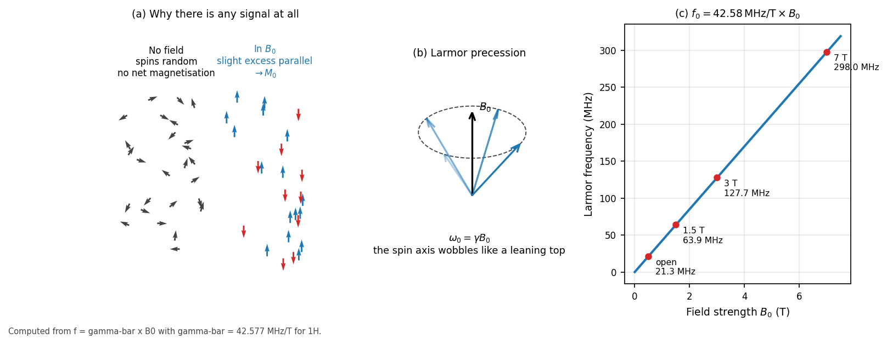

*Figure 1 — (a) Without a field, spins are randomly oriented and there is no net magnetisation; in $B_0$, a slight excess aligns with the field and sums to $M_0$. (b) Individual spins do not sit still — they precess around the field direction like a leaning spinning top. (c) The precession frequency is exactly proportional to field strength, which is why 3 T scanners operate near 128 MHz, squarely in the FM radio band.*

### *(Working)* Larmor precession

A spin in a magnetic field does not simply align; it **precesses** about the field
direction, sweeping out a cone. The analogy is a spinning top: gravity pulls it
down, but because it is spinning it wobbles around the vertical instead of
falling. The frequency of that wobble is the **Larmor frequency**:

$$\omega_0 = \gamma B_0 \qquad\text{or}\qquad f_0 = \bar{\gamma} B_0$$

with $\bar{\gamma} = 42.577$ MHz/T for hydrogen. So:

| Field | Larmor frequency |
|-------|------------------|
| 1.5 T | 63.9 MHz |
| 3 T | 127.7 MHz |
| 7 T | 298.0 MHz |

Two consequences matter downstream. First, this is a radio frequency, so MRI
hardware is fundamentally radio engineering — hence the shielded room. Second,
because $f_0$ depends on $B_0$ *exactly*, any imperfection in the field becomes a
frequency error, and a frequency error becomes a **position** error once we start
encoding position as frequency. That single fact is the root of the susceptibility
distortion in §16.

### *(Advanced)* Where the one-in-100,000 comes from

The population difference between the parallel and antiparallel states follows
Boltzmann statistics:

$$\frac{\Delta N}{N} \approx \frac{\gamma \hbar B_0}{2 k_B T}$$

At 3 T and 310 K this is about $1.0 \times 10^{-5}$. The net magnetisation is

$$M_0 = \frac{N \gamma^2 \hbar^2 B_0}{4 k_B T}$$

Note $M_0 \propto B_0$: doubling field strength doubles the available
magnetisation, which is the main reason 3 T displaced 1.5 T for research imaging.
The gain is not free — $T_1$ lengthens with field, susceptibility effects worsen
quadratically, and RF power deposition (SAR) rises roughly with $B_0^2$.

---

## 2. Excitation: tipping the magnetisation over

### *(Beginner)* Pushing a swing

The net magnetisation $M_0$ points along the main field, and a detector coil sits
in the plane at right angles to it. In that geometry $M_0$ induces no signal
whatsoever: it is static and pointing the wrong way. To measure it, we must knock
it sideways.

The trick is resonance, and the analogy is a playground swing. Shove a swing at
random moments and nothing much happens. Shove it in time with its natural rhythm
and small pushes accumulate into a large arc. Broadcast a radio pulse at
*precisely* the Larmor frequency and the same thing happens to the magnetisation:
it spirals away from the field axis into the transverse plane, where the coil can
finally hear it.

### *(Working)* Flip angle and slice selection

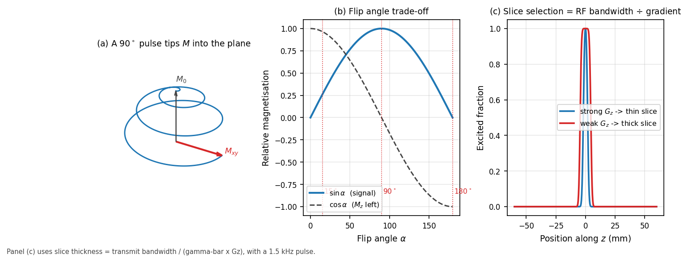

*Figure 2 — (a) In the rotating frame, a resonant RF pulse spirals the magnetisation down into the transverse plane. (b) Transverse signal follows $\sin\alpha$, while the longitudinal magnetisation left for the next repetition follows $\cos\alpha$ — the two cannot both be maximised. (c) Slice thickness is set by the ratio of RF bandwidth to gradient strength, so a stronger gradient with the same pulse selects a thinner slice.*

The **flip angle** $\alpha$ is how far the pulse tips the magnetisation, set by
the pulse's amplitude and duration. Transverse signal goes as $\sin\alpha$, so 90°
extracts the most signal from a single shot. But it also leaves nothing behind
($\cos 90° = 0$), so you must wait a full $T_1$ before repeating. Fast sequences
therefore use small flip angles: less signal per shot, but the ability to repeat
every few milliseconds more than compensates.

**Slice selection** is the elegant part. Apply a gradient along $z$ during the RF
pulse, so Larmor frequency varies with position. A pulse containing only a narrow
band of frequencies then excites only the slab whose spins resonate in that band:

$$\Delta z = \frac{\Delta f_{\text{RF}}}{\bar{\gamma} G_z}$$

Move the pulse's centre frequency and you move the slice. Nothing physically
moves; the scanner just listens and speaks at a different pitch.

### *(Advanced)* Why the pulse shape is a sinc

Selecting a rectangular slab in space means selecting a rectangular band in
frequency, and the Fourier transform of a rectangle is a sinc. That is why RF
pulses look like the ringing waveform in Figure 2. A truly rectangular profile
would need an infinitely long sinc, so real pulses are truncated and apodised,
giving slightly rounded slice edges. Those imperfect edges are one contributor to
**cross-talk** between adjacent slices, which is why 2-D protocols often acquire
slices in an interleaved order rather than consecutively.

The small-flip-angle regime has a further convenience: for $\alpha \lesssim 30°$
the Bloch equations are approximately linear, so the slice profile really is the
Fourier transform of the pulse envelope. At 90° and 180° that approximation
fails and pulse design becomes a genuinely non-linear problem.

---

## 3. Relaxation: T1, T2, and T2*

### *(Beginner)* Two independent clocks

Once tipped, the magnetisation returns to equilibrium by two separate processes
that run at the same time but are otherwise unrelated.

- **$T_1$ — the recovery clock.** Magnetisation climbs back up along the field.
  The analogy is a struck bell handing its energy to the surroundings: the system
  is giving energy back to the tissue lattice.
- **$T_2$ — the coherence clock.** Immediately after the pulse, all the spins
  precess in step. They drift out of step because each one feels a slightly
  different local field from its neighbours. The analogy is a choir that starts
  perfectly together and gradually spreads apart; the sound fades not because
  anyone stopped singing but because they stopped agreeing.

Crucially, $T_2$ is always faster than $T_1$. Coherence is lost long before energy
is returned.

### *(Working)* The numbers that matter at 3 T

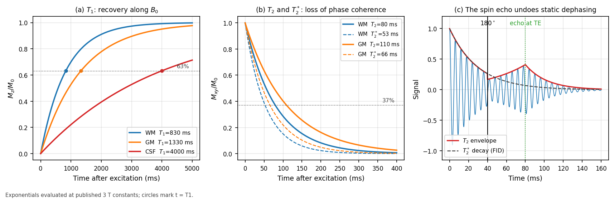

*Figure 3 — (a) $T_1$ recovery: CSF takes several seconds, white matter under a second. (b) $T_2$ decay, with the faster $T_2^*$ shown dashed. (c) Why the spin echo matters: a 180° pulse at TE/2 reverses the static part of the dephasing, so the signal rebuilds into an echo at TE governed by true $T_2$ rather than $T_2^*$.*

| Tissue | $T_1$ (ms) | $T_2$ (ms) | $T_2^*$ (ms) |
|--------|-----------|-----------|-------------|
| White matter | ~830 | ~80 | ~53 |
| Grey matter | ~1330 | ~110 | ~66 |
| CSF | ~4000 | ~2000 | ~500 |

Two practical readings. CSF's enormous $T_1$ is why it looks black on a
$T_1$-weighted scan — it has barely begun recovering when you sample it — and why
FLAIR needs an inversion time of ~2.5 s to null it. White matter's short $T_1$ is
why it is the brightest tissue on MPRAGE, which is the contrast FreeSurfer relies
on to place the grey/white surface.

**$T_2^*$** is the one that governs diffusion imaging. Real dephasing has two
sources: random molecular interactions (irreversible, giving $T_2$) and static
field inhomogeneity, from imperfect shim and from tissue susceptibility
differences (reversible). Together:

$$\frac{1}{T_2^*} = \frac{1}{T_2} + \gamma \Delta B_{0,\text{inhom}}$$

$T_2^*$ is always shorter, and it is much shorter near air/bone interfaces.

### *(Advanced)* The spin echo as time reversal

The static part of the dephasing is *deterministic*: a spin sitting in a field
that is 5 Hz high accumulates phase at a steady 5 Hz. Apply a 180° pulse at time
TE/2 and every accumulated phase flips sign. That same spin now unwinds at 5 Hz
and arrives back at zero phase exactly at time TE. Every spin does, regardless of
its offset, so the signal reappears as an **echo**.

Hahn's original insight is often explained with the runners analogy: sprinters of
different speeds spread out along a track, but if you tell them all to turn round
at the same moment, they all cross the start line together. Random molecular
tumbling cannot be reversed this way, which is precisely why the echo is governed
by $T_2$ and not $T_2^*$.

---

# Part II — Turning signal into a picture

## 4. Contrast: what TR and TE actually control

### *(Beginner)* Two dials

A pulse sequence repeats: excite, wait, read, repeat. Two timings dominate what
the resulting image looks like.

- **TR (repetition time)** — how long between excitations. Short TR does not give
  slow-recovering tissue time to catch up, so tissues that differ in $T_1$ end up
  at very different brightnesses. **TR exposes $T_1$ differences.**
- **TE (echo time)** — how long after excitation you listen. Wait longer and
  fast-decaying tissue has faded while slow-decaying tissue has not.
  **TE exposes $T_2$ differences.**

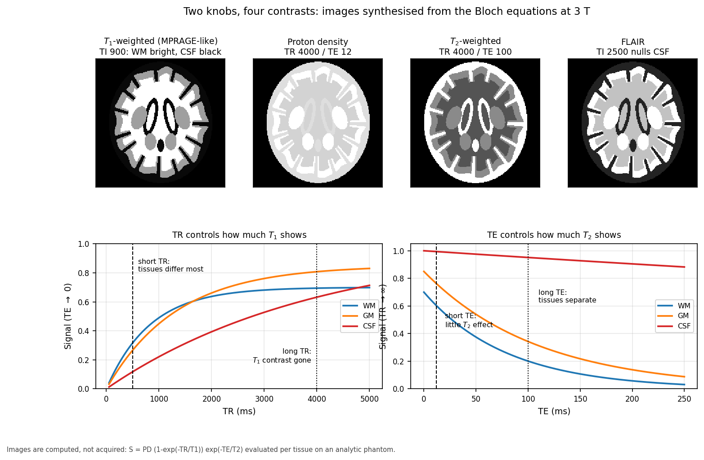

*Figure 4 — Four familiar contrasts, all synthesised from the same phantom by changing only the timing. The curves below explain the images: at short TR the $T_1$ recovery curves are far apart, and at long TE the $T_2$ decay curves are far apart. Note the CSF curve in red — nearly flat in $T_2$, which is why CSF is brilliant on $T_2$-weighted images and why FLAIR must null it deliberately.*

### *(Working)* The four workhorse contrasts

| Contrast | Timing | Appearance | Used for |
|----------|--------|------------|----------|
| $T_1$-weighted | short TR, short TE | WM bright, GM grey, CSF black | anatomy, segmentation, FreeSurfer |
| $T_2$-weighted | long TR, long TE | CSF bright, oedema bright | pathology, fluid |
| Proton density | long TR, short TE | reflects water content | contrast-neutral reference |
| FLAIR | inversion nulls CSF | CSF black, lesions bright | white matter lesions, WMH |

One honest caveat visible in the figure: a plain **spin echo** at 3 T gives only
weak grey/white separation, because $T_1$ contrast is intrinsically modest at high
field. That is exactly why structural $T_1$-weighted scans are almost always
**inversion-prepared** (MPRAGE), which is what Figure 4 shows. If you ever see a
structural scan with disappointing grey/white contrast, check whether inversion
preparation was actually used.

### *(Advanced)* Signal equations

Spin echo:

$$S = \rho \left(1 - e^{-TR/T_1}\right) e^{-TE/T_2}$$

Spoiled gradient echo, with flip angle $\alpha$:

$$S = \rho \sin\alpha \, \frac{1 - e^{-TR/T_1}}{1 - e^{-TR/T_1}\cos\alpha} \, e^{-TE/T_2^*}$$

Differentiating the second with respect to $\alpha$ gives the **Ernst angle**,
$\alpha_E = \arccos(e^{-TR/T_1})$, the flip angle maximising signal at a given TR.
Short-TR sequences run near it.

Inversion recovery:

$$S = \rho \left|1 - 2e^{-TI/T_1} + e^{-TR/T_1}\right| e^{-TE/T_2}$$

Setting the bracket to zero nulls a tissue: $TI_{\text{null}} \approx T_1 \ln 2$
for long TR. For CSF at 3 T that is $4000 \times 0.693 \approx 2770$ ms, which is
where FLAIR's inversion time comes from.

---

## 5. Spatial encoding: giving every voxel an address

### *(Beginner)* The orchestra

So far the coil hears one summed note from the entire head with no idea where any
of it came from. Gradients solve this.

A **gradient** is a small extra magnetic field that varies linearly across space.
Since precession frequency tracks field strength, a gradient makes position
determine pitch. Imagine an orchestra where the conductor forces every player to
tune according to where they sit — the left side plays flat, the right side sharp.
Now a single recording of the whole orchestra can be unmixed by pitch, and you can
work out how much sound came from each seat.

MRI uses three gradients for three jobs:

1. **Slice select** ($G_z$) — during the RF pulse, so only one slab is excited.
2. **Frequency encode** ($G_x$) — during readout, so position maps to frequency.
3. **Phase encode** ($G_y$) — briefly before readout, leaving each row with a
   different phase offset.

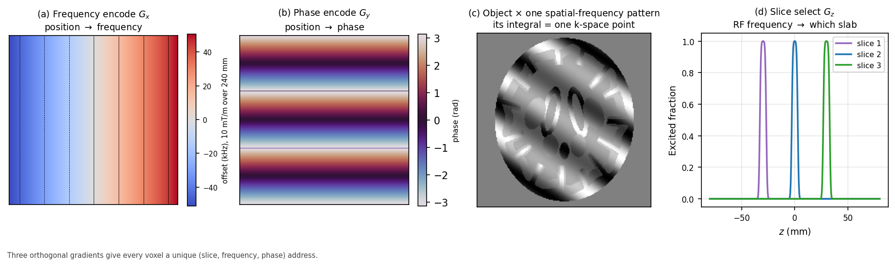

*Figure 5 — (a) The readout gradient makes frequency a linear function of position; a 10 mT/m gradient over a 240 mm field of view spreads the signal across roughly ±51 kHz. (b) The phase-encode gradient leaves a phase ramp instead. (c) Multiplying the object by one such spatial-frequency pattern and integrating gives exactly one k-space sample. (d) Slice selection picks the slab by RF centre frequency.*

### *(Working)* Why phase encoding is the slow axis

Frequency encoding is nearly free: one readout captures a whole line of spatial
frequencies at once, because the receiver can distinguish many frequencies
simultaneously within a single acquisition window.

Phase encoding cannot do that. Phase is only measurable modulo $2\pi$ at one
instant, so each phase-encode step requires **its own excitation and readout**.
An image with 128 phase-encode lines therefore takes 128 repetitions, and total
scan time is roughly

$$T_{\text{scan}} \approx TR \times N_{\text{PE}} \times N_{\text{averages}}$$

This asymmetry drives nearly every acceleration technique in MRI: parallel
imaging, partial Fourier, and EPI all attack the phase-encode axis, because that
is where the time goes. It is also why distortion and blurring appear along the
phase-encode direction and essentially never along the readout direction — a fact
you will meet again in §16.

---

## 6. k-space: where the scanner really writes its data

### *(Beginner)* The recipe, not the cake

Here is the idea that makes MRI click, and it is worth slowing down for.

**The scanner does not measure the image. It measures the image's ingredients.**

Any picture can be built by adding together striped patterns of different
spacings, orientations and strengths — coarse stripes for the broad shapes, fine
stripes for the sharp edges. The list of "how much of each stripe pattern is
present" is a complete description of the picture: given the list, you can rebuild
the image exactly.

That list is **k-space**, and it is what the scanner actually fills in. A k-space
plot is not a squashed picture of a head; it is a recipe. The Fourier transform is
the oven.

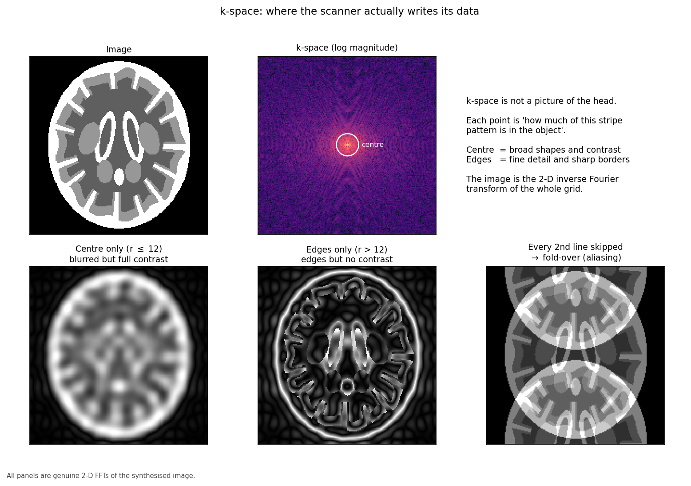

*Figure 6 — Top: the image and its k-space. Bottom: reconstructing from the centre alone gives a blurred image that keeps all the contrast; from the edges alone gives edges with no contrast; and skipping every second line folds the image onto itself. All three are genuine Fourier transforms of the same data.*

### *(Working)* Reading the map

The geometry is worth memorising because it explains a great deal:

- **Centre of k-space** = low spatial frequencies = overall brightness and
  contrast. Corrupt the centre and the image is ruined.
- **Edges of k-space** = high spatial frequencies = fine detail and sharp
  boundaries. Discard them and the image blurs but stays recognisable.
- **Extent of k-space sampled** sets spatial **resolution**.
- **Spacing between k-space samples** sets the **field of view**.

That last pair is the one people invert, so state it plainly: *how far out you go*
determines how fine the detail, and *how finely you step* determines how wide the
picture. Step too coarsely and the image wraps around on itself, which is the
aliasing in the bottom-right panel.

### *(Advanced)* The signal equation

The measured signal at time $t$ is

$$S(t) = \int_{\text{object}} \rho(\mathbf{r}) \, e^{-i 2\pi \mathbf{k}(t) \cdot \mathbf{r}} \, d\mathbf{r}$$

where the k-space coordinate is the time integral of the gradient waveform:

$$\mathbf{k}(t) = \bar{\gamma} \int_0^t \mathbf{G}(\tau) \, d\tau$$

This is exactly a Fourier transform, so $\rho(\mathbf{r})$ is recovered by
inverting it. The second equation is the one to internalise for sequence design:
**the gradient waveform is a steering wheel, and k-space is the terrain**.
Playing a gradient moves you through k-space at a rate set by its amplitude.
Every sequence in Part III is a different route through the same terrain.

---

## 7. Resolution, field of view, and aliasing

### *(Working)* Four numbers, tightly coupled

| Quantity | Determined by | Relationship |
|----------|---------------|--------------|
| Field of view | k-space **sample spacing** $\Delta k$ | $\text{FOV} = 1/\Delta k$ |
| Voxel size | k-space **extent** $k_{\max}$ | $\Delta x = 1/(2k_{\max})$ |
| Matrix size | FOV ÷ voxel size | $N = \text{FOV}/\Delta x$ |
| Scan time | number of phase-encode lines | $\propto N_{\text{PE}}$ |

If anatomy extends beyond the field of view, it does not vanish — it **wraps
around** and reappears on the opposite side, because the Fourier transform of a
finitely-sampled signal is periodic. In diffusion EPI this shows up as the
subject's neck or shoulders folding into the brain, and it will happily corrupt
the parts of the image you care about.

### *(Advanced)* Partial Fourier

Because the object is real-valued, its k-space is (in principle) conjugate
symmetric: $S(-k) = S^*(k)$. So you could acquire just over half of k-space and
synthesise the rest. **Partial Fourier** does exactly this, typically sampling
6/8 or 5/8 of the lines, and it is common in diffusion imaging because it shortens
the echo train.

It is not free. Real phase errors — from motion, flow, and the very field
inhomogeneity we are about to discuss — break the symmetry assumption, so partial
Fourier reconstruction introduces blurring along the phase-encode axis and can
amplify motion artefact. It buys a shorter TE, which raises SNR; it costs
robustness. The homodyne and POCS reconstructions differ in how gracefully they
degrade when the assumption fails.

---

# Part III — Sequences

## 8. Spin echo and gradient echo

### *(Working)* The two families

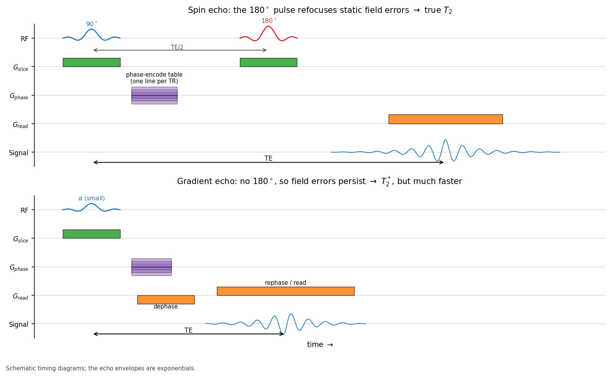

*Figure 7 — Spin echo (top) inserts a 180° refocusing pulse at TE/2, so the echo at TE is governed by true $T_2$. Gradient echo (bottom) refocuses with a gradient reversal instead: much faster, but field imperfections are never undone, so the echo decays with $T_2^*$.*

Nearly every sequence descends from one of two ideas.

**Spin echo** refocuses with a 180° RF pulse. Because that pulse reverses static
dephasing, the sequence is robust to field inhomogeneity and gives true $T_2$
contrast. The cost is time (RF pulses are slow) and RF power deposition.

**Gradient echo** refocuses by reversing the readout gradient: dephase with a
negative lobe, then rephase with a positive one. No 180° pulse means it can run
far faster and at low flip angles, but static inhomogeneity is never undone, so
contrast follows $T_2^*$. This sensitivity is sometimes the point — susceptibility
weighted imaging and BOLD fMRI both depend on it — and sometimes the problem.

| | Spin echo | Gradient echo |
|---|---|---|
| Refocusing | 180° RF pulse | gradient reversal |
| Decay constant | $T_2$ | $T_2^*$ |
| Inhomogeneity | corrected | preserved |
| Speed | slower | faster |
| SAR | higher | lower |
| Typical use | $T_2$w, FLAIR, DWI readout | MPRAGE, SWI, BOLD |

### *(Advanced)* Turbo spin echo

A single 180° pulse can be replaced by a *train* of them, collecting a different
phase-encode line after each. This is **turbo/fast spin echo**, and the echo train
length is the acceleration factor. The catch is that successive echoes have
experienced different amounts of $T_2$ decay, so different parts of k-space carry
different weightings. Since contrast is dominated by the k-space centre, the
**effective TE** is whichever echo happens to land there. This is why two TSE
protocols with identical nominal TE can look different: what matters is the view
ordering, not the label.

---

## 9. Echo-planar imaging: the whole plane in one shot

### *(Beginner)* One breath, the whole song

Conventional imaging collects one k-space line per excitation. Diffusion imaging
cannot afford that: you need dozens of volumes, and the subject would have to hold
still for an hour.

**EPI** takes the extreme option. After a single excitation, it oscillates the
readout gradient back and forth as fast as the hardware allows, zig-zagging
through *all* of k-space before the signal dies. A whole slice in roughly 50 ms;
a whole brain in a couple of seconds.

The analogy: instead of singing one note per breath, EPI sings the entire song on
a single breath. It is fast, and it works — but the singer is running out of air
throughout, and you can hear it in the last few bars.

### *(Working)* What running out of air costs

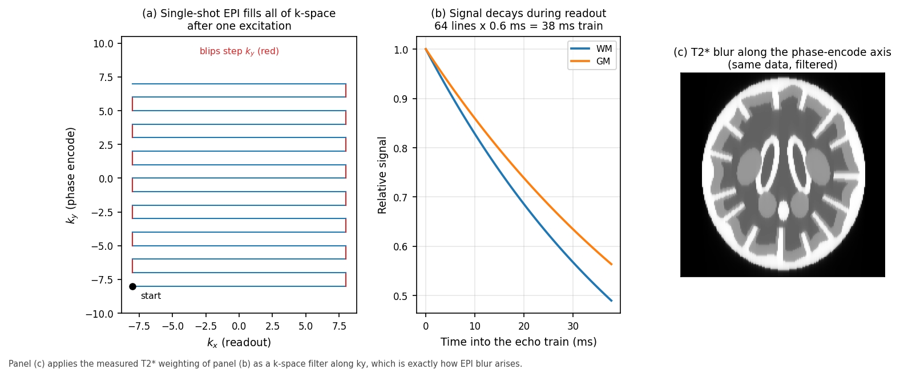

*Figure 8 — (a) The zig-zag trajectory: readout sweeps back and forth while small "blips" step the phase-encode position. (b) $T_2^*$ decay across a 38 ms echo train. (c) Because later k-space lines are systematically weaker, the effective k-space filter blurs the image along the phase-encode axis.*

Three consequences follow directly, and all three are visible in the data this
pipeline processes:

1. **Blurring along the phase-encode axis.** Signal decays during the train, so
   high-$k_y$ lines are attenuated. That is a low-pass filter in one direction
   only.
2. **Geometric distortion.** The phase-encode axis accumulates phase error for the
   entire readout duration, so off-resonance turns into large spatial
   displacement. This is §16, and it is the big one.
3. **Ghosting.** Alternate lines are collected under opposite gradient polarity.
   Any timing mismatch between them produces a copy of the image shifted by half
   the field of view — the **N/2 ghost**.

The single most useful protocol lever here is **shortening the echo train**, via
parallel imaging, partial Fourier, or multi-shot EPI. Everything improves at once.

---

## 10. Accelerating: parallel imaging and multiband

### *(Working)* Two different kinds of cheating

**Parallel imaging** (SENSE, GRAPPA) skips phase-encode lines and recovers the
missing information from the fact that multiple receive coils each see the head
with a different spatial sensitivity. Undersampling alone would fold the image
(Figure 6, bottom right), but the coil sensitivity profiles provide the extra
constraint needed to unfold it.

- Acceleration factor $R$: scan time and echo train shrink by $R$.
- SNR cost: $\text{SNR} \propto 1/(g\sqrt{R})$, where the **g-factor** $g \geq 1$
  depends on coil geometry and worsens toward the centre of the head.
- Typical diffusion use: $R = 2$. Higher factors produce central noise
  amplification and residual unfolding artefacts.

**Multiband** (simultaneous multi-slice) is a different trick: excite several
slices at once with a composite RF pulse and separate them afterwards using coil
sensitivity plus deliberately applied inter-slice phase shifts (blipped CAIPI).

- Multiband factor MB: **slices per unit time** improve by MB.
- The crucial difference from parallel imaging: it does not shorten the echo
  train, so it does **not** reduce distortion — and, because it does not
  undersample within a slice, its intrinsic SNR penalty is much smaller.
- Cost: slice leakage between simultaneously excited slices, and higher SAR.

The two combine, and modern diffusion protocols routinely use both. If you are
reading a protocol and want to predict distortion, look at the in-plane
acceleration and partial Fourier, not the multiband factor.

---

## 11. The structural scan: MPRAGE and FLAIR

### *(Working)* Why the pipeline needs a good $T_1$

This pipeline's anatomical steps — FreeSurfer or FastSurfer, the 5TT image, the
parcellation — all rest on one $T_1$-weighted volume. Its quality sets a ceiling
on everything downstream, and no amount of clever processing recovers a
poorly-acquired structural scan.

**MPRAGE** is a 3-D gradient echo preceded by an inversion pulse. The inversion is
what generates strong grey/white contrast, and the 3-D readout gives isotropic
sub-millimetre voxels with good SNR. Typical 3 T parameters: TI ≈ 900 ms,
TR ≈ 2300 ms, flip angle 8–9°, 1 mm isotropic.

What matters for surface reconstruction:

| Property | Why it matters |
|----------|----------------|
| Isotropic ~1 mm | the cortical ribbon is only 2–4 mm thick; anisotropic voxels blur it |
| Good GM/WM contrast | the white surface is placed on the intensity gradient |
| Minimal motion | motion blurs precisely the boundary being detected |
| Bias field within reason | correctable by N4, but not without limit |

**FLAIR** adds a long inversion (~2.5 s) to null CSF, leaving lesions conspicuous.
It is not required by this pipeline, but it is the sequence that makes white
matter hyperintensities visible, and those matter for interpreting connectivity
findings in older or vascular cohorts (see [`brain.md`](brain.md) §12).

---

# Part IV — Diffusion

## 12. Brownian motion and what diffusion MRI measures

### *(Beginner)* Ink in water, and ink in a bundle of straws

Drop ink into still water and it spreads on its own. Nothing pushes it; water
molecules are in constant thermal motion, and random jostling carries the ink
outward. That is **Brownian motion**, and every water molecule in the brain is
doing it, all the time.

The key insight of diffusion MRI is that this random motion is **not random in its
geometry**. Where water is free, it spreads equally in all directions. Where it is
hemmed in, it cannot.

Now imagine dropping ink into a tightly packed bundle of drinking straws. Along
the straws, it spreads freely. Across them, it is blocked by the walls. Measure
how far the ink got in various directions and you can deduce which way the straws
point — *without ever seeing a straw*.

White matter is that bundle of straws. Axons, wrapped in myelin and packed in
parallel, restrict water movement across the fibre far more than along it.
Diffusion MRI measures displacement in many directions and infers fibre
orientation from the pattern. Tractography then joins those local orientations
into pathways, and this pipeline counts the pathways between regions to build a
connectome.

Worth being clear about what is and is not measured: **we never see an axon.**
Diffusion MRI voxels are 1–3 mm across and axons are microns. We observe the
average behaviour of water in a volume containing perhaps a million axons and
infer a dominant orientation. That inferential gap is the origin of every
tractography controversy in the literature.

### *(Working)* Numbers

Free water at body temperature has a diffusion coefficient of about
$3.0 \times 10^{-3}$ mm²/s. In tissue, apparent values are much lower:

| Tissue | Apparent diffusivity (mm²/s) | Anisotropy |
|--------|------------------------------|------------|
| CSF | ~3.0 × 10⁻³ | none |
| Grey matter | ~0.8 × 10⁻³ | low |
| White matter (along fibre) | ~1.7 × 10⁻³ | high |
| White matter (across fibre) | ~0.3 × 10⁻³ | — |

In roughly 50 ms of diffusion time, water diffuses on the order of 10 µm — a
distance comparable to cell dimensions, which is exactly why the measurement is
sensitive to microstructure it cannot resolve.

Acute stroke is the clinical showcase: cytotoxic oedema traps water inside
swollen cells, diffusivity plummets, and the lesion lights up on DWI within
minutes, long before anything appears on CT or $T_2$.

---

## 13. The Stejskal–Tanner experiment and the b-value

### *(Beginner)* Label, wait, re-read

The experiment, invented by Stejskal and Tanner in 1965, is beautifully simple:

1. **Label** every spin with a position-dependent phase, using a gradient pulse.
   Think of stamping each water molecule with its map reference.
2. **Wait** a short interval $\Delta$, during which molecules diffuse.
3. **Re-read** with an equal and opposite gradient pulse. Anything that stayed
   put gets its phase perfectly cancelled. Anything that moved does not.

Spins that stayed put add together coherently and give full signal. Spins that
moved have scattered phases and partially cancel. **Signal loss is the
measurement.** More movement means less signal.

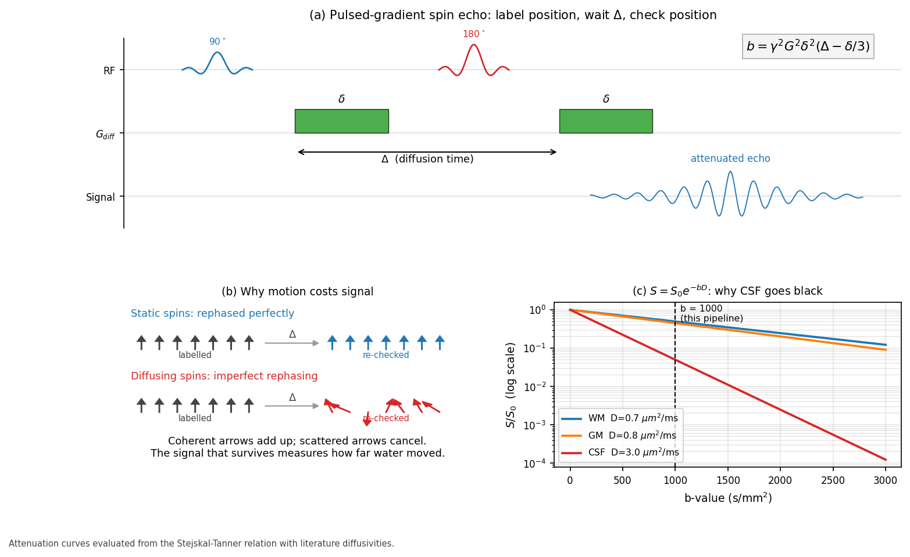

*Figure 9 — (a) The PGSE sequence: two matched gradient pulses of duration $\delta$ straddling the 180° refocusing pulse, separated by the diffusion time $\Delta$. (b) Static spins are perfectly rephased; diffusing spins are not, and scattered phases cancel. (c) Attenuation against b-value. CSF, diffusing ten times faster than white matter, is almost entirely suppressed by b = 1000 — which is why ventricles are black on a diffusion-weighted image.*

### *(Working)* The b-value

How strongly you diffusion-weight is summarised in one number:

$$b = \gamma^2 G^2 \delta^2 \left(\Delta - \frac{\delta}{3}\right)$$

with $G$ the gradient amplitude, $\delta$ its duration, $\Delta$ the separation.
Units are s/mm². Signal attenuates as

$$S = S_0 \, e^{-bD}$$

| b-value | Effect | Use |
|---------|--------|-----|
| 0 | none | reference volume, needed to normalise |
| 700–1000 | moderate | clinical DWI, DTI, this pipeline |
| 2000–3000 | strong | crossing fibres, HARDI, CSD |
| >3000 | severe | microstructure models; low SNR |

The trade-off is unavoidable: raising b increases angular contrast but reduces
signal exponentially, so noise eventually dominates. And note what $b$ hides —
very different combinations of $G$, $\delta$ and $\Delta$ give the same $b$ but
probe different length scales. Two protocols quoting "b = 1000" are not
necessarily measuring the same thing, which is a real obstacle to multi-site
harmonisation.

### *(Advanced)* Why the $-\delta/3$

The idealised derivation assumes infinitesimally short gradient pulses, so that
all diffusion happens in the interval $\Delta$ between them. Real pulses have
finite duration $\delta$, during which spins are both being labelled and
diffusing. Integrating the phase properly over the finite pulses yields the
correction, giving an **effective diffusion time** of $\Delta - \delta/3$. For
typical clinical parameters ($\delta \approx 30$ ms, $\Delta \approx 50$ ms) this
is not a small correction — it changes the effective diffusion time by about 20%.

---

## 14. Directions, shells, and the gradient table

### *(Working)* How many directions, and where

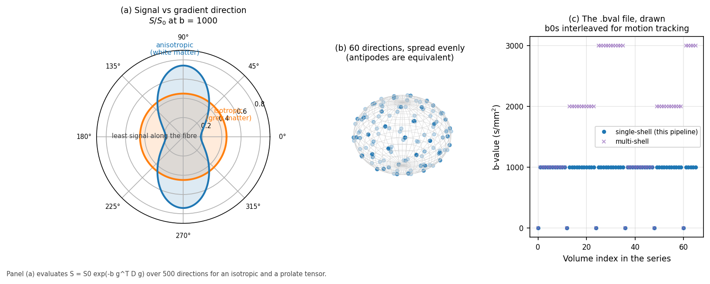

*Figure 10 — (a) Signal as a function of gradient direction. Isotropic tissue gives a circle; anisotropic tissue gives a peanut, with **least** signal along the fibre, because that is the direction water travels furthest. (b) A well-designed 60-direction table spreads samples evenly over the sphere, exploiting the fact that $+\mathbf{g}$ and $-\mathbf{g}$ are equivalent. (c) The b-value list volume by volume, with b = 0 images interleaved throughout for motion tracking.*

Diffusion is measured one direction at a time, so the gradient table is a design
choice with real consequences:

| Directions | Supports |
|-----------:|----------|
| 6 | the diffusion tensor, minimally — no redundancy, no error estimate |
| 30 | robust DTI: FA, MD, and a stable principal direction |
| 60+ | constrained spherical deconvolution, crossing fibres |
| 90+ | higher-order models, multi-shell microstructure |

Directions should be spread as evenly as possible over the sphere; the standard
construction minimises an electrostatic repulsion energy between antipodal point
pairs. Two details that bite in practice:

- **Antipodal symmetry.** Diffusion cannot distinguish $+\mathbf{g}$ from
  $-\mathbf{g}$, so directions live on a half-sphere. A table that fails to
  account for this wastes measurements.
- **b = 0 volumes must be interleaved**, not all collected at the start. They are
  the anchors for motion and eddy-current correction, and anchors are only useful
  if they are distributed through the series.

**Single-shell versus multi-shell** is the choice that determines which
reconstruction models are available. A single shell (this pipeline: b = 1000 plus
b = 0) supports DTI and single-shell CSD variants. Multi-shell adds b = 2000 and
b = 3000, enabling multi-tissue CSD and microstructure models such as NODDI, at
the cost of proportionally more scan time.

This is precisely why the pipeline's QSIRecon spec uses **SS3T** — single-shell
three-tissue CSD. Standard multi-tissue CSD needs multiple shells to separate the
tissue response functions; SS3T was developed to achieve a comparable separation
from a single shell. The reconstruction choice is downstream of an acquisition
choice made years earlier, and cannot be revisited afterwards. See
[`pipeline_science.md`](pipeline_science.md) for what SS3T then does with it.

---

## 15. Designing a diffusion protocol

### *(Working)* A worked example

Suppose you have 10 minutes for diffusion in a 45-minute session, and the goal is
structural connectomics.

| Decision | Choice | Reasoning |
|----------|--------|-----------|
| b-value | 1000 s/mm² | good SNR; adequate for CSD-family models |
| Directions | 60 | supports spherical deconvolution; ~30 would cap you at DTI |
| b = 0 volumes | 6–7, interleaved | anchors for motion and eddy correction |
| Voxel size | 2 mm isotropic | 1.5 mm would cost over half the SNR |
| Partial Fourier | 6/8 | shortens TE, hence more signal |
| In-plane accel | R = 2 | shortens echo train, hence less distortion |
| Multiband | 2–3 | more slices per second, little SNR penalty |
| **Reversed PE** | **a few b = 0 volumes, opposite direction** | **enables proper distortion correction** |

The last row is the one most often omitted and the most expensive to omit. A
handful of reversed-phase-encode b = 0 volumes costs under a minute and is the
difference between principled distortion correction and a fieldmap-free
approximation. If you can change one thing about a legacy protocol, change this.

Total volumes: 66. At TR ≈ 4 s with multiband, roughly 4–5 minutes, leaving room
for the reversed-PE acquisition and a repeat if the first attempt fails QC.

---

# Part V — Everything that goes wrong

## 16. Susceptibility distortion and the reversed-PE trick

### *(Beginner)* Where the head stops being a sphere of water

Magnetic susceptibility describes how a material distorts a magnetic field.
Air and tissue differ substantially, so wherever they meet — the sinuses behind
the nose, the air cells in the temporal bone, the ear canals — the field is
locally warped no matter how well the scanner is shimmed.

Now recall the chain of logic from §1 and §5. Field determines frequency.
Frequency determines apparent position. So a *field* error becomes a *position*
error: signal is reconstructed in the wrong place. Orbitofrontal and anterior
temporal cortex, which sit directly against air cavities, are exactly where this
is worst — and both are of central interest in traumatic brain injury.

### *(Working)* Why the phase-encode axis, and how far

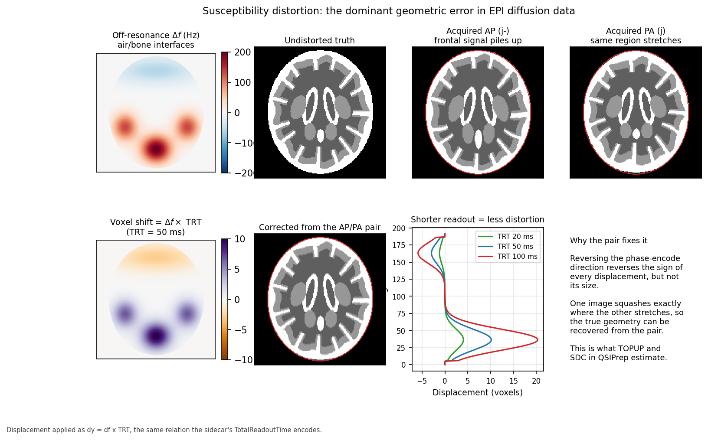

*Figure 11 — Off-resonance near air/bone interfaces (top left) displaces signal along the phase-encode axis. The AP and PA acquisitions distort in exactly opposite senses — the red outline marks true anatomy, and the frontal region piles up in one and stretches in the other. Bottom left: displacement in voxels. Bottom middle: the geometry recovered from the pair. Bottom right: halving the readout time halves the distortion.*

The displacement is given by a strikingly simple relation:

$$\Delta y \; [\text{voxels}] = \Delta f \; [\text{Hz}] \times T_{\text{readout}} \; [\text{s}]$$

That is the whole story, and two things follow.

**First, distortion is confined to the phase-encode axis.** The readout axis
samples an entire line in under a millisecond, so accumulated phase error is
negligible. The phase-encode axis accumulates error across the *whole* echo train,
tens of milliseconds. The ratio is roughly the echo train length, so distortion is
about a hundred times worse in one direction than the other.

**Second, it scales linearly with readout duration.** A 200 Hz offset with a 50 ms
readout displaces signal by 10 voxels — 2 cm at 2 mm resolution. Halve the readout
via parallel imaging and you halve the displacement.

**The reversed-PE trick.** Reverse the phase-encode direction and every
displacement reverses sign while keeping its magnitude. One image compresses
exactly where the other stretches. Given both, the underlying field map (and hence
the true geometry) can be estimated. This is what FSL's `topup` does, and what
QSIPrep's SDC stage invokes. It requires that the reversed-PE data was acquired —
which is why §15 insisted on it, and why the sidecar fields in §19 must be right.

### *(Advanced)* When you do not have a reversed pair

Fallbacks exist, in descending order of trustworthiness:

1. **Acquired fieldmap** (phase-difference or multi-echo GRE): measures
   off-resonance directly. Good, though it needs unwrapping and is itself
   sensitive to motion between the fieldmap and the diffusion scan.
2. **Fieldmap-less SDC** (`--use-syn-sdc`): non-linearly registers the distorted
   EPI to an undistorted $T_1$, constraining the warp to the phase-encode axis.
   Surprisingly effective, but it is *inference from anatomy*, not measurement,
   and it degrades exactly where anatomy is abnormal — which in a lesion cohort
   is the region of interest.
3. **Nothing**: leaves centimetre-scale misplacement in frontal and temporal
   cortex, which then silently misassigns streamlines to the wrong parcels.

This pipeline's behaviour is documented in [`fmaps.md`](../fmaps.md), and the
sidecar requirements in [`bids.md`](../bids.md). The relevant point for
acquisition is that option 1 and option 2 are decided at the scanner, not later.

---

## 17. Eddy currents, motion, and the rest of the artefact zoo

### *(Working)* The gallery

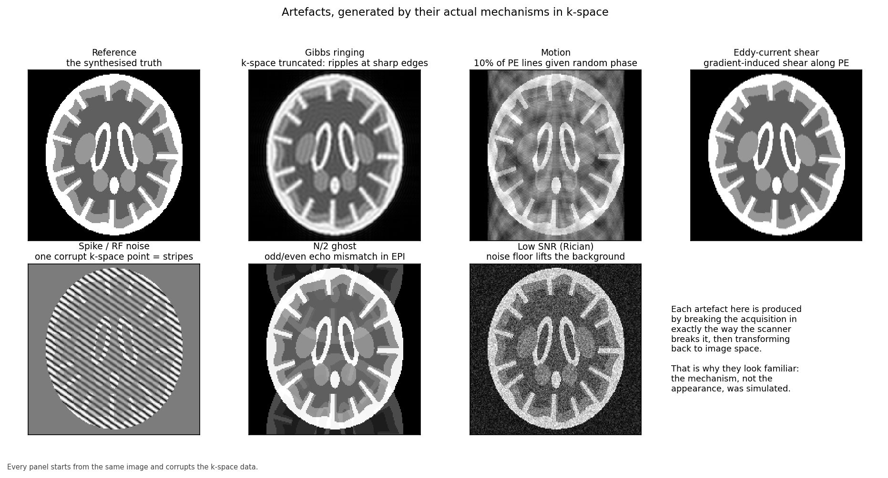

*Figure 12 — Each panel starts from the same image and corrupts the k-space data in the way the scanner does: truncating for Gibbs, randomising line phase for motion, shearing for eddy currents, adding a single bad sample for the spike, mismatching odd and even lines for the N/2 ghost, and adding Rician noise.*

| Artefact | Mechanism | Appearance | Handled by |
|----------|-----------|------------|------------|
| **Eddy currents** | switching diffusion gradients induces currents in conductors, which add unwanted fields | shear, scale and shift that vary *with gradient direction* | `eddy` |
| **Motion** | subject moves between or during volumes | ghosting, blurring, signal dropout | `eddy`, volume-to-volume registration |
| **Gibbs ringing** | k-space truncated at finite extent | ripples adjacent to sharp edges | subvoxel-shift unringing |
| **Spike / RF noise** | a single corrupt k-space sample | stripes across the whole image | QC and volume rejection |
| **N/2 ghost** | odd/even echo timing mismatch in EPI | copy shifted half a field of view | reconstruction-side phase correction |
| **Thermal noise** | receiver electronics, patient | grain; Rician, not Gaussian | denoising (MP-PCA) |

Two of these deserve emphasis because they interact with diffusion specifically.

**Eddy currents are direction-dependent.** Each diffusion direction uses a
different gradient combination, so each volume is distorted *differently*. Rigid
registration cannot fix it; you need a model that accounts for the gradient
direction, which is what FSL's `eddy` provides. Uncorrected, it appears as
apparent anisotropy that is actually an artefact of misregistration.

**Noise in magnitude images is Rician, not Gaussian.** Taking the magnitude of
complex data with Gaussian noise rectifies it, so the noise floor sits *above*
zero. At high b-values, where true signal approaches the floor, this biases
diffusivity estimates downward. It is a systematic bias, not random error, and it
is why denoising before any model fitting is the recommended order of operations.

---

## 18. Noise, SNR, and the trade-off triangle

### *(Beginner)* You cannot have all three

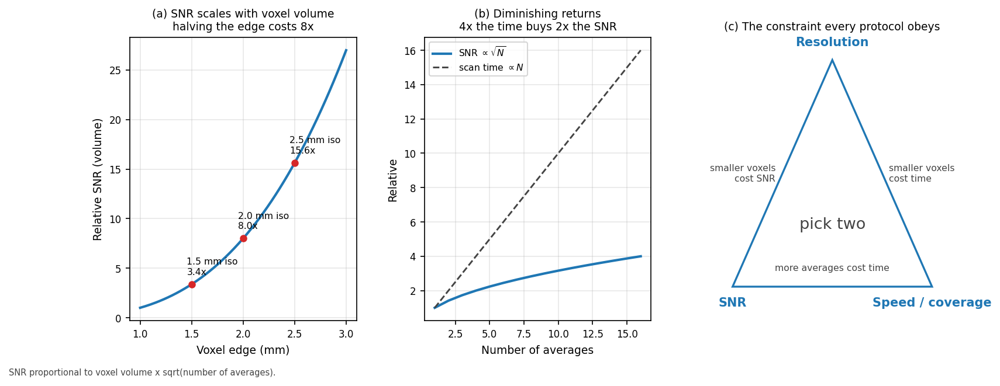

*Figure 13 — (a) SNR scales with voxel **volume**, so shrinking the edge from 2.5 mm to 1.5 mm costs nearly five-fold. (b) Averaging helps only as $\sqrt{N}$, so four times the scan time buys twice the SNR. (c) Resolution, SNR and speed: pick two.*

Every protocol argument reduces to three quantities that cannot be maximised
together:

$$\text{SNR} \propto (\Delta x \, \Delta y \, \Delta z) \times \sqrt{N_{\text{avg}} \, T_{\text{acq}}}$$

**Resolution is brutally expensive**: SNR follows voxel *volume*, so halving the
edge length costs a factor of eight. **Averaging is inefficient**: signal adds
coherently and noise adds in quadrature, so SNR improves only as the square root
of the time spent. Four times the scan for double the SNR is a poor exchange when
subjects are moving.

The practical consequence is that resolution should be set by the smallest
structure you genuinely need to resolve, not by ambition. For structural
connectomics, 2 mm isotropic is the common compromise: fine enough to follow major
tracts, coarse enough to keep SNR workable at b = 1000 within a clinical session.

---

# Part VI — From scanner to pipeline

## 19. DICOM to BIDS: what must survive the conversion

### *(Working)* Metadata is not optional

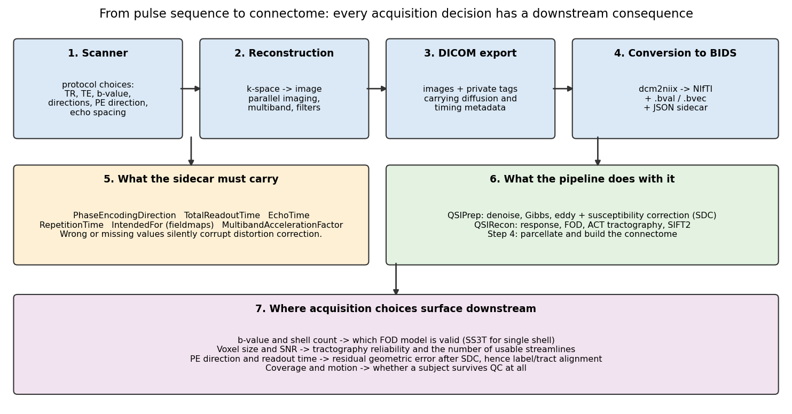

*Figure 14 — The full chain. Acquisition decisions on the left propagate all the way to the connectome on the right, and several of them cannot be undone afterwards.*

The scanner exports DICOM; the pipeline consumes [BIDS](https://bids.neuroimaging.io/).
`dcm2niix` bridges them, producing a NIfTI image, a `.bval`/`.bvec` pair, and a
JSON sidecar. Everything the pipeline knows about how the data was acquired comes
from that sidecar, and **wrong metadata is worse than missing metadata**: missing
values usually stop the pipeline, whereas wrong ones let it run confidently to a
wrong answer.

| Field | Meaning | Consequence if wrong |
|-------|---------|----------------------|
| `PhaseEncodingDirection` | axis and polarity (`j`, `j-`, …) | distortion correction applied **backwards**, doubling the error |
| `TotalReadoutTime` | echo train duration | distortion scaled incorrectly |
| `EffectiveEchoSpacing` | time between echoes | same |
| `EchoTime`, `RepetitionTime` | timings | modelling and QC |
| `IntendedFor` | which scans a fieldmap applies to | fieldmap silently ignored |
| `SliceTiming` | acquisition order | relevant for slice-wise outlier detection |
| `.bvec` | gradient directions | **wrong fibre orientations, hence wrong tractography** |
| `.bval` | b-values | wrong model fitting |

The `.bvec` file deserves particular caution. Gradient directions are expressed in
a coordinate frame, and the conventions differ between vendors, between
`dcm2niix` versions, and between image orientations. A left–right flip produces a
tractogram that looks entirely plausible and is systematically wrong. The standard
sanity check is to reconstruct a tensor and confirm that the corpus callosum comes
out left–right (red in the usual colour convention) and the corticospinal tract
superior–inferior (blue). Do this once per protocol, not once per study.

Repairing sidecars is a **pre-pipeline** step here, deliberately kept outside the
processing so that the fix is explicit, inspectable and version-controlled. See
[`bids.md`](../bids.md).

---

## 20. How acquisition choices reach the connectome

### *(Working)* The causal chain

Worth stating plainly, because it is easy to treat acquisition as somebody else's
problem:

| Acquisition choice | Immediate effect | Consequence for the connectome |
|--------------------|------------------|-------------------------------|
| Single shell at b = 1000 | multi-tissue CSD unavailable | forces SS3T; multi-shell models permanently out of reach |
| 60 directions | supports spherical deconvolution | fewer would restrict you to DTI and lose crossing fibres |
| 2 mm isotropic | moderate SNR | smaller voxels would raise noise and destabilise tracking |
| No reversed-PE volumes | no `topup` | frontal/temporal misplacement, streamlines assigned to wrong parcels |
| Long echo train | large distortion | same, in proportion to readout time |
| Motion during the scan | volume-wise corruption | dropped volumes, or a subject failing QC entirely |
| $T_1$ resolution and contrast | surface placement quality | parcel boundaries, hence every matrix entry |

The recurring theme is that acquisition errors do not announce themselves. A
distorted brain still produces a full connectivity matrix of exactly the right
size. Nothing in the pipeline will refuse to run. The matrix will simply be wrong
in a spatially structured way — worst in orbitofrontal and temporal regions,
which is precisely where a TBI study is looking.

---

## 21. Acquisition QC: what to check before you process

### *(Working)* A checklist

Cheap to run, and each one catches a failure that is expensive later.

**On the structural scan**
- [ ] Grey/white contrast adequate, and inversion preparation actually used
- [ ] No motion blur at the grey/white boundary
- [ ] Full brain coverage including cerebellum and vertex
- [ ] Bias field within N4's ability to correct

**On the diffusion series**
- [ ] Volume count matches the expected number
- [ ] `.bval`/`.bvec` row counts match the number of volumes
- [ ] b = 0 volumes present and **interleaved**, not front-loaded
- [ ] Reversed-PE volumes present, if the protocol specified them
- [ ] No wrap-around of neck or shoulders into the brain
- [ ] Signal dropout absent in temporal lobes and cerebellum
- [ ] Tensor colour map shows callosum left–right, corticospinal superior–inferior

**On the metadata**
- [ ] `PhaseEncodingDirection` present, and its polarity verified against the pair
- [ ] `TotalReadoutTime` present and physically plausible (tens of ms)
- [ ] `IntendedFor` resolves to files that actually exist
- [ ] Parameters consistent across subjects in the cohort

The last box is the one that quietly ruins group analyses. A protocol changed
midway through recruitment — a different readout time, a different multiband
factor — introduces a systematic difference that no amount of downstream
harmonisation fully removes. Record the protocol, check it periodically, and
treat any change as a covariate at minimum.

---

## Glossary

**ADC** — apparent diffusion coefficient; measured diffusivity, "apparent" because
tissue restriction makes it lower than free water.
**b-value** — diffusion weighting strength, s/mm².
**BIDS** — Brain Imaging Data Structure; the directory and metadata convention.
**CSD** — constrained spherical deconvolution; recovers fibre orientation
distributions from diffusion signal.
**EPI** — echo-planar imaging; fills k-space after a single excitation.
**Ernst angle** — flip angle maximising signal for a given TR and $T_1$.
**FLAIR** — fluid-attenuated inversion recovery; nulls CSF.
**Flip angle** — how far an RF pulse tips the magnetisation.
**FOV** — field of view; the spatial extent imaged.
**GRAPPA / SENSE** — parallel imaging methods using multiple coil sensitivities.
**Gibbs ringing** — ripples near sharp edges from truncating k-space.
**g-factor** — geometry-dependent noise amplification in parallel imaging.
**k-space** — the spatial-frequency domain the scanner actually samples.
**Larmor frequency** — precession frequency, $\bar{\gamma}B_0$.
**MPRAGE** — inversion-prepared 3-D gradient echo; the standard structural $T_1$w.
**Multiband** — exciting several slices simultaneously.
**N/2 ghost** — half-FOV image copy from odd/even echo mismatch in EPI.
**Partial Fourier** — acquiring just over half of k-space and exploiting symmetry.
**PGSE** — pulsed-gradient spin echo; the Stejskal–Tanner diffusion sequence.
**Phase encoding** — spatial encoding by phase; the slow, distortion-prone axis.
**Rician noise** — the noise distribution of magnitude MRI data; biased above zero.
**SAR** — specific absorption rate; RF power deposition limit.
**SDC** — susceptibility distortion correction.
**Shim** — correction coils that flatten $B_0$ inhomogeneity.
**SNR** — signal-to-noise ratio.
**SS3T** — single-shell three-tissue CSD.
**Susceptibility** — a material's response to a magnetic field; mismatches at
air/tissue interfaces cause distortion.
**TE** — echo time; controls $T_2$ weighting.
**TI** — inversion time; controls which tissue is nulled.
**topup** — FSL tool estimating the field from reversed-PE image pairs.
**TR** — repetition time; controls $T_1$ weighting.
**$T_1$** — longitudinal relaxation time.
**$T_2$** — transverse relaxation time.
**$T_2^*$** — transverse relaxation including static inhomogeneity; shorter.

---

## References

### MRI physics: textbooks and general reference

1. Nishimura DG. *Principles of Magnetic Resonance Imaging.* Stanford University, 2010. — the clearest treatment of k-space and signal encoding.
2. Bernstein MA, King KF, Zhou XJ. *Handbook of MRI Pulse Sequences.* Elsevier, 2004. — the standard reference for sequence design.
3. Haacke EM, Brown RW, Thompson MR, Venkatesan R. *Magnetic Resonance Imaging: Physical Principles and Sequence Design.* 2nd ed. Wiley, 2014.
4. Brown RW, Cheng YCN, Haacke EM, et al. *MRI: Physical Principles and Sequence Design.* Wiley-Blackwell.
5. Elster AD. *Questions and Answers in MRI* — [mriquestions.com](https://mriquestions.com/). Free, searchable, and unusually good at explaining *why*.
6. McRobbie DW, Moore EA, Graves MJ, Prince MR. *MRI from Picture to Proton.* 3rd ed. Cambridge University Press, 2017. — the friendliest starting point.

### Foundational papers

7. Bloch F. Nuclear induction. *Physical Review* 1946;70:460–474.
8. Hahn EL. Spin echoes. *Physical Review* 1950;80(4):580–594.
9. Lauterbur PC. Image formation by induced local interactions: examples employing nuclear magnetic resonance. *Nature* 1973;242:190–191.
10. Mansfield P. Multi-planar image formation using NMR spin echoes. *Journal of Physics C* 1977;10(3):L55–L58. (**EPI**)
11. Ljunggren S. A simple graphical representation of Fourier-based imaging methods. *Journal of Magnetic Resonance* 1983;54(2):338–343. (**k-space formalism**)

### Diffusion MRI

12. Stejskal EO, Tanner JE. Spin diffusion measurements: spin echoes in the presence of a time-dependent field gradient. *Journal of Chemical Physics* 1965;42:288–292.
13. Le Bihan D, Breton E, Lallemand D, et al. MR imaging of intravoxel incoherent motions. *Radiology* 1986;161(2):401–407.
14. Basser PJ, Mattiello J, LeBihan D. MR diffusion tensor spectroscopy and imaging. *Biophysical Journal* 1994;66(1):259–267.
15. Jones DK (ed). *Diffusion MRI: Theory, Methods, and Applications.* Oxford University Press, 2010.
16. Jones DK, Knösche TR, Turner R. White matter integrity, fiber count, and other fallacies: the do's and don'ts of diffusion MRI. *NeuroImage* 2013;73:239–254. — essential reading before interpreting any diffusion metric.
17. Tournier JD, Calamante F, Connelly A. Robust determination of the fibre orientation distribution in diffusion MRI. *NeuroImage* 2007;35(4):1459–1472. (**CSD**)
18. Dhollander T, Raffelt D, Connelly A. Unsupervised 3-tissue response function estimation from single-shell or multi-shell diffusion MR data. *ISMRM Workshop*, 2016. (**SS3T**)
19. Jones DK, Horsfield MA, Simmons A. Optimal strategies for measuring diffusion in anisotropic systems by magnetic resonance imaging. *Magnetic Resonance in Medicine* 1999;42(3):515–525. — where direction schemes come from.

### Artefacts and correction

20. Jezzard P, Balaban RS. Correction for geometric distortion in echo planar images from $B_0$ field variations. *Magnetic Resonance in Medicine* 1995;34(1):65–73.
21. Andersson JLR, Skare S, Ashburner J. How to correct susceptibility distortions in spin-echo echo-planar images: application to diffusion tensor imaging. *NeuroImage* 2003;20(2):870–888. (**topup**)
22. Andersson JLR, Sotiropoulos SN. An integrated approach to correction for off-resonance effects and subject movement in diffusion MR imaging. *NeuroImage* 2016;125:1063–1078. (**eddy**)
23. Veraart J, Novikov DS, Christiaens D, et al. Denoising of diffusion MRI using random matrix theory. *NeuroImage* 2016;142:394–406. (**MP-PCA**)
24. Kellner E, Dhital B, Kiselev VG, Reisert M. Gibbs-ringing artifact removal based on local subvoxel-shifts. *Magnetic Resonance in Medicine* 2016;76(5):1574–1581.
25. Gudbjartsson H, Patz S. The Rician distribution of noisy MRI data. *Magnetic Resonance in Medicine* 1995;34(6):910–914.
26. Tustison NJ, Avants BB, Cook PA, et al. N4ITK: improved N3 bias correction. *IEEE Transactions on Medical Imaging* 2010;29(6):1310–1320.

### Acceleration

27. Pruessmann KP, Weiger M, Scheidegger MB, Boesiger P. SENSE: sensitivity encoding for fast MRI. *Magnetic Resonance in Medicine* 1999;42(5):952–962.
28. Griswold MA, Jakob PM, Heidemann RM, et al. Generalized autocalibrating partially parallel acquisitions (GRAPPA). *Magnetic Resonance in Medicine* 2002;47(6):1202–1210.
29. Setsompop K, Gagoski BA, Polimeni JR, et al. Blipped-controlled aliasing in parallel imaging for simultaneous multislice EPI with reduced g-factor penalty. *Magnetic Resonance in Medicine* 2012;67(5):1210–1224. (**blipped-CAIPI multiband**)

### Protocol design, standards, and reproducibility

30. Gorgolewski KJ, Auer T, Calhoun VD, et al. The brain imaging data structure. *Scientific Data* 2016;3:160044. (**BIDS**)
31. Li X, Morgan PS, Ashburner J, et al. The first step for neuroimaging data analysis: DICOM to NIfTI conversion. *Journal of Neuroscience Methods* 2016;264:47–56. (**dcm2niix**)
32. Cieslak M, Cook PA, He X, et al. QSIPrep: an integrative platform for preprocessing and reconstructing diffusion MRI data. *Nature Methods* 2021;18:775–778.
33. Glasser MF, Sotiropoulos SN, Wilson JA, et al. The minimal preprocessing pipelines for the Human Connectome Project. *NeuroImage* 2013;80:105–124.
34. Nichols TE, Das S, Eickhoff SB, et al. Best practices in data analysis and sharing in neuroimaging using MRI. *Nature Neuroscience* 2017;20:299–303.
35. Fortin JP, Parker D, Tunç B, et al. Harmonization of multi-site diffusion tensor imaging data. *NeuroImage* 2017;161:149–170.

### Tissue property values used in the figures

36. Wansapura JP, Holland SK, Dunn RS, Ball WS. NMR relaxation times in the human brain at 3.0 Tesla. *Journal of Magnetic Resonance Imaging* 1999;9(4):531–538.
37. Stanisz GJ, Odrobina EE, Pun J, et al. T1, T2 relaxation and magnetization transfer in tissue at 3T. *Magnetic Resonance in Medicine* 2005;54(3):507–512.
38. Bojorquez JZ, Bricq S, Acquitter C, et al. What are normal relaxation times of tissues at 3 T? *Magnetic Resonance Imaging* 2017;35:69–80.

---

## Reproducing the figures

Every figure is computed from the equations, with no input data of any kind:

```bash
python3 dwi_pipeline/scripts/make_acquisition_figures.py \
    --out-dir dwi_pipeline/figures/acquisition
```

Requires `numpy`, `scipy` and `matplotlib`. Runs in a few seconds.

**Provenance**

| Figure | How it is produced | Measured data? |
|--------|--------------------|----------------|
| 1 | $f_0 = \bar\gamma B_0$ evaluated over field strength | No — exact physics |
| 2 | Rotating-frame trajectory; $\sin/\cos\alpha$; slice profile from bandwidth ÷ gradient | No |
| 3 | Bloch solutions at published 3 T constants (refs 36–38) | No — literature constants |
| 4 | Signal equations of §4 applied to an analytic phantom | No |
| 5 | Gradient-induced frequency and phase maps, 10 mT/m over 240 mm | No |
| 6 | Genuine 2-D FFT of the phantom, variously filtered | No |
| 7 | Schematic timing; echo envelopes are exponentials | No |
| 8 | $T_2^*$ decay applied as a k-space filter along $k_y$ | No |
| 9 | Stejskal–Tanner relation with literature diffusivities | No |
| 10 | $S = S_0 e^{-b\mathbf{g}^T\mathbf{D}\mathbf{g}}$; Fibonacci-sphere directions | No |
| 11 | Displacement $\Delta y = \Delta f \times T_{\text{readout}}$ applied as a warp | No |
| 12 | Each artefact induced by its real mechanism in k-space | No |
| 13 | SNR $\propto$ voxel volume $\times \sqrt{N}$ | No |
| 14 | Schematic | No |

The phantom is defined analytically in `brain_phantom()`: nested ellipses for the
brain, ventricles and deep nuclei, an undulating cortical ribbon of roughly
constant thickness, and explicitly cut sulcal clefts lined by cortex. It is not
derived from any scan, and nothing in this document depicts a person.

---

*This document supports research engineering and is not a clinical reference. Tissue property values are representative literature figures at 3 T and vary with sequence, temperature, and measurement method.*
