# The Brain for Neuroimaging Research Engineers

**Anatomy, physiology, and radiological interpretation — connected to the science, engineering, and pipelines used in this repository**

---

## How to read this document

This is written for someone who builds and operates neuroimaging pipelines and needs the domain knowledge that normally sits with clinicians and neuroscientists. Every section is layered:

| Layer | Marker | Who it is for |
|-------|--------|---------------|
| **Foundation** | *(Beginner)* | You know programming but little neuroanatomy |
| **Working knowledge** | *(Practitioner)* | You run pipelines and must interpret and QC outputs |
| **Research depth** | *(PhD)* | You design studies, defend methods in review, extend algorithms |

Read the Foundation tier of every section first if you are new; the tiers are cumulative but each is self-contained enough to skip.

**All imaging figures are generated from this project's own data** (subject `TBI011204`, FastSurfer + QSIPrep + QSIRecon ACT-HSVS run in `CIDUR_BIDS/dwi_test2_fast`) by `scripts/make_brain_figures.py`. Two figures are explicitly schematic drawings, and say so, because the repository contains no lesion-positive example to image. Nothing here is an AI-generated depiction of anatomy.

> **Scope and safety.** This document supports *research engineering*: QC, method choice, and interpretation of automated output. It is not a clinical reference and must not be used for diagnosis or patient care. Radiological interpretation is the responsibility of a qualified radiologist.

**Companion documents**

- `pipeline_science.md` — the physics, math, and software of the four pipeline stages
- `DWI_Connectivity_Pipeline_Documentation.docx` — operational run instructions
- `subject.sh` — the implementation this document refers to throughout

---

## Table of contents

1. [Organising principles of the brain](#1-organising-principles-of-the-brain)
2. [Normal macroscopic anatomy](#2-normal-macroscopic-anatomy)
3. [The three tissue classes and why pipelines care](#3-the-three-tissue-classes-and-why-pipelines-care)
4. [Subcortical gray matter](#4-subcortical-gray-matter)
5. [White matter organisation and the major tracts](#5-white-matter-organisation-and-the-major-tracts)
6. [Cortical organisation, surfaces, and parcellation](#6-cortical-organisation-surfaces-and-parcellation)
7. [Physiology a research engineer must know](#7-physiology-a-research-engineer-must-know)
8. [How MRI turns biology into numbers](#8-how-mri-turns-biology-into-numbers)
9. [Reading an MRI: systematic interpretation](#9-reading-an-mri-systematic-interpretation)
10. [Lesions: mechanisms and appearances](#10-lesions-mechanisms-and-appearances)
11. [Traumatic brain injury in depth](#11-traumatic-brain-injury-in-depth)
12. [Vascular disease](#12-vascular-disease)
13. [Neurodegenerative and demyelinating disease](#13-neurodegenerative-and-demyelinating-disease)
14. [Tumours, infection, and other abnormalities](#14-tumours-infection-and-other-abnormalities)
15. [Normal variants and artefacts that are not disease](#15-normal-variants-and-artefacts-that-are-not-disease)
16. [Anatomy meets the pipeline: geometry and coordinate spaces](#16-anatomy-meets-the-pipeline-geometry-and-coordinate-spaces)
17. [From anatomy to the 5TT image and ACT](#17-from-anatomy-to-the-5tt-image-and-act)
18. [From parcellation to connectome](#18-from-parcellation-to-connectome)
19. [Quantitative morphometry and what the numbers mean](#19-quantitative-morphometry-and-what-the-numbers-mean)
20. [QC: anatomical failure modes and how to catch them](#20-qc-anatomical-failure-modes-and-how-to-catch-them)
21. [Pathology breaks pipelines: engineering consequences](#21-pathology-breaks-pipelines-engineering-consequences)
22. [Study design and statistics for structural connectivity](#22-study-design-and-statistics-for-structural-connectivity)
23. [Glossary](#23-glossary)
24. [Curated resources by topic](#24-curated-resources-by-topic)
25. [References](#25-references)

---

## 1. Organising principles of the brain

### *(Beginner)* The five ideas that make everything else easier

Before any anatomy, five organising principles explain most of what you will see in an image and most of what a pipeline does.

**1. The brain is layered, and the layers are evolutionarily ordered.** From the inside out: brainstem (breathing, arousal), cerebellum (coordination), diencephalon including thalamus (relay and gating), basal ganglia (action selection), limbic structures (memory, emotion), and cerebral cortex (perception, language, planning). Damage low in this stack is more immediately life-threatening; damage high in it produces more specific cognitive deficits.

**2. Gray matter computes, white matter communicates.** Gray matter is where neuronal cell bodies and synapses sit. White matter is the wiring: myelinated axons carrying signals between gray matter regions. Nearly every design decision in a diffusion pipeline follows from this split — we track *through* white matter and we *stop* at gray matter.

**3. The cortex is a folded sheet, not a blob.** The cerebral cortex is a 2-D sheet roughly 2–4 mm thick, crumpled to fit the skull. Ridges are **gyri**, valleys are **sulci**. Roughly two-thirds of cortex is buried inside sulci. This single geometric fact is why surface-based methods (FreeSurfer, HSVS) outperform voxel-only methods, and it is the subject of Section 6.

**4. Structure is roughly bilaterally symmetric, and asymmetry is informative.** Paired structures should be similar in volume. Marked left/right asymmetry is either real pathology or a segmentation failure — and distinguishing those two is a core QC skill (Sections 19–20).

**5. The brain sits in a closed box.** The skull is rigid, so anything that adds volume (blood, tumour, swelling) must displace something else. This is why mass effect, midline shift, and herniation are the concepts that turn a "finding" into an emergency, and why they wreck registration (Section 21).

### *(Practitioner)* Directional and sectional terminology

You cannot read a header, a filename, or a log line without this vocabulary.

| Term | Meaning | Axis |
|------|---------|------|
| **Anterior / posterior** | front / back | also rostral / caudal in the brain |
| **Superior / inferior** | up / down | also dorsal / ventral |
| **Left / right** | patient's own left and right | not the viewer's |
| **Medial / lateral** | toward / away from the midline | — |
| **Axial (transverse)** | horizontal slice | varies along S–I |
| **Coronal** | frontal slice, like a crown | varies along A–P |
| **Sagittal** | side slice | varies along L–R |
| **Ipsilateral / contralateral** | same side / opposite side | — |

Two conventions cause real bugs. **Radiological convention** displays axial slices with the patient's left on the *viewer's right*; **neurological convention** does the opposite. Independently, image files encode orientation as axis codes such as **RAS** (first axis increases toward Right, then Anterior, then Superior) or **LIA**. FreeSurfer conformed volumes are **LIA**; most NIfTI files in this pipeline are **LPS** or **RAS**. A left/right flip is the single most common silent error in neuroimaging, and it will not throw an exception — it will just quietly mirror your results.

### *(PhD)* Coordinate systems as a formal problem

"Where is this structure" has no answer without specifying a frame. Three families coexist:

- **Voxel indices** \((i,j,k)\) — array subscripts, meaningless without an affine.
- **World / scanner coordinates** — millimetres, defined by the NIfTI/MGZ `affine`, mapping \((i,j,k,1)^\top\) to \((x,y,z,1)^\top\).
- **Template coordinates** — MNI152, Talairach; comparable across subjects but only after nonlinear registration.

FreeSurfer adds **surface RAS (tkrRAS)**, a frame centred on the conformed volume, in which surface geometry files are stored. Converting a surface vertex to a voxel of some other image requires composing three matrices, which is exactly what `make_brain_figures.py` does to produce Figure 5:

\[
\mathbf{v}_{\text{target}} = A_{\text{target}}^{-1}\, A_{\text{orig}}\, T_{\text{tkr}}^{-1}\, \mathbf{p}_{\text{tkr}}
\]

Getting this composition wrong produces surfaces that look plausible but are offset by a few millimetres — enough to systematically bias cortical measurements without looking obviously broken. Section 16 returns to this.

---

## 2. Normal macroscopic anatomy

### *(Beginner)* The tour

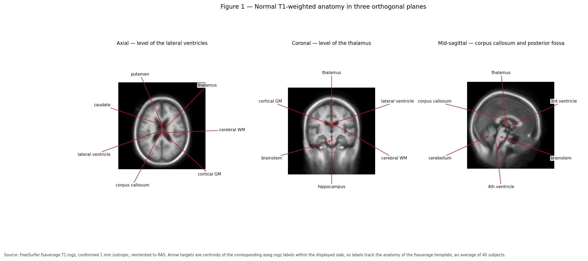

*Figure 1 — Normal T1-weighted anatomy of subject TBI011204 in three orthogonal planes. Arrow targets are computed from the centroids of the corresponding `aseg.mgz` labels, so every label points at this subject's actual structure rather than a textbook position.*

Work outside in.

**Coverings.** Brain is wrapped in three **meninges**: **dura** (tough, outermost, adherent to skull), **arachnoid** (delicate, spiderweb-like), and **pia** (thin, follows every fold). CSF flows in the **subarachnoid space** between arachnoid and pia. These layers define where blood collects after trauma, which is why "epidural", "subdural", and "subarachnoid" haemorrhage are distinct entities with distinct shapes (Section 11).

**Cerebrum.** Two hemispheres, joined by the **corpus callosum**, divided into lobes:

| Lobe | Dominant functions | Common lesion consequence |
|------|--------------------|---------------------------|
| **Frontal** | Motor output, planning, working memory, inhibition, expressive language (left) | Executive dysfunction, disinhibition, hemiparesis |
| **Parietal** | Somatosensation, spatial attention, numeracy | Neglect (right), apraxia |
| **Temporal** | Hearing, memory (hippocampus), receptive language (left) | Amnesia, aphasia, seizures |
| **Occipital** | Vision | Visual field loss |
| **Insula** | Interoception, autonomic, taste | Autonomic and visceral symptoms |
| **Limbic (cingulate etc.)** | Emotion, memory, motivation | Apathy, memory and affective change |

**Deep structures.** **Thalamus** is the central relay: almost all sensory traffic to cortex passes through it, so thalamic lesions have widespread effects. **Basal ganglia** (caudate, putamen, pallidum) sit lateral to the thalamus and shape movement and action selection. **Hippocampus** and **amygdala** sit medially in the temporal lobe, handling memory formation and emotional salience.

**Posterior fossa.** **Brainstem** (midbrain, pons, medulla) carries all traffic between brain and body and hosts the nuclei for consciousness, breathing, and heart rate. **Cerebellum** sits behind it, coordinating and calibrating movement.

**Ventricles.** A connected series of CSF-filled cavities — two **lateral**, then **third**, then **fourth** — draining to the subarachnoid space. Their size is one of the most useful things in a brain image, because they enlarge both when the brain shrinks (atrophy) and when CSF cannot drain (hydrocephalus).

### *(Practitioner)* What each plane is good for

Each plane answers different questions, which matters when you choose what to render in a QC report.

- **Axial** — ventricular symmetry, midline shift, most vascular territories. The default for review.
- **Coronal** — medial temporal structures (hippocampal volume and asymmetry), the thalamus, and cortical thickness in a plane perpendicular to many gyri.
- **Sagittal** — midline structures: corpus callosum shape, brainstem, cerebellar vermis, pituitary region. Mid-sagittal is where callosal thinning and Chiari malformations are obvious.

For automated QC, generate all three plus a mosaic; single-plane review misses a large fraction of failures.

### *(PhD)* Vascular territories, watersheds, and selective vulnerability

Anatomy alone does not predict lesion distribution — **perfusion** does. Three arterial territories dominate the cerebrum:

| Artery | Territory | Classic deficit |
|--------|-----------|-----------------|
| **Anterior cerebral (ACA)** | Medial frontal and parietal, anterior corpus callosum | Contralateral leg weakness, abulia |
| **Middle cerebral (MCA)** | Lateral hemisphere, basal ganglia via lenticulostriates | Face/arm weakness, aphasia (left), neglect (right) |
| **Posterior cerebral (PCA)** | Occipital, inferomedial temporal, thalamus | Homonymous hemianopia, memory deficits |

Between territories lie **watershed zones** with the poorest collateral supply, selectively injured by global hypoperfusion (cardiac arrest, prolonged hypotension). Certain cell populations are also intrinsically vulnerable to hypoxia — hippocampal CA1, cerebellar Purkinje cells, and layers 3/5/6 of cortex — producing stereotyped patterns after global insults.

For engineering, this explains why lesion masks are **spatially structured, not random**. Lesion probability maps are strongly non-uniform, which matters when you model lesion effects, simulate them for validation, or interpret why some regions fail segmentation far more often than others.

---

## 3. The three tissue classes and why pipelines care

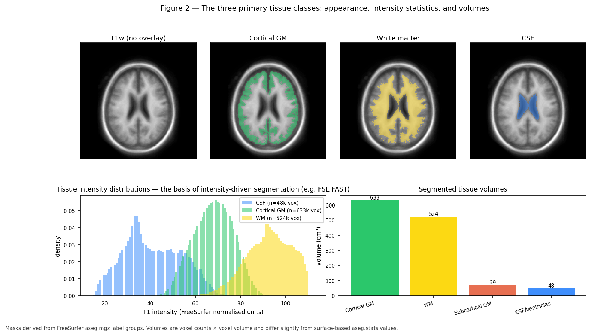

*Figure 2 — Cortical GM, WM, and CSF for this subject: spatial distribution (top), T1 intensity histograms (bottom left), and segmented volumes (bottom right). The overlapping histograms are precisely why intensity-only segmentation such as FSL FAST is imperfect at tissue boundaries.*

### *(Beginner)* What the three classes are

**Gray matter (GM)** — neuronal cell bodies, dendrites, synapses, and supporting glia. Where computation happens. Found in the cortical sheet and in deep nuclei. On T1-weighted MRI it is mid-gray, slightly darker than white matter.

**White matter (WM)** — bundles of myelinated axons. **Myelin** is a fatty insulating sheath wrapped around axons by oligodendrocytes; it speeds conduction roughly tenfold and, being fatty, appears **bright on T1**. This is the single most useful intensity fact in structural MRI.

**Cerebrospinal fluid (CSF)** — clear fluid produced mainly by the choroid plexus, filling ventricles and the subarachnoid space. It cushions the brain, removes waste, and appears **dark on T1** and **bright on T2**.

Approximate adult proportions: GM ~40–45%, WM ~35–40%, CSF ~10–20% of intracranial volume, with large normal variation by age and head size. This subject's measured values appear in Figure 2 and Section 19.

### *(Practitioner)* The partial volume problem

A voxel is typically 1 mm on a side for T1 and 2 mm for DWI in this pipeline. Tissue boundaries do not respect voxel boundaries, so a voxel straddling a boundary records a **weighted average** of the tissues within it. This is the **partial volume effect**, and it has three consequences you will meet constantly:

1. **Histograms overlap** (Figure 2). A voxel of intensity halfway between GM and WM may be pure boundary tissue, or genuinely ambiguous tissue. Intensity alone cannot resolve it.
2. **Thin structures are systematically mismeasured.** Cortex is 2–4 mm thick, so a 1 mm voxel sees at most a few voxels across the ribbon and sulcal CSF can vanish entirely.
3. **Segmentations disagree at boundaries** — which is exactly where tractography needs to be accurate, because ACT makes its stop/continue decisions there.

Two responses exist, and this pipeline uses both. **Partial volume estimation** represents each voxel as fractions rather than a hard label — the 5TT image is exactly this (Section 17). **Surface-based modelling** represents the boundary as a geometric object at sub-voxel resolution — this is FreeSurfer's approach and the basis of HSVS (Section 6).

### *(PhD)* Segmentation as statistical inference

Intensity-based segmentation is a mixture model. Given intensity \(y_v\) at voxel \(v\) and classes \(k\):

\[
p(y_v) = \sum_k \pi_k\, \mathcal{N}(y_v;\ \mu_k,\ \sigma_k^2)
\]

fitted by expectation–maximisation. **FSL FAST** adds two essential extensions:

- A **Markov random field prior** so neighbouring voxels are likely to share a class, suppressing noise-driven speckle.
- A simultaneously estimated smooth **bias field** \(b(v)\), because MRI intensity is not quantitative and drifts across the field of view: \(y_v = b(v)\,s_v + \varepsilon\).

The MRF is what makes FAST usable, and also what limits it: the smoothness prior that removes noise also smooths across genuinely thin structures. No amount of tuning recovers a sulcus narrower than a voxel from intensity alone — the information is not in the data. That is an argument from information content, not implementation quality, and it is the strongest justification for surface-based approaches.

Modern learning-based segmentation (FastSurfer's CNN, SynthSeg) replaces the generative model with a discriminative one trained on labelled data, gaining large speed and robustness advantages while inheriting a different weakness: behaviour on inputs unlike the training distribution — which is to say, on pathology (Section 21).

---

## 4. Subcortical gray matter

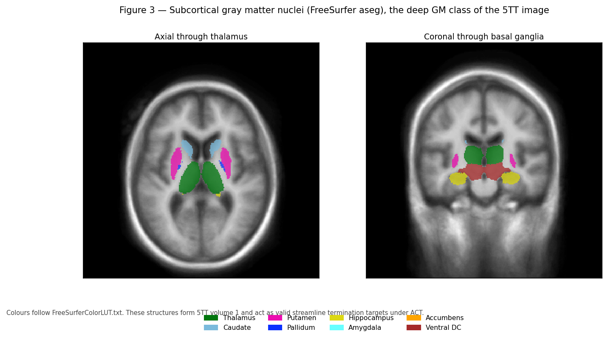

*Figure 3 — Deep gray matter nuclei from FreeSurfer `aseg.mgz`, axial through the thalamus and coronal through the basal ganglia. These structures form volume 1 of the 5TT image and are valid streamline termination targets under ACT.*

### *(Beginner)* The structures and what they do

| Structure | Location | Function | Notable in |
|-----------|----------|----------|-----------|
| **Thalamus** | Central, either side of third ventricle | Relay and gating of sensory, motor, and cognitive traffic | Almost every disorder; highly connected hub |
| **Caudate** | C-shaped, along lateral ventricle | Goal-directed action, learning | Huntington disease (early atrophy) |
| **Putamen** | Lateral to pallidum | Motor habit and sequence learning | Parkinsonian syndromes |
| **Globus pallidus** | Medial to putamen | Output nucleus of basal ganglia | Dystonia; DBS target |
| **Hippocampus** | Medial temporal lobe | Formation of new episodic memory | Alzheimer disease, epilepsy |
| **Amygdala** | Anterior to hippocampus | Emotional salience, fear learning | PTSD, anxiety |
| **Nucleus accumbens** | Ventral striatum | Reward, motivation | Addiction |
| **Ventral diencephalon** | Around hypothalamus | Composite label in `aseg` | — |
| **Brainstem** | Midbrain, pons, medulla | Vital functions, all ascending/descending traffic | Severe TBI, stroke |

**Caudate + putamen = striatum. Striatum + pallidum = basal ganglia**, functionally coupled with the substantia nigra and subthalamic nucleus in loops that select and gate actions.

### *(Practitioner)* Why deep GM is a separate tissue class

MRtrix's 5TT format separates cortical from subcortical GM (volumes 0 and 1), for three concrete reasons:

1. **Different intensity.** Deep nuclei contain more iron and different myelin density, so their T1 intensity sits between cortical GM and WM. An intensity-only classifier frequently mislabels thalamus as WM.
2. **Different geometry.** They are compact blobs surrounded by WM, not a thin folded sheet. Surface methods do not apply; volume labels do. HSVS therefore takes cortex from surfaces and deep nuclei from `aseg` — the "hybrid" in its name.
3. **Different tracking rules.** Streamlines terminate on entering deep GM as they do for cortex, but subcortical structures are also traversed by fibres passing nearby (for example the internal capsule between putamen and thalamus), so boundary precision directly changes tract counts.

For QC, deep GM structures are the most reliable indicators of segmentation quality, because their volumes are stable in health and their left/right symmetry is strong (Figure 11). A 20% thalamic asymmetry in a healthy young adult is a segmentation failure, not biology.

### *(PhD)* Hubs, rich clubs, and why thalamus dominates connectomes

The thalamus and other deep structures are consistently identified as **hubs** — high-degree, high-strength nodes — and as members of the **rich club**, the densely interconnected core of the structural connectome. This is biologically real: the thalamus genuinely projects to nearly all cortex.

It is also **partly an artefact of method**, and conflating the two is a common error in the literature. Three mechanisms inflate deep GM connectivity:

- **Volume bias.** Larger regions intersect more streamlines. Unless you normalise by node volume — the `sift_invnodevol` variant used in Figure 8 — bigger nodes look better connected by construction.
- **Central position.** Streamlines passing near a central structure are more likely to be assigned to it under radial-search assignment, especially with a generous search radius.
- **Termination rules.** ACT terminates streamlines at deep GM, converting fibres that merely pass nearby into apparent terminations.

Distinguishing genuine hub status from these biases requires explicit control: compare weighting schemes, vary the assignment radius, and test whether findings survive volume normalisation. Reviewers of connectomics papers ask this, and the honest answer is usually that the effect is real but smaller than the raw matrix suggests.

---

## 5. White matter organisation and the major tracts

### *(Beginner)* Three classes of fibre

White matter is organised by where axons start and end:

1. **Projection fibres** run vertically between cortex and lower structures. The **corticospinal tract** carries motor commands from cortex through the internal capsule and brainstem to the spinal cord; damage causes weakness. Thalamocortical fibres run the other way.
2. **Commissural fibres** cross the midline connecting the hemispheres. The **corpus callosum** is by far the largest, with named parts front to back: **rostrum, genu, body, isthmus, splenium**.
3. **Association fibres** connect regions within a hemisphere. Long ones include the **arcuate fasciculus** (language, temporal to frontal), **superior** and **inferior longitudinal fasciculi**, **uncinate fasciculus** (temporal to orbitofrontal), and **cingulum** (along the cingulate gyrus). Short **U-fibres** connect adjacent gyri just under the cortex.

### *(Practitioner)* Why fibre geometry limits tractography

Two geometric facts dominate what tractography can and cannot do.

**Crossing fibres.** Between one third and two thirds of white matter voxels contain axons running in more than one direction. A single diffusion tensor, which has one principal direction, cannot represent this. In a crossing region the tensor's principal eigenvector points somewhere between the true directions — often at neither. This is why the pipeline uses **constrained spherical deconvolution** to estimate a full **fibre orientation distribution** rather than a tensor, and why FA is a poor measure in crossing regions: FA drops where fibres cross, mimicking the drop caused by genuine damage.

**Bottlenecks and gyral bias.** Fibres fan out as they approach cortex and must turn sharply to enter the gyral crown. Streamline algorithms have a maximum curvature and preferentially terminate on gyral crowns rather than sulcal walls — the **gyral bias**. Combined with bottleneck regions where many distinct tracts share a narrow corridor, this makes streamline counts a biased estimator of connection strength. It is a known, quantified limitation, not a reason to abandon the method, but it must be stated in any paper.

### *(PhD)* From signal to orientation: the deconvolution model

The measured DWI signal on the sphere is modelled as a convolution of the fibre orientation distribution \(f\) with a single-fibre **response function** \(R\):

\[
S(\hat{\mathbf{u}}) = \int_{S^2} R(\hat{\mathbf{u}} \cdot \hat{\mathbf{v}})\, f(\hat{\mathbf{v}})\, d\hat{\mathbf{v}}
\]

In the spherical harmonic basis this becomes a per-order multiplication, so deconvolution is division — ill-posed and noise-amplifying at high order. **CSD** regularises by requiring \(f \ge 0\), which is both physically necessary and a strong enough constraint to stabilise the solution.

**Single-shell three-tissue CSD (SS3T)**, used by this pipeline's default recon spec, extends this to estimate WM, GM, and CSF compartments from data with a single non-zero b-value. It exploits the fact that the three tissues have distinct b-value-dependent signal decay, and resolves the ill-conditioning of the single-shell case with an iterative non-negativity-constrained scheme. The practical benefit is large: without tissue separation, CSF and GM partial volume in a voxel inflates the apparent WM signal, producing spurious FOD peaks precisely at the tissue boundaries where ACT is making decisions.

The relevant caveat for study design is that the response functions are estimated from the data, so they depend on the tissue actually present. In a cohort with substantial pathology, response estimation can be biased by lesioned tissue, which propagates into every downstream FOD. Group studies with heavy pathology should check response function stability across subjects.

---

## 6. Cortical organisation, surfaces, and parcellation

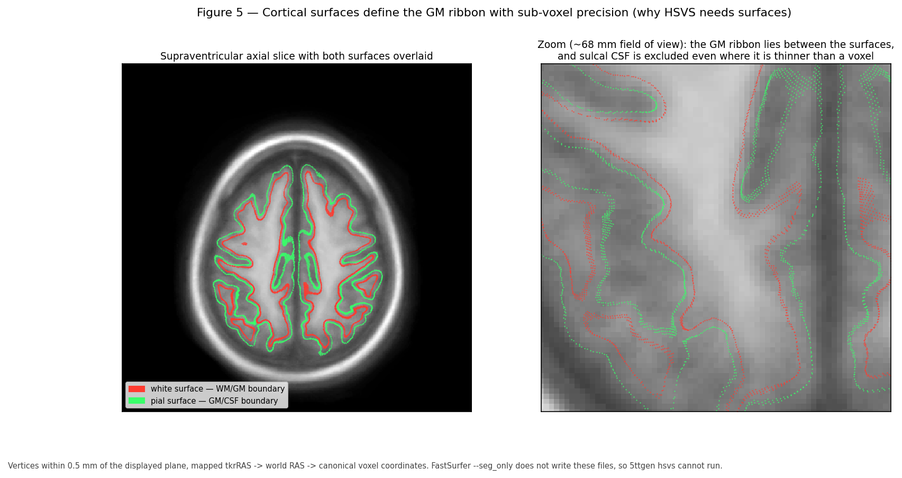

*Figure 5 — The white (red) and pial (green) surfaces for this subject on a supraventricular axial slice, with a ~68 mm zoom. The cortical ribbon is the volume between the surfaces. Sulcal CSF is excluded even where it is thinner than a voxel — the capability that volume-only segmentation cannot match.*

### *(Beginner)* The cortex as a sheet

The cerebral cortex is a sheet of tissue 2–4 mm thick with a layered microstructure — classically six layers, differing in cell type and connectivity. Its total area is roughly 1,800–2,400 cm² per hemisphere, folded to fit a skull that could otherwise not contain it. Roughly two-thirds of the surface lies within sulci, hidden from the outer view.

Two boundaries define the sheet:

- the **white surface**, between WM and GM (the inner boundary)
- the **pial surface**, between GM and CSF (the outer boundary)

**Cortical thickness** is the distance between them, typically 2–4 mm and thinning with age and in many diseases. FreeSurfer reconstructs both surfaces as triangular meshes with roughly 130,000–160,000 vertices per hemisphere and computes thickness per vertex.

### *(Practitioner)* Why surfaces beat voxels for cortex

Consider two adjacent gyri separated by a sulcus containing a sheet of CSF 0.5 mm thick, imaged at 1 mm resolution. Every voxel in the sulcus contains GM from both banks plus some CSF. A voxel-based segmentation sees continuous GM-ish intensity and labels the sulcus as gray matter, **merging the two banks**.

The consequence for tractography is direct and serious: a streamline arriving at one gyral bank can continue straight across the merged sulcus into the adjacent gyrus, creating a short, high-count, entirely fictitious connection. Because these false connections are between spatially adjacent regions, they appear as inflated short-range connectivity — a systematic bias, not random noise.

Surfaces solve this by construction. The pial surfaces of the two banks are distinct geometric objects with CSF between them, even where that CSF is thinner than a voxel, because the surface is placed using intensity gradients, curvature constraints, and topological requirements rather than per-voxel thresholding. This is exactly what Figure 5 shows, and it is the entire justification for **HSVS**.

**The engineering consequence, stated plainly:** ACT-HSVS requires `surf/{lh,rh}.{white,pial}`. FastSurfer's `--seg_only` mode runs only the segmentation CNN and does **not** run `recon-surf`, so it produces no surfaces, and `5ttgen hsvs` cannot run. Either run full FastSurfer (as job 48173 did) or switch the recon spec to `ACT-fast`, which builds a 5TT from FSL FAST volumes instead. There is no way to get HSVS quality from `--seg_only` output.

### *(Practitioner)* Parcellation: turning cortex into regions

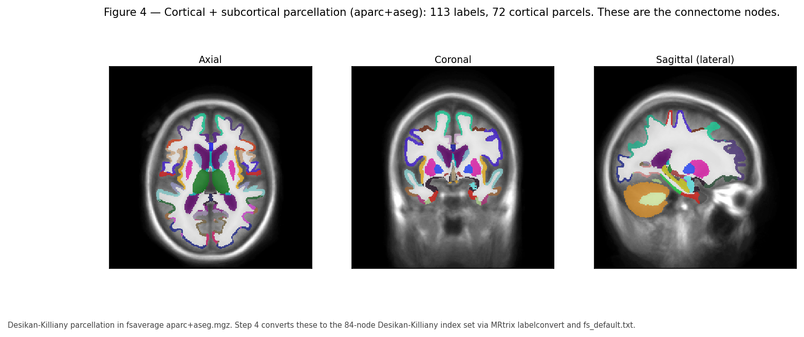

*Figure 4 — The parcellation for this subject. Each colour is a distinct anatomical region and becomes a node in the connectome.*

A **parcellation** divides cortex into labelled regions. This matters because a connectome needs discrete nodes, and the choice of parcellation changes every result downstream.

| Atlas | Regions | Basis | Where it appears here |
|-------|---------|-------|----------------------|
| **Desikan–Killiany (DK)** | 34 cortical per hemisphere | Gyral and sulcal landmarks | Step 4 output after `recon-all`, 84 nodes with subcortical |
| **DKT (Desikan–Killiany–Tourville)** | 31 cortical per hemisphere | DK with refined, more reproducible boundaries | What FastSurfer produces; Step 4 output after FastSurfer, 78 nodes |
| **Destrieux** | 74 per hemisphere | Explicit gyral/sulcal division | FreeSurfer `aparc.a2009s` |
| **4S (4S156 and larger)** | 156 and up | Multi-scale, includes subcortical and cerebellar | QSIRecon atlas connectome, Figure 8 |
| **Schaefer** | 100–1000 | Functional connectivity boundaries | Common in functional work |

**A subtlety specific to this repository.** FastSurfer writes DKT labels into `aparc+aseg.mgz` (in this subject, a symlink to `aparc.DKTatlas+aseg.mapped.mgz`), and the DKT protocol does not define three DK regions: **bankssts**, the **frontal pole** and the **temporal pole**. Step 4 originally applied MRtrix `labelconvert` with `fs_default.txt`, the **DK** lookup table, to that DKT segmentation. The result was an 84-node matrix in which 6 nodes — those three regions, bilaterally — were structurally empty, because the labels the DK table asks for are simply not in the image. `tck2connectome` warned about exactly those indices: 1, 31, 32, 50, 80, 81.

Step 4 now matches the lookup table to the segmentation. A `recon-all` subject uses `fs_default.txt` and yields the 84-node DK matrix; a FastSurfer subject uses `fs_dkt.txt` and yields a **78-node DKT matrix with no empty nodes**. Which table was used is recorded per subject in `dk_parcellation.json`, and the matrix is named for it (`dk_connectome.csv` or `dkt_connectome.csv`) so the two can never be confused — they have different dimensions and must not be pooled.

This is a relabelling, not a change to the tractography. Verified on this subject: the 78-node DKT matrix is *exactly* the 84-node DK matrix with those 6 rows and columns deleted — 0 differing cells, and the same 15,425,166 assigned streamlines. The 6 nodes that disappeared were empty rows all along.

**DKT can also be obtained from a `recon-all` subject.** FreeSurfer writes both atlases — `aparc+aseg.mgz` (DK) and `aparc.DKTatlas+aseg.mgz` (DKT) — so setting `DK_PARCELLATION=dkt` reads the latter and yields a genuine 78-node DKT matrix. The reverse is not possible: a FastSurfer tree has no DK parcellation whatsoever. That asymmetry is worth knowing before committing a cohort, because `recon-all` keeps both options open at the cost of a re-run of Step 4 alone, whereas FastSurfer fixes the atlas at Step 2.

**For a methods section:** report the recon tool and the parcellation together, since the recon tool constrains which atlases are available. Note that a cohort processed with a mix of the two tools has DKT as its only common node set.

### *(PhD)* The parcellation problem is not solved

There is no correct parcellation, and this is a live methodological problem rather than a detail.

- **Scale changes topology.** Graph metrics — degree distribution, small-worldness, modularity — depend systematically on node count. Comparing a 68-node result to a 156-node result is not meaningful without explicit correction.
- **Anatomical landmarks are not functional boundaries.** DK boundaries follow gyri; gyral anatomy and functional areas correspond only loosely. A single DK region may contain multiple functional areas with different connectivity.
- **Node definition dominates edge estimation.** Reproducibility studies consistently find that parcellation choice explains more variance in graph metrics than tractography algorithm choice.
- **Individual variability is large.** Fixed atlases mapped to individuals absorb real inter-subject differences in areal boundaries into apparent connectivity differences.

Defensible practice: pre-register the parcellation, report at least one alternative as a robustness check, and never compare graph metrics across parcellations without accounting for scale.

---

## 7. Physiology a research engineer must know

### *(Beginner)* Four systems that shape the images

**Blood supply and metabolism.** The brain is ~2% of body mass but consumes ~20% of resting oxygen and glucose, with almost no local energy reserve. Interruption of flow causes dysfunction within seconds and irreversible death of tissue within minutes. This is why stroke is time-critical and why the **ischaemic penumbra** — tissue that is hypoperfused but not yet dead — is the target of acute treatment.

**The blood–brain barrier (BBB).** Brain capillaries have tight junctions and astrocytic support, excluding most large molecules and creating a protected chemical environment. Two imaging consequences follow directly:
- **Gadolinium contrast** cannot leave intact vessels, so **enhancement means BBB disruption** — tumour, inflammation, infection, or subacute infarct.
- BBB breakdown lets plasma leak into tissue, producing **vasogenic oedema**.

**CSF circulation.** Roughly 500 mL/day is produced, mostly by the choroid plexus, circulating from lateral to third to fourth ventricle, then into the subarachnoid space and out via arachnoid granulations and glymphatic/lymphatic routes. Obstruction anywhere in this path causes **hydrocephalus**.

**Autoregulation and intracranial pressure.** Cerebral blood flow is held roughly constant across a range of blood pressures by autoregulation. Because the skull is closed, the **Monro–Kellie doctrine** applies: the sum of brain, blood, and CSF volume is fixed, so added volume must displace something. Compensation is initially effective and then abruptly fails, which is why deterioration in raised intracranial pressure is non-linear and sudden.

### *(Practitioner)* Oedema: two kinds, opposite implications

Distinguishing the two types of brain swelling is one of the highest-value interpretation skills, because they mean different things and behave differently on diffusion imaging.

| | **Cytotoxic (cellular) oedema** | **Vasogenic oedema** |
|---|---|---|
| **Mechanism** | Energy failure; Na⁺/K⁺ pump stops; water moves into cells | BBB breakdown; plasma leaks into extracellular space |
| **Water location** | Intracellular | Extracellular |
| **Water mobility** | **Restricted** | **Increased** |
| **DWI (b>0)** | **Bright** | Mildly bright |
| **ADC** | **Low** — the signature | **High** |
| **Distribution** | Follows vascular territory; involves GM and WM | Spreads along WM tracts, spares cortex |
| **Typical cause** | Acute ischaemic stroke | Tumour, abscess, contusion, inflammation |

The **DWI-bright with low ADC** combination is the classic acute infarct signature and the reason DWI transformed stroke imaging. Note that "bright on DWI" alone is insufficient — T2 shine-through can produce it — so ADC must always be read alongside.

For the pipeline: vasogenic oedema raises water content in WM, lowering FA and altering FOD amplitude. Tractography through oedematous WM may fail even when axons are structurally intact, so reduced connectivity in a peri-lesional region cannot be interpreted as axonal loss without corroboration.

### *(PhD)* Plasticity, degeneration, and interpreting longitudinal change

Structural connectivity changes over time through several mechanisms with very different meanings, and separating them is the central inferential challenge of longitudinal connectomics.

- **Wallerian degeneration.** After axonal transection, the distal segment degenerates over weeks to months. Diffusion changes therefore evolve long after the injury, and a scan at two weeks and one at six months measure different biology.
- **Diaschisis.** Function and structure change in regions remote from but connected to a lesion. Reduced connectivity in intact tissue may be a network consequence rather than local damage.
- **Plasticity and reorganisation.** Genuine remodelling of connections, typically modest in adults over months.
- **Myelin change.** Both loss and activity-driven myelination alter diffusion without changing axon count.
- **Non-biological drift.** Scanner upgrades, coil changes, software version changes, and sequence tweaks all produce apparent longitudinal effects. This is often the largest effect in a poorly controlled longitudinal study.

Because diffusion metrics are sensitive but not specific, none of these can be distinguished by DWI alone. Strong designs use multiple timepoints, fix acquisition and software versions across the study, include a travelling-phantom or test–retest subset, and where possible add complementary contrasts such as quantitative T1, myelin water imaging, or MTR.

---

## 8. How MRI turns biology into numbers

### *(Beginner)* Where the signal comes from

MRI measures hydrogen nuclei — protons, mostly in water and fat. Placed in a strong static field \(B_0\) (1.5 T or 3 T clinically), protons preferentially align with it, producing net magnetisation. A radiofrequency pulse tips this magnetisation; as it returns to equilibrium it induces a measurable signal in receiver coils.

Two independent relaxation processes govern contrast:

- **T1 (longitudinal) relaxation** — recovery of magnetisation along \(B_0\). **Fat and myelin have short T1 and appear bright** on T1-weighted images.
- **T2 (transverse) relaxation** — decay of magnetisation in the transverse plane. **Water has long T2 and appears bright** on T2-weighted images.

Spatial encoding uses magnetic field **gradients** so that resonant frequency depends on position; the acquired data (**k-space**) is the spatial Fourier transform of the image, inverted at reconstruction.

### *(Practitioner)* The sequences you will meet, and what each is for

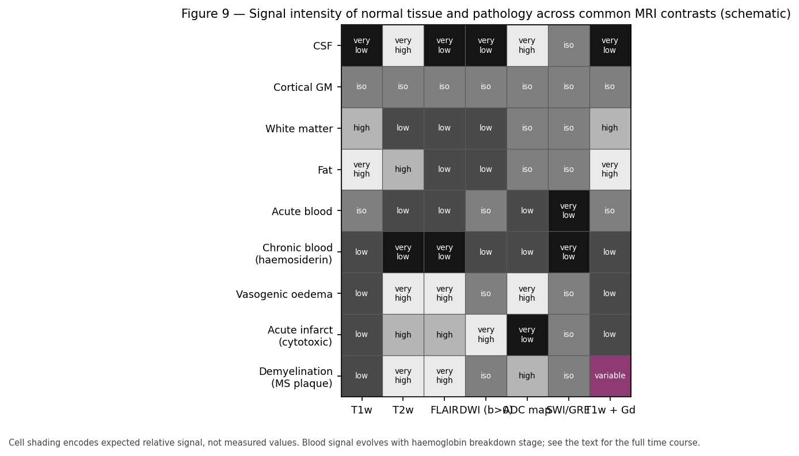

*Figure 9 — Expected signal intensity of normal tissue and common pathology across standard sequences. This panel is a schematic reference table, not measured data; shading encodes expected relative signal.*

| Sequence | Bright | Primary use | Pipeline relevance |
|----------|--------|-------------|--------------------|
| **T1w (MPRAGE)** | Fat, myelin, subacute blood, Gd enhancement | Anatomy, segmentation, morphometry | **The anatomical input.** FreeSurfer/FastSurfer require it |
| **T2w** | Water, oedema, gliosis, CSF | Pathology detection | Lesion delineation |
| **FLAIR** | Water, but CSF suppressed | Periventricular and cortical lesions | Best for WM hyperintensities, MS plaques |
| **DWI** | Restricted diffusion | Acute infarct, cellularity | **The diffusion input** for tractography |
| **ADC map** | Free diffusion (bright = high mobility) | Confirms restriction, excludes shine-through | Always read with DWI |
| **SWI / GRE** | — (blood/iron dark) | Microbleeds, calcification, DAI | Detects haemorrhagic DAI missed elsewhere |
| **T1w + Gd** | BBB breakdown | Tumour, infection, active inflammation | Not used here |

**Why T1w for morphometry.** Segmentation needs strong, reliable GM/WM contrast at high isotropic resolution with minimal distortion. A 1 mm isotropic MPRAGE delivers this; T2 and FLAIR do not have comparable GM/WM contrast, and EPI-based sequences are geometrically distorted.

**Why DWI for connectivity.** Only diffusion weighting provides orientation information, because it measures directionally dependent water mobility, which in coherent WM aligns with axons.

### *(PhD)* Diffusion encoding, the b-value, and the acquisition trade space

Diffusion weighting uses a pair of gradient pulses so that molecular displacement between them causes signal loss. For Gaussian diffusion the Stejskal–Tanner relation gives

\[
S(b, \hat{\mathbf{g}}) = S_0 \exp\!\left(-b\, \hat{\mathbf{g}}^\top \mathbf{D}\, \hat{\mathbf{g}}\right),
\qquad
b = \gamma^2 G^2 \delta^2 \left(\Delta - \tfrac{\delta}{3}\right)
\]

where \(\gamma\) is the gyromagnetic ratio, \(G\) the gradient amplitude, \(\delta\) the pulse duration, \(\Delta\) the separation, and \(\mathbf{D}\) the diffusion tensor.

The acquisition trade space is unforgiving, and understanding it explains most of the design of this pipeline:

- **Higher b** increases angular contrast and reduces the isotropic contribution, improving crossing-fibre resolution — but signal decays exponentially, so SNR falls. **b ≈ 1000 s/mm²** is the clinical standard used here; **b ≥ 2000** is preferred for high-quality CSD but demands more averaging or better hardware.
- **More directions** improve FOD estimation; the achievable spherical harmonic order is limited by direction count (order 8 needs at least 45 directions).
- **Multiple shells** enable multi-tissue CSD but multiply scan time. **Single-shell data is why SS3T exists** — it recovers three-tissue behaviour from one shell, which is what makes ACT-HSVS feasible on clinical acquisitions like this cohort's.
- **Smaller voxels** reduce partial volume but cut SNR as the cube of the dimension.

Beyond the Gaussian model, **NODDI**, **DKI**, and **spherical mean techniques** estimate microstructural parameters (neurite density, orientation dispersion, kurtosis) with more biological specificity, at the cost of longer acquisitions and stronger modelling assumptions. They are complementary to, not replacements for, tractography.

**Preprocessing is not optional.** QSIPrep's chain — denoising, Gibbs ringing removal, eddy current and motion correction, susceptibility distortion correction, bias correction, and registration to T1w — is what makes the DWI geometrically comparable to the anatomy. Susceptibility distortion in particular displaces EPI signal by many millimetres near air–tissue interfaces (orbitofrontal and temporal regions especially). Uncorrected, the WM mask and the diffusion data disagree about where tissue is, and ACT then terminates valid streamlines and permits invalid ones. Distortion correction is therefore a prerequisite for anatomically constrained tracking, not a refinement of it.

---

## 9. Reading an MRI: systematic interpretation

### *(Beginner)* A checklist that catches most things

Radiologists work systematically because unsystematic review misses findings. A serviceable order for research QC:

1. **Check the basics.** Right subject, right sequence, expected coverage, orientation labels sane.
2. **Symmetry.** Compare left with right for every structure. Asymmetry is the most sensitive general sign.
3. **Midline.** Is the septum, third ventricle, and pineal region central? Shift means mass effect.
4. **Ventricles.** Size appropriate for age? Symmetric? Focally compressed or dilated?
5. **Extra-axial spaces.** Any collection between brain and skull? Crescentic or lens-shaped?
6. **Gray–white boundary.** Crisp everywhere? Blurring suggests oedema, dysplasia, or infiltration.
7. **Systematic sweep.** Frontal, parietal, temporal, occipital, insula; then basal ganglia, thalamus, corpus callosum, brainstem, cerebellum.
8. **Non-brain structures.** Skull, sinuses, orbits, scalp — pathology hides at the edges of the field of view.
9. **Compare sequences.** Any finding should be characterised on at least two contrasts.
10. **Compare with prior imaging** if available. Change over time is often more informative than any single scan.

### *(Practitioner)* Describing a finding

A useful description answers six questions, in this order:

| Question | Options |
|----------|---------|
| **Where?** | Lobe, GM vs WM, cortical vs subcortical vs periventricular, vascular territory |
| **How many?** | Single, few, multiple, confluent |
| **How big?** | Measure in millimetres, on the plane where largest |
| **What signal?** | On each available sequence, relative to normal GM and WM |
| **Mass effect?** | Sulcal effacement, ventricular compression, midline shift, herniation |
| **Enhancement?** | None, homogeneous, ring, nodular, leptomeningeal |

The distinction that most often determines interpretation is **location within GM versus WM versus both**, because it separates broad disease categories: demyelination is periventricular WM, embolic infarct respects vascular territories and involves both, metastases sit at the GM–WM junction, and DAI concentrates at the GM–WM junction, corpus callosum, and brainstem.

### *(PhD)* Sensitivity, specificity, and the limits of signal

Two habits of thought separate rigorous from sloppy interpretation of quantitative imaging.

**Diffusion metrics are sensitive and non-specific.** Reduced FA is compatible with axonal loss, demyelination, oedema, increased fibre dispersion, more crossing fibres, or partial volume with CSF. Reporting "reduced FA indicates white matter damage" overstates what the measurement supports. The defensible form states the observation and enumerates the candidate mechanisms.

**Automated findings need a base rate.** Many "abnormalities" are common in healthy people, and their prevalence rises steeply with age: white matter hyperintensities, incidental cysts, cavum septum pellucidum, mild ventricular asymmetry. Without an age-matched normative distribution, a per-subject deviation is uninterpretable. This is why normative modelling — expressing each subject as a centile against a large reference cohort — has become standard practice for individual-level inference.

---

## 10. Lesions: mechanisms and appearances

### *(Beginner)* The vocabulary

| Term | Meaning |
|------|---------|
| **Lesion** | Any area of abnormal tissue |
| **Focal / diffuse** | Localised / widely distributed |
| **Acute / subacute / chronic** | Roughly: days / weeks / months onwards |
| **Ischaemia / infarct** | Insufficient blood flow / resulting dead tissue |
| **Haemorrhage** | Bleeding |
| **Oedema** | Excess water (Section 7) |
| **Gliosis** | Glial scar; the brain's healing response |
| **Encephalomalacia** | Softened, cavitated tissue after injury; the end stage |
| **Atrophy** | Tissue volume loss |
| **Mass effect** | Displacement of structures by added volume |
| **Enhancement** | Gd uptake indicating BBB breakdown |

### *(Practitioner)* Blood on MRI evolves — and the stage tells you the age

Haemorrhage signal changes predictably as haemoglobin degrades. This is genuinely useful because it dates a bleed, and it is also a classic exam topic.

| Stage | Time | Haemoglobin form | T1 | T2 |
|-------|------|------------------|----|----|
| Hyperacute | < 24 h | Oxyhaemoglobin | iso | bright |
| Acute | 1–3 d | Deoxyhaemoglobin | iso | **dark** |
| Early subacute | 3–7 d | Intracellular methaemoglobin | **bright** | dark |
| Late subacute | 1–4 wk | Extracellular methaemoglobin | **bright** | **bright** |
| Chronic | months+ | Haemosiderin / ferritin | dark | **dark** |

Two practical points. **Haemosiderin is permanently dark on T2 and especially on SWI**, so old microbleeds remain detectable indefinitely — the basis for detecting remote haemorrhagic DAI. And **acute blood is nearly invisible on T1**, which is why CT (where acute blood is bright) remains the first-line test in acute trauma.

### *(Practitioner)* Patterns that break automated pipelines

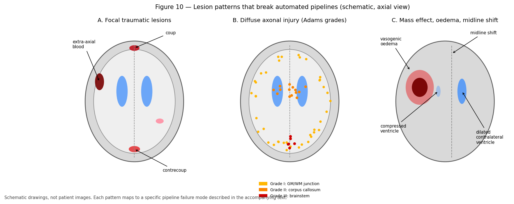

*Figure 10 — Schematic axial illustrations of three lesion patterns with distinct engineering consequences: focal traumatic lesions, the distribution of diffuse axonal injury by Adams grade, and mass effect with midline shift. These are drawings, not patient images.*

### *(PhD)* Lesions as a domain shift problem

It is productive to frame pathology as **distribution shift** rather than as a special case requiring bespoke handling.

Segmentation tools — whether generative like FAST or discriminative like FastSurfer's CNN — encode a model of what brains look like. Registration encodes an assumption of topological correspondence between subject and template. Surface reconstruction assumes the cortex is a topological sphere with a continuous ribbon of predictable intensity. **Every one of these assumptions is violated by a resection cavity, a large tumour, or a haemorrhage.**

The failures are therefore not random but structured and predictable:

- Intensity models assign lesion voxels to whichever normal class is nearest in intensity, typically labelling a chronic cavity as CSF and acute blood as WM.
- Registration compensates for a lesion by distorting the surrounding normal anatomy, so error propagates well beyond the lesion.
- Topology-constrained surface placement fails when the actual topology differs, and the failure can propagate across the whole hemisphere.
- Deep networks are confidently wrong out of distribution and give no useful uncertainty signal by default.

Mitigations, roughly in increasing order of effort: exclude affected regions from analysis and say so; use **cost-function masking** so lesion voxels do not drive registration; **virtually fill** the lesion with plausible tissue before processing; use lesion-aware or explicitly lesion-modelling tools; or analyse in native space and avoid template registration altogether. Each trades bias against variance and coverage differently, and the choice should be stated and justified in the methods.

---

## 11. Traumatic brain injury in depth

TBI is this project's domain, so it gets extended treatment.

### *(Beginner)* Mechanism, and the primary/secondary distinction

Injury forces come in two kinds. **Contact loading** — a direct blow — produces skull fracture and focal contusion under the impact. **Inertial loading** — acceleration, deceleration, and especially rotation — produces shearing forces throughout the brain and causes diffuse injury.

**Primary injury** occurs at the moment of impact: contusion, haemorrhage, axonal shearing. It is not modifiable after the fact.

**Secondary injury** develops over hours to days: oedema, raised intracranial pressure, ischaemia, excitotoxicity, inflammation, and eventually apoptosis. It is the target of clinical management, and it is why a patient can deteriorate substantially after a lucid interval.

**Severity** is graded clinically, most commonly by the Glasgow Coma Scale (GCS): mild 13–15, moderate 9–12, severe ≤ 8, supplemented by duration of loss of consciousness and post-traumatic amnesia. Crucially, **most mild TBI has a normal clinical CT or MRI**, which is precisely the motivation for quantitative diffusion and connectomic measures — they aim to detect injury that conventional imaging misses.

### *(Practitioner)* Focal traumatic lesions

**Contusion** — bruising of cortex, most often where the brain strikes bony ridges: **inferior frontal** and **anterior temporal** lobes. **Coup** contusion is under the impact site; **contrecoup** is diametrically opposite, often the larger of the two. Contusions are cortical and haemorrhagic, and they evolve into encephalomalacia and gliosis.

**Extra-axial haemorrhage** — blood outside the brain, classified by which meningeal layer it is bounded by. Shape distinguishes them and shape is the diagnostic key:

| Type | Space | Shape | Crosses sutures? | Crosses midline? | Typical source |
|------|-------|-------|------------------|------------------|----------------|
| **Epidural** | Between skull and dura | **Lens-shaped (biconvex)** | No | Yes | Arterial, often middle meningeal |
| **Subdural** | Between dura and arachnoid | **Crescentic** | Yes | No | Venous, bridging veins |
| **Subarachnoid** | In subarachnoid space | Fills sulci and cisterns | — | — | Traumatic or aneurysmal |
| **Intraventricular** | Within ventricles | Layers dependently | — | — | Extension of other bleeds |

Epidural haematoma classically presents with a **lucid interval** followed by rapid deterioration, because arterial bleeding accumulates until compensation fails abruptly. Subdural haematoma is commoner in the elderly and in atrophy, where stretched bridging veins tear easily.

### *(Practitioner)* Diffuse axonal injury — the key entity for connectomics

**DAI** is the most important TBI pathology for this pipeline. Rotational acceleration shears axons where tissues of differing density and stiffness meet, injuring axons across widespread white matter without necessarily producing any focal lesion.

The **Adams grading** describes a predictable spatial progression with increasing injury severity:

| Grade | Distribution | Implication |
|-------|--------------|-------------|
| **I** | GM–WM junction of the lobes | Mildest; often imaging-negative |
| **II** | Grade I plus **corpus callosum** | Interhemispheric disconnection |
| **III** | Grade II plus **dorsolateral brainstem** | Severe; associated with poor outcome and coma |

Why this matters for engineering:

- **DAI is frequently invisible on conventional MRI**, especially non-haemorrhagic DAI, and especially in mild TBI. Only microbleeds are reliably detected, and only on SWI/GRE.
- **The pathology is axonal**, which is exactly what diffusion MRI is sensitive to. Reduced FA and altered connectivity in the corpus callosum and at GM–WM junctions are the expected signatures.
- **The pathology is a disconnection**, so a network model is biologically appropriate rather than merely fashionable. This is the strongest scientific justification for building connectomes in a TBI cohort.
- **Effects are subtle and distributed**, so studies need adequate sample sizes, careful harmonisation, and network-level statistics rather than region-by-region testing (Section 22).

### *(PhD)* Chronic sequelae and longitudinal design

Beyond the acute phase, TBI produces **post-traumatic atrophy** (often disproportionate in the thalamus, hippocampus, and corpus callosum), **chronic traumatic encephalopathy** after repetitive injury (a tau pathology diagnosable definitively only at autopsy), **post-traumatic epilepsy**, and **post-traumatic hydrocephalus**.

For study design, three problems recur in the TBI connectomics literature and are worth anticipating:

1. **Timing dominates.** Wallerian degeneration, oedema resolution, and atrophy all evolve on different timescales. A cross-sectional cohort scanned at heterogeneous intervals confounds injury severity with time since injury. This cohort's session labels (for example `ses-2WK`) exist precisely to control this and must be modelled, not ignored.
2. **Heterogeneity is extreme.** Mechanism, severity, lesion location, age, and pre-injury status all vary. Group means can be near-zero while individual effects are large, which argues for individual-level normative comparison alongside group tests.
3. **Pipeline failures correlate with severity.** More severely injured brains are harder to segment and register, so QC-based exclusions are **not** missing-at-random — they systematically remove the most affected subjects and bias effects toward zero. Report QC exclusions by group and, where possible, quantify the bias.

---

## 12. Vascular disease

### *(Beginner)* Stroke

**Ischaemic stroke** (~85%) results from arterial occlusion; **haemorrhagic stroke** (~15%) from vessel rupture. Distinguishing them is the first task in acute imaging because treatment is opposite: thrombolysis helps one and kills in the other.

Ischaemic infarct evolves through characteristic imaging stages:

| Phase | Time | DWI | ADC | T2/FLAIR | Enhancement |
|-------|------|-----|-----|----------|-------------|
| Hyperacute | < 6 h | **bright** | **low** | normal | none |
| Acute | 6 h – 3 d | bright | low | bright | none |
| Subacute | 3 d – 3 wk | variable | normalising | bright | present |
| Chronic | > 3 wk | iso/dark | **high** | bright, volume loss | none |

The **ADC pseudo-normalisation** at roughly 1–2 weeks is a well-known trap: ADC passes through normal values on its way from low to high, so a normal ADC does not exclude infarct at that stage.

Infarcts respect **vascular territories** (Section 2), which is the main feature distinguishing them from demyelinating or traumatic lesions.

### *(Practitioner)* Small vessel disease

Far more common in research cohorts than acute stroke, and highly relevant because it affects white matter and therefore tractography.

**White matter hyperintensities (WMH)** are FLAIR-bright periventricular and deep WM regions reflecting chronic ischaemia, demyelination, and gliosis. They are graded by the **Fazekas scale** (0–3 separately for periventricular and deep WM) and are near-universal with advancing age. **Lacunar infarcts** are small (< 15 mm) deep infarcts that cavitate. **Enlarged perivascular spaces** are CSF-filled spaces around penetrating vessels, normal in small numbers. **Cerebral microbleeds** appear as dark dots on SWI, with lobar distribution suggesting amyloid angiopathy and deep distribution suggesting hypertension.

The consolidated reporting framework is **STRIVE** (Standards for Reporting Vascular Changes on Neuroimaging), which is the standard to cite and follow.

**Engineering consequence:** WMH intensity resembles GM on T1, so intensity-based segmentation frequently misclassifies WMH as gray matter, producing spurious "GM islands" deep in white matter. This inflates GM volume, corrupts the 5TT WM map, and causes ACT to terminate streamlines in the middle of white matter. In any cohort older than about 50, WMH handling is a decision you must make explicitly rather than accept by default.

### *(PhD)* Perfusion, collaterals, and quantitative vascular imaging

The penumbra concept formalises tissue at risk as the mismatch between a **perfusion** deficit and the already-infarcted **diffusion** core, and it underpins modern extended-window thrombectomy trials. Quantifying it requires perfusion imaging — dynamic susceptibility contrast, arterial spin labelling — yielding CBF, CBV, MTT, and Tmax maps.

For structural connectivity research, three interactions with vascular status are worth attention: WMH burden is a confounder correlated with age and vascular risk and should usually be a covariate; small vessel disease reduces FA globally, which can masquerade as a disease effect; and collateral status modulates the relationship between occlusion and tissue outcome, so structural connectivity after stroke depends on haemodynamics as well as anatomy.

---

## 13. Neurodegenerative and demyelinating disease

### *(Practitioner)* Atrophy patterns are diagnostic

Neurodegenerative diseases are distinguished less by any single finding than by **which regions atrophy first**. This makes automated morphometry genuinely useful.

| Disease | Earliest atrophy | Other features |
|---------|------------------|----------------|
| **Alzheimer disease** | **Medial temporal**: hippocampus, entorhinal cortex; then temporoparietal | Amyloid and tau biomarkers; posterior cingulate hypometabolism |
| **Frontotemporal dementia** | **Frontal and anterior temporal**, often asymmetric | Behavioural or language onset by subtype |
| **Dementia with Lewy bodies** | Relatively preserved hippocampus; occipital involvement | Visual hallucinations, parkinsonism |
| **Progressive supranuclear palsy** | **Midbrain** ("hummingbird" sign on sagittal) | Vertical gaze palsy |
| **Multiple system atrophy** | Pons, cerebellum ("hot cross bun" on axial) | Autonomic failure |
| **Huntington disease** | **Caudate**, then putamen | Autosomal dominant; chorea |
| **Amyotrophic lateral sclerosis** | Corticospinal tract; motor cortex | Often subtle on structural MRI |

**Hippocampal volume** and **medial temporal atrophy** scores are used clinically, and this is the clearest example of an automated pipeline output entering practice. It also sets the accuracy bar: to be useful in Alzheimer disease, hippocampal segmentation must be reliable to a few percent, because annual atrophy rates are of that order.

### *(Practitioner)* Multiple sclerosis

MS is an inflammatory demyelinating disease producing focal WM plaques with characteristic locations: **periventricular**, **juxtacortical**, **infratentorial**, and **spinal cord**, plus cortical lesions detectable at high field. Plaques are ovoid, often perpendicular to the ventricles (**Dawson's fingers**).

Diagnosis uses the **McDonald criteria**, requiring dissemination in **space** (multiple typical locations) and in **time** (new lesions, or simultaneous enhancing and non-enhancing lesions). **Active lesions enhance** with gadolinium; enhancement resolves over weeks. Chronic disease produces **black holes** on T1 and progressive atrophy, and atrophy correlates with disability better than lesion count does — the "clinico-radiological paradox".

**Engineering consequence:** MS lesions sit in exactly the periventricular WM that tractography depends on. Lesions alter intensity so segmentation misclassifies them, and they alter diffusion so tracking fails through them. Reduced connectivity in MS reflects a combination of genuine demyelination and axonal loss with tracking failure, and separating these requires explicit lesion masking and sensitivity analysis.

### *(PhD)* Network degeneration and selective vulnerability

A powerful contemporary framework holds that neurodegenerative diseases **propagate along network connections** rather than through spatially contiguous spread: misfolded proteins spread trans-synaptically, and regions atrophy in patterns matching the connectivity of an epicentre. This makes structural connectomics mechanistically relevant rather than merely descriptive, and it generates testable predictions — atrophy patterns should match connectivity-based predictions from a disease-specific epicentre.

Two methodological cautions apply. Structural connectivity is itself degraded by the disease being studied, so cross-sectional connectivity cannot cleanly serve as the substrate for spread; healthy-cohort connectomes are usually used as the reference topology, which assumes topology is preserved. And the correlation between predicted and observed atrophy patterns is often driven substantially by shared spatial autocorrelation, so appropriate null models — spin tests, rewiring preserving degree and spatial embedding — are essential rather than optional.

---

## 14. Tumours, infection, and other abnormalities

### *(Practitioner)* Tumours

| Type | Typical appearance | Notes |
|------|--------------------|-------|
| **Glioma (low grade)** | T2/FLAIR bright, little or no enhancement, little oedema | Infiltrative; margins exceed the visible abnormality |
| **Glioblastoma** | **Ring enhancement** with central necrosis, marked oedema | Crosses corpus callosum ("butterfly") |
| **Meningioma** | Extra-axial, dural-based, avidly enhancing | Displaces rather than infiltrates; a CSF cleft is the key sign |
| **Metastases** | Multiple, at the **GM–WM junction**, ring-enhancing, oedema disproportionate to size | Location reflects haematogenous spread |
| **Lymphoma** | Periventricular, homogeneously enhancing, restricted diffusion | Immunocompromise increases risk |

The single most useful distinction is **intra-axial versus extra-axial**, because it separates lesions arising within brain tissue from those compressing it from outside, with completely different implications.

A defining property for engineering purposes is that **infiltrative gliomas extend beyond their imaging margin**. Tumour cells are present in tissue that appears normal, so a lesion mask drawn on imaging understates the affected region, and apparently normal peri-tumoural WM is not normal.

### *(Practitioner)* Infection and inflammation

**Abscess** — ring-enhancing with a smooth, thin wall and **restricted diffusion centrally** (pus is viscous and cellular), which is the key feature distinguishing it from necrotic tumour, where the centre has facilitated diffusion. **Meningitis** shows leptomeningeal enhancement and often no parenchymal abnormality. **Encephalitis** — herpes simplex classically involves medial temporal lobes asymmetrically. **Neurocysticercosis** shows cysts at various stages and is a leading cause of epilepsy globally.

**Autoimmune and inflammatory** conditions — autoimmune encephalitis, ADEM, vasculitis, neurosarcoidosis — produce diverse patterns and are diagnosed with clinical and laboratory data rather than imaging alone.

### *(Practitioner)* Structural and developmental abnormalities

**Hydrocephalus** — CSF accumulation. **Communicating** (impaired absorption) versus **obstructive** (a blockage, with dilatation upstream of it). **Normal pressure hydrocephalus** shows ventriculomegaly disproportionate to sulcal enlargement, with a classic triad of gait disturbance, cognitive decline, and urinary incontinence.

**Malformations of cortical development** — focal cortical dysplasia (a common cause of drug-resistant epilepsy, often subtle), heterotopia (gray matter in the wrong place), polymicrogyria, lissencephaly, schizencephaly. These are especially destructive to automated pipelines because they violate the topological assumptions of surface reconstruction outright.

**Chiari malformation** — cerebellar tonsillar descent below the foramen magnum. **Agenesis of the corpus callosum** — absent or partial callosum with characteristic ventricular configuration; it obviously invalidates any interhemispheric connectivity comparison against normal templates.

### *(PhD)* Advanced imaging and the surgical context

In neuro-oncology, tractography has direct clinical application in **presurgical planning**: mapping the corticospinal tract, arcuate fasciculus, and optic radiations to guide resection and preserve function. This is the highest-stakes use of the methods in this repository, and its requirements differ from research use in instructive ways.

Accuracy requirements are asymmetric — a **false negative** (missing a tract) risks permanent deficit, while a false positive costs only extent of resection, so clinical tractography is deliberately tuned toward sensitivity. Oedema and mass effect displace and distort tracts, so normal anatomical priors and atlas-based approaches are unreliable exactly where they are most needed. And **intraoperative brain shift** means the preoperative image no longer matches the anatomy once the skull is open. Validation against direct **electrocortical stimulation** is the accepted standard, and published comparisons show tractography is useful but not exact — a sobering and appropriate calibration for anyone inclined to over-trust streamlines.

---

## 15. Normal variants and artefacts that are not disease

### *(Practitioner)* Variants

Mistaking normal variation for pathology is a common beginner error and a frequent source of spurious QC failures.

| Variant | Description |
|---------|-------------|
| **Cavum septum pellucidum** | Fluid space between the septal leaves; common, benign |
| **Ventricular asymmetry** | Mild asymmetry is common and normal |
| **Enlarged perivascular spaces** | CSF around penetrating vessels; benign in small numbers |
| **Arachnoid cyst** | CSF-signal extra-axial cyst; usually incidental |
| **Pineal and choroid plexus cysts** | Very common incidental findings |
| **Mega cisterna magna** | Enlarged posterior fossa CSF space; benign |
| **Asymmetric transverse sinuses** | Normal venous variation |
| **Incomplete hippocampal inversion** | Developmental variant; affects hippocampal segmentation |

Age matters enormously: ventricular and sulcal enlargement, and some white matter hyperintensity, are expected with advancing age. "Age-appropriate atrophy" is a normal report, and comparing a 75-year-old against a young adult template will manufacture pathology.

### *(Practitioner)* Artefacts

Artefacts masquerade as findings and, more importantly for this repository, they are the leading cause of pipeline failure.

| Artefact | Appearance | Cause | Mitigation |
|----------|-----------|-------|------------|
| **Motion** | Ghosting, blurring, ringing | Subject movement | Re-acquire; motion correction; QC exclusion |
| **Susceptibility distortion** | Geometric stretching and signal dropout near air | Field inhomogeneity at air–tissue interfaces in EPI | Fieldmap or SyN-based SDC in QSIPrep |
| **Eddy currents** | Volume-to-volume distortion in DWI | Rapid gradient switching | `eddy` |
| **Chemical shift** | Bright/dark rim at fat–water borders | Fat/water frequency difference | Fat suppression |
| **Gibbs ringing** | Ripples near sharp edges | k-space truncation | Ringing removal in QSIPrep |
| **Bias field** | Smooth intensity gradient across the image | Coil sensitivity, \(B_1\) inhomogeneity | N4 bias correction |
| **Wrap-around (aliasing)** | Anatomy folded to the opposite side | Field of view smaller than the object | Acquisition fix |
| **Metal / dental** | Severe local dropout and distortion | Implants, braces | Often unfixable; document |

Two of these deserve emphasis for this pipeline. **Motion** is the dominant cause of artefactual group differences in diffusion studies, because motion correlates with clinical status — patients move more than controls — so uncorrected motion produces exactly the group difference you were hoping to find. Motion metrics must be reported and usually included as covariates. And **bias field** directly breaks intensity-based segmentation, since a smooth multiplicative gradient shifts tissue intensity distributions across the brain; this is why N4 correction precedes segmentation and why FAST estimates a bias field jointly.

---

## 16. Anatomy meets the pipeline: geometry and coordinate spaces

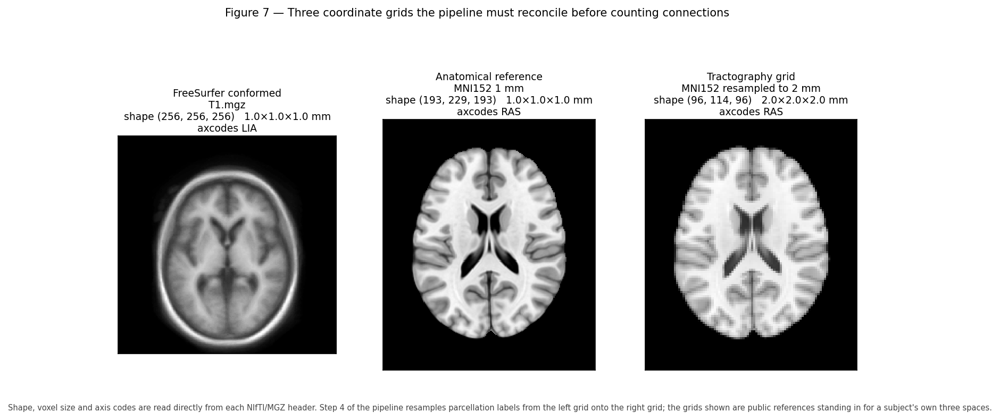

*Figure 7 — The three grids this pipeline must reconcile, with shape, voxel size, and axis codes read directly from each file header: FreeSurfer conformed space, the QSIPrep anatomical reference, and the DWI tractography grid.*

### *(Practitioner)* The three grids and why they differ

| Space | Shape and resolution | Orientation | Produced by | Contains |
|-------|---------------------|-------------|-------------|----------|
| **FreeSurfer conformed** | 256³, 1 mm | **LIA** | FreeSurfer / FastSurfer | `T1.mgz`, `aseg.mgz`, `aparc+aseg.mgz`, surfaces |
| **QSIPrep anatomical (ACPC)** | ~193×229×193, 1 mm | LPS | QSIPrep | `desc-preproc_T1w`, HSVS 5TT |
| **DWI reference (`dwiref`)** | ~80×98×85, 2 mm | LPS | QSIPrep | Tractogram, FODs, connectome grid |

Each exists for a reason. FreeSurfer conforms to a fixed 256³ 1 mm LIA grid because its algorithms and atlases assume it. QSIPrep produces an ACPC-aligned anatomical reference as the common frame for its derivatives. The DWI grid is coarser because diffusion acquisition trades resolution for SNR and angular coverage.

**The consequence, which is the crux of Step 4:** the parcellation and the tractogram are born in different spaces. Counting streamline endpoints against labels requires them on one grid. Doing this wrong produces a matrix that is fully populated, plausible-looking, and wrong — with no error raised anywhere.

### *(Practitioner)* How Step 4 aligns them

`run_dk_connectome.sh` performs an explicit three-stage chain:

```
aparc+aseg.mgz                       FreeSurfer conformed, 256³ LIA
  │  mri_label2vol --temp rawavg.mgz
  ▼
labels on the native T1w grid        scanner-native geometry
  │  ANTs affine: BIDS T1w → desc-preproc_T1w, applied with GenericLabel
  ▼
labels in QSIPrep anatomical space
  │  ANTs resample to dwiref, GenericLabel
  ▼
labels on the tractography grid      2 mm, matches the .tck
  │  labelconvert (FreeSurfer LUT → fs_default.txt for DK, fs_dkt.txt for DKT)
  ▼
dk_nodes.mif  +  tractogram  →  tck2connectome  →  dk_connectome.csv   (DK, 84 nodes)
                                                   dkt_connectome.csv  (DKT, 78 nodes)
```

Three details are load-bearing and easy to get wrong:

1. **`GenericLabel` interpolation, never linear.** Labels are categorical integers. Linear interpolation of labels 10 and 12 yields 11 — a different structure entirely. `GenericLabel` performs label-aware nearest-neighbour-like resampling.
2. **`mri_label2vol` with `rawavg.mgz`** moves labels from the conformed grid to scanner-native geometry, undoing FreeSurfer's conforming.
3. **An empirical affine, not QSIPrep's packaged transform.** QSIPrep's `from-T1wNative_to-T1wACPC` transform targets a reoriented native frame that does not coincide with FreeSurfer's `rawavg`. Using it directly leaves a small residual misalignment. Step 4 therefore registers the BIDS T1w to `desc-preproc_T1w` directly. This choice is empirical, and it is documented in `subject.sh` for exactly that reason.

### *(PhD)* Verifying alignment rather than assuming it

Because misalignment is silent, verification must be active. Four checks, in increasing strength:

- **Header comparison.** `mrinfo` on the node image and `tckinfo` on the tractogram should agree on transform and extent. Step 4 writes both to `dk_nodes.mrinfo.txt` and `tracks.tckinfo.txt` for precisely this purpose.
- **Visual overlay.** Render the resampled parcellation on the DWI reference and inspect boundaries. Cheap and catches gross errors.
- **Assignment statistics.** `tck2connectome -out_assignments` records the nodes assigned to each streamline. A high proportion of unassigned endpoints (assignment to node 0) indicates that streamline ends are not landing in labelled tissue — a strong misalignment signal.
- **Label-count sanity.** Compare node volumes in `dwiref` space against the expected values from `aseg.stats`, scaled for voxel size. Systematic discrepancy indicates a resampling problem.

A subtler point worth internalising: **left–right flips survive every one of these checks except the visual one**, because a mirrored brain is still a plausible brain with plausible node volumes and plausible assignment rates. The only robust guards are consistent use of the header affine throughout and an asymmetry check against known anatomical asymmetries.

---

## 17. From anatomy to the 5TT image and ACT

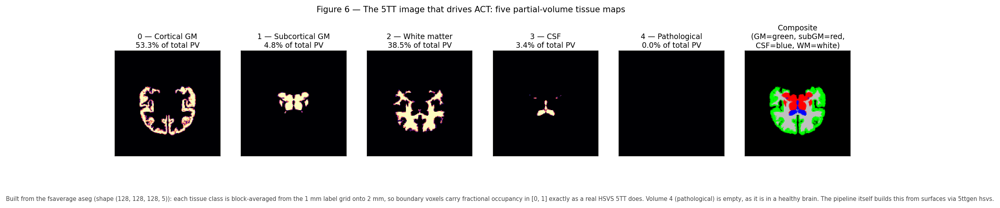

*Figure 6 — The actual HSVS 5TT image driving ACT for this subject: five partial-volume tissue maps plus a composite. Volume order and the percentage of total partial volume in each are read directly from the file.*

### *(Practitioner)* What the 5TT image is

The **five-tissue-type (5TT)** image is a 4-D volume with five 3-D partial-volume maps. For this subject, QSIRecon wrote `sub-TBI011204_space-ACPC_seg-hsvs_probseg.nii.gz` with shape `(135, 180, 147, 5)`. The MRtrix convention, verified against this file, is:

| Index | Tissue | Share of total PV here | ACT behaviour |
|-------|--------|------------------------|---------------|
| **0** | Cortical gray matter | 32.7% | Valid **termination** |
| **1** | Subcortical gray matter | 13.0% | Valid **termination** |
| **2** | White matter | 35.1% | **Propagation** allowed |
| **3** | CSF | 16.9% | **Forbidden**; streamline discarded |
| **4** | Pathological tissue | 2.3% | Configurable |

Values are fractions in [0, 1], so a boundary voxel can be, say, 60% WM and 40% GM. This is the partial-volume representation that Section 3 argued for.

> **Note.** An earlier draft of `pipeline_science.md` listed this order incorrectly (CSF first). It has been corrected against this file. Do not trust remembered tissue orderings — read the header and inspect the volumes.

### *(Practitioner)* How HSVS builds it, and why it needs surfaces

**HSVS** — Hybrid Surface–Volume Segmentation — earns its name by taking each tissue class from whichever representation describes it best:

| Tissue | Source | Why |
|--------|--------|-----|
| Cortical GM | **`lh/rh.white` and `lh/rh.pial` surfaces** | A thin folded sheet needs sub-voxel geometry |
| Subcortical GM | **`aseg.mgz` volume labels** | Compact blobs; surfaces do not apply |
| White matter | Interior to the white surface, minus deep nuclei | Defined by what it is not |
| CSF | Ventricles from `aseg`, sulcal CSF outside the pial surface | Surfaces give sulcal CSF that voxels miss |
| Pathological | Unclassified or abnormal residual | Prevents tracking through non-viable tissue |

The required FreeSurfer files are therefore `surf/{lh,rh}.white`, `surf/{lh,rh}.pial`, `mri/aseg.mgz`, and a T1 reference. **This is the concrete reason `--seg_only` is incompatible with ACT-HSVS:** it writes `aparc.DKTatlas+aseg.deep.mgz` and no surfaces, so `5ttgen hsvs` has no cortical geometry to work from, and typically no `aparc+aseg.mgz` or `rawavg.mgz` in the form Step 4 expects either.

Having built the 5TT in FreeSurfer space, QSIRecon registers it to its T1w reference — visible in the logs as `create_5tt_hsvs`, then `register_fs_to_qsiprep_wf`, then `apply_header_to_5tt`.

### *(Practitioner)* What ACT does with it

**Anatomically Constrained Tractography** turns the biological facts of Section 3 into tracking rules applied at every integration step:

| Transition | Action | Biological justification |
|------------|--------|--------------------------|
| WM → WM | Continue | Axons run through white matter |
| WM → cortical GM | **Terminate** — valid endpoint | Axons synapse in cortex |
| WM → subcortical GM | **Terminate** — valid endpoint | Axons synapse in deep nuclei |
| WM → CSF | **Discard the streamline** | No axons in fluid |
| Exiting the brain | Discard | Anatomically impossible |

Seeding is restricted to WM or the WM–GM interface. The net effect is a large reduction in anatomically implausible streamlines, and the quality of the effect is limited entirely by the quality of the 5TT boundaries — which is the argument for HSVS over FAST, and for accurate distortion correction so that the 5TT and the diffusion data agree about where tissue is.

### *(PhD)* ACT's assumptions and its failure modes

ACT is a strong prior, and strong priors are wrong in specific, knowable ways.

- **It assumes the segmentation is correct.** ACT enforces the 5TT boundaries as ground truth. A segmentation error becomes a tracking constraint, so errors are amplified rather than averaged out. In pathology this is the dominant failure mode.
- **It assumes normal tissue rules apply.** Streamlines are forbidden from CSF — correct in health, but a chronic encephalomalacic cavity is labelled CSF-like, so tracking stops at a lesion whose surrounding axons may be partly intact.
- **It biases termination toward gyral crowns.** Combined with the curvature limit and gyral bias, ACT does not remove the bias against sulcal-wall connections.
- **It cannot fix bad FODs.** ACT constrains where streamlines may go, not whether the orientation estimates are right. Spurious peaks from noise or unmodelled partial volume still generate false connections, just anatomically plausible ones.

Empirically ACT substantially improves specificity at some cost in sensitivity, and this trade-off should be acknowledged rather than presented as strictly superior. The honest framing for a methods section is that ACT reduces false positives given accurate anatomy, and that the accuracy of that anatomy is itself a limitation of the study.

The **ACT-fast** alternative, used when no FreeSurfer surfaces exist, builds the 5TT from FSL FAST. It is a legitimate fallback that requires no surfaces and much less compute, but it is **not interchangeable with HSVS**: cortical boundaries are less accurate, so connectome values differ systematically. Mixing HSVS and FAST subjects within one analysis introduces a methodological confound that will correlate with whatever caused the fallback — usually poor image quality, which correlates with clinical status.

---

## 18. From parcellation to connectome

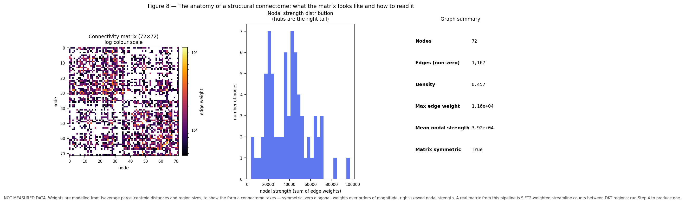

*Figure 8 — The real structural connectome for this subject from QSIRecon (SS3T + ACT-HSVS, 4S156 atlas): the SIFT2-weighted, volume-normalised matrix on a log scale, the nodal strength distribution, and summary graph statistics.*

### *(Beginner)* What a connectome is

A **structural connectome** is a graph. **Nodes** are brain regions from a parcellation. **Edges** are weighted by the estimated strength of white matter connection between region pairs. Represented as a matrix \(C\) where \(C_{ij}\) is the connection between regions \(i\) and \(j\).

This pipeline produces matrices that are **symmetric** (\(C_{ij} = C_{ji}\), because streamlines have no direction — a genuine limitation, since real axonal projections are directed) and have a **zero diagonal** (self-connections excluded).

### *(Practitioner)* From streamlines to edge weights

`tck2connectome` counts streamlines between label pairs, but the weighting scheme matters more than most people appreciate.

| Weighting | Meaning | Caveat |
|-----------|---------|--------|
| **Raw count** | Number of streamlines | Biased by region volume, length, and seeding |
| **SIFT2-weighted** | Streamlines reweighted to match FOD-derived fibre density | Much more quantitative |
| **Inverse node volume** | Divided by the volumes of the two nodes | Removes size bias |
| **Mean length** | Average streamline length | A geometric, not strength, measure |
| **FA-weighted** | Mean FA along the streamline | Confounded in crossing regions |

**Streamline count is not fibre count.** Streamlines are computational objects whose number depends on seeding density and algorithm parameters, not on the number of axons. **SIFT2** addresses this by assigning each streamline a weight so that the weighted streamline density matches the fibre density implied by the FODs, making the values comparable across subjects. This pipeline's `connectivity.mat` contains several variants; Figure 8 shows `sift_invnodevol_radius2_count`, which is SIFT2-weighted and volume-normalised.

**A concrete observation from this subject's data.** The matrix has 156 nodes and a **density of 0.936** — nearly every possible pair is connected. This is normal for probabilistic tractography with dense seeding and does **not** mean the brain is nearly fully connected. Most edges are very weak, which is why Figure 8 uses a log colour scale. Any graph analysis must therefore either use weighted metrics that are robust to weak edges, or threshold explicitly — and thresholding is itself a consequential methodological decision, since arbitrary thresholds change topology and different thresholds have produced opposite published conclusions.

### *(PhD)* Graph metrics and their pitfalls

| Metric | Interpretation | Principal pitfall |
|--------|----------------|-------------------|
| **Degree / strength** | Number or total weight of connections | Volume and density dependent |
| **Clustering coefficient** | Local interconnectedness | Sensitive to weak-edge threshold |
| **Characteristic path length** | Global integration | Undefined for disconnected graphs |
| **Small-worldness** | High clustering with short paths | Requires careful null models; often over-interpreted |
| **Modularity** | Community structure | Algorithm- and resolution-dependent; degenerate solutions |
| **Rich club** | Densely interconnected hub core | Strongly affected by volume bias |
| **Betweenness centrality** | Traffic through a node | Unstable to small weight perturbations |
| **Efficiency** | Integration capacity | Correlated with density; report density too |

The recurring theme is that **most graph metrics depend on density and node count**, so any comparison must control both. Comparing a patient group with systematically sparser matrices to controls will produce differences in nearly every metric, driven by density rather than topology.

The four standards worth holding to: report density alongside every metric; use appropriate null models (degree-preserving rewiring, and spatially constrained nulls when spatial autocorrelation could explain the effect); prefer weighted metrics over thresholded binary ones, or show robustness across a threshold range; and correct for multiple comparisons properly, using network-level inference such as network-based statistic or spin tests rather than uncorrected edge-wise testing across ~12,000 edges.

---

## 19. Quantitative morphometry and what the numbers mean

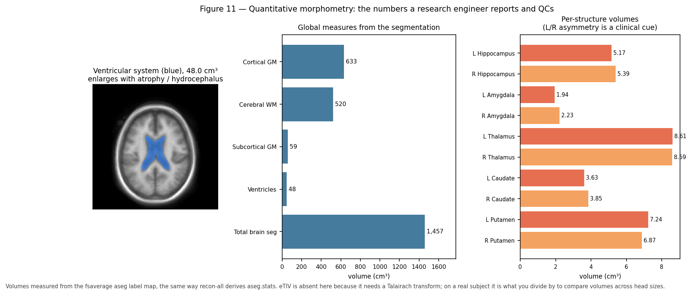

*Figure 11 — Morphometry for this subject: the ventricular system, global measures from `aseg.stats`, and per-structure volumes with left/right pairs adjacent. QC values are shown in the centre panel.*

### *(Practitioner)* The measures and how to read them

FreeSurfer and FastSurfer write `stats/aseg.stats`, `stats/*.aparc.*.stats`, and related files. The measures that matter most:

| Measure | This subject | Meaning |
|---------|-------------|---------|
| **eTIV** | 1,586 cm³ | Estimated total intracranial volume — a proxy for head size |
| **BrainSegVol** | 1,291 cm³ | Total segmented brain |
| **CortexVol** | 511 cm³ | Total cortical gray matter |
| **CerebralWhiteMatterVol** | 532 cm³ | Total cerebral white matter |
| **SubCortGrayVol** | 65 cm³ | Subcortical gray matter |
| **VentricleChoroidVol** | 25.7 cm³ | Ventricles and choroid plexus |
| **BrainSegVol-to-eTIV** | 0.814 | Brain parenchymal fraction; a normalised atrophy index |
| **SurfaceHoles** | 121 | Topological defects repaired during surface reconstruction |

Three interpretation rules prevent most misuse:

1. **Always normalise by head size.** Raw volumes vary by 20–30% between healthy adults purely from head size. Either divide by eTIV or include eTIV as a covariate. Reporting raw volume differences between groups that differ in sex or stature is a well-known error, because it recovers head size rather than pathology.
2. **Volumes are not directly comparable across software or versions.** FreeSurfer and FastSurfer values are close but not identical, and values shift between versions. **Fix the version for a study and report it** — here, FastSurfer 2.4.2.
3. **Cortical thickness and volume carry different information.** Volume is thickness times surface area, so a volume change does not say which factor changed. Thickness and area have distinct genetic and developmental determinants and should be analysed separately when the question concerns cortex.

### *(Practitioner)* Symmetry as a QC instrument

Because paired structures should be similar, the **asymmetry index** is a cheap, powerful QC statistic:

\[
AI = \frac{V_L - V_R}{\tfrac{1}{2}(V_L + V_R)}
\]

For this subject: thalamus \(|AI| \approx 3\%\), hippocampus \(\approx 4\%\), putamen \(\approx 1\%\), caudate \(\approx 4\%\) — all within the few-percent range expected in health. Amygdala shows \(\approx 24\%\), which is worth noting: the amygdala is small, has poor intrinsic contrast, and is among the least reliable `aseg` structures, so this most likely reflects segmentation noise rather than biology. That distinction — knowing which structures are reliable — is exactly the practitioner-level knowledge that prevents over-interpretation.

Useful thresholds in practice: \(|AI| > 10\%\) in a large structure warrants inspection; \(> 20\%\) usually indicates a segmentation failure unless there is known pathology.

**`SurfaceHoles` = 121** is a topological-defect count from surface reconstruction. Higher values indicate more difficult reconstruction, correlate with motion and image quality, and are a good continuous QC covariate. Typical values run from tens to low hundreds; values in the many hundreds warrant visual inspection.

### *(PhD)* Statistical treatment of morphometric data

Four issues determine whether a morphometry analysis is credible.

**Site and scanner effects are often larger than biological effects.** Multi-site studies require harmonisation — **ComBat** and its variants are standard — and even then, site should remain in the model. Confounding of site with group is fatal and surprisingly common.

**QC exclusions are rarely missing-at-random.** Failures correlate with motion, age, and disease severity, so excluding failures biases the sample toward healthier subjects and attenuates effects. Report exclusions by group and check whether conclusions survive inclusion of borderline cases.

**Longitudinal designs need longitudinal tools.** Independently processing timepoints introduces registration noise that can exceed the true change. FreeSurfer's longitudinal stream uses a within-subject template to reduce this. Also beware regression to the mean and, in trials, the practice effect on cognitive covariates.

**Normative modelling beats case-control for individual inference.** Expressing a subject as a centile against a large reference cohort (as in lifespan brain charts) supports individual-level statements that group means cannot, and handles the non-linear age trajectories of most structures naturally.

---

## 20. QC: anatomical failure modes and how to catch them

### *(Practitioner)* A QC protocol grounded in anatomy

Every check below has an anatomical rationale — that is what makes it a check rather than a ritual.

**Stage 1: Raw input.**

| Check | Anatomical rationale |
|-------|---------------------|
| Correct subject and session | Mismatch invalidates everything downstream |
| Full brain coverage including vertex and cerebellum | Truncation biases global volumes and removes tracts |
| Orientation labels sane | Left–right flips are silent and catastrophic |
| Motion assessed | Motion correlates with clinical status and fakes group effects |
| Obvious pathology noted | Determines whether the standard pipeline is even applicable |

**Stage 2: Segmentation and surfaces.**

| Check | What failure looks like |
|-------|------------------------|
| Skull strip | Dura or skull retained as GM; cerebellum or temporal pole removed |
| WM surface follows the GM/WM boundary | Surface cuts through WM, or crosses into GM |
| Pial surface excludes dura and vessels | Pial surface bulges into dura, inflating thickness |
| Sulci resolved, banks not merged | Merged banks create false short-range connections |
| Deep nuclei plausible in shape and volume | Thalamus labelled as WM; grossly asymmetric nuclei |
| `SurfaceHoles` in the normal range | Very high counts indicate difficult reconstruction |
| Left/right asymmetry within a few percent | Large asymmetry means failure or real pathology |
| WMH not labelled as GM | Bright GM-like islands deep in WM |

**Stage 3: Diffusion and space alignment.**

| Check | What failure looks like |
|-------|------------------------|
| Distortion correction effective | Frontal and temporal signal restored; DWI matches T1w outline |
| Brain mask correct on DWI | Missing tissue means missing tracts |
| Node image and tractogram headers agree | `mrinfo`/`tckinfo` mismatch |
| Parcellation overlays correctly on `dwiref` | Labels offset from anatomy |
| Assignment rate reasonable | Many streamlines unassigned in `dk_assignments.csv` |
| 5TT plausible | Compare against Figure 6; look for missing tissue classes |

**Stage 4: Connectome.**

| Check | What failure looks like |
|-------|------------------------|
| Expected node count | Missing nodes indicate parcellation or coverage problems |
| Symmetric, zero diagonal | Asymmetry indicates a construction bug |
| No empty rows | An empty row means a node received no streamlines |
| Density in a plausible range | Extreme density suggests a parameter or alignment problem |
| Strong known connections present | Homotopic callosal connections should be among the strongest |

### *(PhD)* Automating QC without deceiving yourself

Manual review does not scale and is not reproducible; automated QC has its own failure mode of being trusted beyond its validation. A defensible approach combines four elements: **quantitative metrics** (motion, SNR, `SurfaceHoles`, Euler number, asymmetry indices, tissue volume ratios) with pre-specified thresholds; **automatic report generation** with consistent visual panels, as QSIPrep and QSIRecon already produce; **rated subsamples** where a human rates a random subset so automated metrics can be validated against judgement; and **pre-registered exclusion criteria** decided before seeing outcome data, which is the only reliable protection against QC decisions drifting toward the hypothesis.

The deepest point is that **QC decisions are analysis decisions**. Excluding subjects changes the sample and therefore the result. The corrosive pattern is not obvious fraud but the slow adjustment of thresholds until results look clean — indistinguishable, in its effect, from p-hacking.

---

## 21. Pathology breaks pipelines: engineering consequences

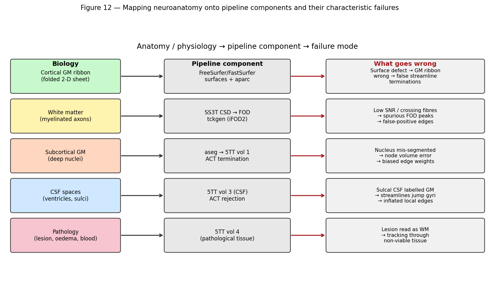

*Figure 12 — Each anatomical structure maps to a specific pipeline component and a characteristic failure mode.*

### *(Practitioner)* The failure table

| Pathology | What breaks | Mechanism | Mitigation |
|-----------|-------------|-----------|------------|
| **Chronic cavity / encephalomalacia** | Segmentation, ACT | CSF-like intensity; ACT forbids CSF, so tracking stops | Lesion mask; report affected regions; cost-function masking |
| **Acute haemorrhage** | Segmentation | Intensity resembles WM; labelled as normal tissue | Manual mask; exclude region |
| **WM hyperintensities** | Segmentation, 5TT | GM-like on T1; false GM islands in WM | WMH segmentation; correct the WM map |
| **Mass effect / midline shift** | Registration | Template correspondence assumption fails; error spreads beyond the lesion | Cost-function masking; native-space analysis |
| **Large tumour** | Everything | Topology and intensity both violated | Lesion-aware tools; virtual filling |
| **Severe atrophy** | Surfaces, registration | Wide sulci, thin cortex; surfaces misplaced | Age-appropriate templates; careful QC |
| **Ventriculomegaly** | Registration, segmentation | Extreme deformation from template | Nonlinear registration with care; inspect |
| **Resection cavity** | Surfaces, topology | Cortical sheet is genuinely discontinuous | Exclude hemisphere or use lesion-aware tools |
| **Cortical dysplasia** | Surfaces, parcellation | Abnormal folding violates atlas assumptions | Manual review essential |
| **Motion artefact** | Everything | Blurring degrades boundary estimation | Exclude; report; covary |

### *(Practitioner)* Guidance specific to this pipeline

For the TBI cohort processed here, several decisions follow directly from the above:

- **Mild TBI without visible lesions** is the best case: standard processing is appropriate, and quantitative connectivity is exactly the right tool because conventional imaging is negative by definition.
- **Focal contusions**, most often inferior frontal and anterior temporal, sit in regions already prone to susceptibility distortion. Those two problems compound, so QC should scrutinise orbitofrontal and temporal regions specifically.
- **Chronic encephalomalacia** will be labelled CSF-like and will stop ACT. Affected nodes should be identified and either excluded or explicitly flagged; leaving them in silently produces reduced connectivity that looks like a finding.
- **DAI without focal lesions** does not break the pipeline at all, which is precisely why this pipeline is worth running on this cohort.
- **Severity correlates with pipeline failure**, so QC exclusions are informative-missing. Report them by group.

### *(PhD)* Choosing an analysis strategy under pathology

There is no universally correct approach, only a trade-off to be made deliberately and stated:

| Strategy | Advantage | Cost |
|----------|-----------|------|
| **Exclude affected subjects** | Clean data | Biased sample; excludes the most affected; reduced power and generalisability |
| **Exclude affected regions** | Retains subjects | Different coverage per subject; complicates group statistics |
| **Cost-function masking** | Registration ignores lesion voxels | Does not fix segmentation; needs a lesion mask |
| **Virtual lesion filling** | Downstream tools see a plausible brain | Fabricates data; can bias nearby measures |
| **Lesion-aware tools** | Explicitly models pathology | Fewer mature options; validation often limited |
| **Native-space analysis only** | Avoids template assumptions | Loses cross-subject spatial correspondence |

Whichever is chosen, three practices distinguish credible work: **report the lesion burden** quantitatively rather than descriptively; **run a sensitivity analysis** with and without the most affected subjects; and **pre-specify the strategy** before analysis so it cannot drift toward the desired answer.

---

## 22. Study design and statistics for structural connectivity

### *(Practitioner)* Getting the design right before acquisition

Most fatal problems in connectivity studies are created before any data is processed.

**Match groups on nuisance variables** — age, sex, education, and head size — or measure them and model them. Age is the single largest driver of variance in nearly every structural measure.

**Fix the acquisition and the software.** Sequence parameters, scanner, coil, and every software version should be constant across the study. If a mid-study change is unavoidable, acquire a **bridging subset** on both configurations so the shift can be estimated rather than assumed away.

**Control timing in longitudinal or injury studies.** Time since injury is a strong predictor and interacts with severity, so it must be modelled explicitly rather than treated as noise.

**Power the study honestly.** Effects in connectivity studies are typically small, especially in mild TBI. Effect size estimates taken from small published studies are inflated by selection, so power calculations based on them are optimistic. Where available, base estimates on large consortium data.

### *(PhD)* Statistical inference on networks

The core difficulty is **massive multiplicity with strong dependence**: a 156-node matrix has 12,090 edges, which are not independent, and edge-wise testing with naive correction is both underpowered and misleading.

Established approaches, each with its own assumptions:

- **Network-based statistic (NBS)** — cluster-based permutation inference on the graph, controlling family-wise error at the level of connected components. Powerful when effects are topologically clustered; it does not localise individual edges.
- **Summary graph metrics** — reduce the matrix to a handful of interpretable measures, trading spatial specificity for power. Report density alongside every metric.
- **Multivariate and predictive modelling** — connectome-based predictive modelling, canonical correlation, or machine learning, with strict nested cross-validation and, ideally, external validation. Reported accuracy without held-out data is not evidence.
- **Bayesian and mixed-effects models** — natural handling of longitudinal and hierarchical structure, and partial pooling that shrinks noisy edge estimates.

Four cautions that recur in review:

1. **Spatial autocorrelation inflates apparent associations.** Nearby regions have similar values, so naive null models are anti-conservative. Use spin tests or spatially constrained nulls when comparing brain maps.
2. **Density differences masquerade as topology differences.** Always report and, where appropriate, match density.
3. **Thresholding is a researcher degree of freedom.** Show robustness across a range rather than reporting a single arbitrary threshold.
4. **Motion and QC metrics are confounders, not nuisances to be ignored.** They correlate with group in almost every clinical study.

The most valuable habits are the least technical: pre-register the analysis, share the code and the derived matrices, report the pipeline versions exactly, and state limitations in terms of the specific mechanisms that could produce the observed result — the enumerated-alternatives style used throughout this document.

---

## 23. Glossary

| Term | Definition |
|------|-----------|
| **ACT** | Anatomically Constrained Tractography; uses tissue segmentation to constrain streamlines |
| **ADC** | Apparent diffusion coefficient; quantifies water mobility |
| **Affine** | 12-DOF linear transform (rotation, translation, scale, shear); also the NIfTI voxel-to-world matrix |
| **aparc** | Automated cortical parcellation (FreeSurfer) |
| **aseg** | Automated subcortical segmentation (FreeSurfer) |
| **Atrophy** | Loss of tissue volume |
| **b-value** | Diffusion weighting strength, s/mm² |
| **BBB** | Blood–brain barrier |
| **BIDS** | Brain Imaging Data Structure; standard dataset layout |
| **Conformed space** | FreeSurfer's 256³, 1 mm, LIA reference grid |
| **Connectome** | Graph of brain regions and their connections |
| **Contrecoup** | Injury opposite the impact site |
| **CSD** | Constrained spherical deconvolution |
| **CSF** | Cerebrospinal fluid |
| **DAI** | Diffuse axonal injury |
| **DK / DKT** | Desikan–Killiany / Desikan–Killiany–Tourville cortical atlases |
| **DWI** | Diffusion-weighted imaging |
| **Encephalomalacia** | Softened, cavitated tissue after injury |
| **eTIV** | Estimated total intracranial volume |
| **FA** | Fractional anisotropy |
| **FAST** | FMRIB's Automated Segmentation Tool |
| **FLAIR** | Fluid-attenuated inversion recovery; T2 with CSF suppressed |
| **FOD** | Fibre orientation distribution |
| **Gliosis** | Glial scarring |
| **GM** | Gray matter |
| **Gyrus / sulcus** | Cortical ridge / groove |
| **HSVS** | Hybrid Surface–Volume Segmentation |
| **Mass effect** | Displacement of structures by added volume |
| **Myelin** | Fatty axonal sheath; bright on T1 |
| **Oedema** | Excess tissue water; cytotoxic or vasogenic |
| **Parcellation** | Division of the brain into labelled regions |
| **Partial volume** | Multiple tissues within one voxel |
| **Pial surface** | GM/CSF boundary mesh |
| **SIFT2** | Streamline weighting to match FOD-derived fibre density |
| **SS3T** | Single-shell three-tissue CSD |
| **Streamline** | A computed 3-D curve approximating a fibre pathway |
| **5TT** | Five-tissue-type image used by ACT |
| **tkrRAS** | FreeSurfer surface coordinate frame |
| **Tractography** | Reconstruction of WM pathways from diffusion data |
| **WM** | White matter |
| **WMH** | White matter hyperintensity |
| **White surface** | WM/GM boundary mesh |

---

## 24. Curated resources by topic

Grouped by what you are trying to learn, with an indication of level.

### Neuroanatomy — foundations

| Resource | Type | Level | Why use it |
|----------|------|-------|-----------|
| **Radiopaedia** (radiopaedia.org) | Free encyclopaedia and case library | Beginner→Advanced | The best free radiology reference; thousands of annotated cases with images |
| **e-Anatomy** (IMAIOS) | Interactive atlas | Beginner→Advanced | Cross-sectional atlas with labelled MRI in all planes; subscription |
| **The Human Brain Atlas** (Michigan State) | Free image atlas | Beginner | Labelled sections and MRI, freely available |
| **Neuroanatomy Atlas** (Duke/UNC) | Free web atlas | Beginner | Clear labelled cross-sections |
| **Blumenfeld, *Neuroanatomy through Clinical Cases*** | Textbook | Intermediate | Anatomy taught through clinical reasoning; the standard bridge text |
| **Kandel et al., *Principles of Neural Science*** | Textbook | Advanced | The definitive neuroscience reference |
| **Nolte, *The Human Brain*** | Textbook | Intermediate | Clear functional neuroanatomy |

### Radiology and interpretation

| Resource | Type | Level | Why use it |
|----------|------|-------|-----------|
| **Radiopaedia** | Cases and articles | All | Search any pathology for imaging appearances |
| **Osborn, *Diagnostic Imaging: Brain*** | Textbook | Advanced | The reference neuroradiology text |
| **Osborn's *Brain: Imaging, Pathology, and Anatomy*** | Textbook | Advanced | Correlates imaging with pathology |
| **Radiology Assistant** (radiologyassistant.nl) | Free tutorials | Intermediate | Excellent systematic approaches by topic |
| **STRIVE consensus** (Wardlaw et al., *Lancet Neurol* 2013) | Consensus paper | Intermediate | Standard terminology for small vessel disease |
| **ASFNR / ASNR resources** | Society material | Advanced | Current practice guidance |

### MRI physics

| Resource | Type | Level | Why use it |
|----------|------|-------|-----------|
| **MRIquestions.com** (Elster) | Free Q&A site | Beginner→Advanced | Best free physics resource; clear answers to specific questions |
| **Westbrook, *MRI in Practice*** | Textbook | Beginner→Intermediate | Accessible and practical |
| **Brown et al., *MRI: Physical Principles and Sequence Design*** | Textbook | Advanced | Rigorous and complete |
| **Bernstein et al., *Handbook of MRI Pulse Sequences*** | Reference | Advanced | The sequence reference |

### Diffusion MRI and tractography

| Resource | Type | Level | Why use it |
|----------|------|-------|-----------|
| **MRtrix3 documentation** (mrtrix.readthedocs.io) | Docs and tutorials | Intermediate | Authoritative for the tools this pipeline uses; excellent conceptual sections |
| **Jones, *Diffusion MRI: Theory, Methods, and Applications*** | Textbook | Advanced | Comprehensive edited volume |
| **Tournier et al., MRtrix3 paper** (*NeuroImage* 2019) | Paper | Intermediate | The software's design and rationale |
| **Jeurissen et al., crossing fibres review** (*NMR Biomed* 2019) | Review | Advanced | Why tensors are insufficient |
| **Maier-Hein et al., tractography challenge** (*Nat Commun* 2017) | Paper | Advanced | Sobering empirical assessment of tractography accuracy |
| **Schilling et al., tractography limitations** | Reviews | Advanced | Systematic treatment of known biases |
| **Smith et al., ACT** (*NeuroImage* 2012) | Paper | Advanced | The method this pipeline relies on |
| **Smith et al., HSVS** (*NeuroImage* 2020) | Paper | Advanced | The 5TT construction used here |
| **Smith et al., SIFT2** (*NeuroImage* 2015) | Paper | Advanced | Quantitative streamline weighting |

### Software documentation

| Resource | Scope | Why use it |
|----------|-------|-----------|
| **FreeSurfer wiki** (surfer.nmr.mgh.harvard.edu) | Surfaces, `aseg`, `aparc`, stats | Includes the essential QC troubleshooting guide |
| **FastSurfer GitHub and paper** | Fast deep-learning alternative | Documents `--seg_only` versus full `recon-surf` — directly relevant here |
| **QSIPrep docs** (qsiprep.readthedocs.io) | DWI preprocessing | Explains every preprocessing decision |
| **QSIRecon docs** (qsirecon.readthedocs.io) | Reconstruction workflows | Documents recon specs including ACT-HSVS and ACT-fast |
| **FSL wiki** | FAST, eddy, TOPUP | Reference for the FSL tools |
| **ANTs / ANTsX** | Registration | Registration theory and practice |
| **BIDS specification** (bids.neuroimaging.io) | Data organisation | The standard this project follows |
| **NiBabel docs** | Image I/O, affines, orientation | The clearest explanation of coordinate systems in practice |

### Connectomics and network neuroscience

| Resource | Type | Level | Why use it |
|----------|------|-------|-----------|
| **Fornito, Zalesky & Bullmore, *Fundamentals of Brain Network Analysis*** | Textbook | Intermediate→Advanced | The standard reference; read before doing graph analysis |
| **Rubinov & Sporns** (*NeuroImage* 2010) | Paper | Intermediate | Graph measures and the Brain Connectivity Toolbox |
| **Zalesky et al., NBS** (*NeuroImage* 2010) | Paper | Advanced | Network-level statistical inference |
| **Sporns, *Networks of the Brain*** | Book | Intermediate | Conceptual foundations |
| **Bassett & Sporns** (*Nat Neurosci* 2017) | Review | Intermediate | Network neuroscience overview |

### TBI specifically

| Resource | Type | Why use it |
|----------|------|-----------|
| **TRACK-TBI** (tracktbi.ucsf.edu) | Study and data resource | Directly relevant to this cohort's design and measures |
| **CENTER-TBI** (center-tbi.eu) | European counterpart | Large-scale TBI methodology |
| **FITBIR** (fitbir.nih.gov) | Data repository | Shared TBI imaging data |
| **Common Data Elements for TBI** (NINDS) | Standards | Harmonised variable definitions |
| **Hulkower et al., DTI in TBI review** (*AJNR* 2013) | Review | Systematic review of DTI findings in TBI |
| **Adams et al., DAI grading** | Classic papers | The original grading system |

### Public datasets for practice and validation

| Dataset | Content | Use |
|---------|---------|-----|
| **Human Connectome Project** | High-quality multi-shell diffusion, 1,200+ subjects | The reference for method development |
| **UK Biobank** | 100,000+ imaging subjects | Normative modelling and epidemiology |
| **OpenNeuro** | Many BIDS datasets | Testing pipelines on varied real data |
| **ADNI** | Longitudinal Alzheimer imaging | Morphometry and longitudinal methods |
| **ABCD** | Longitudinal adolescent cohort | Development |
| **BraTS** | Annotated tumour segmentation challenge | Lesion segmentation |
| **ATLAS** (stroke) | Annotated stroke lesions | Lesion-aware method development |

### Courses and training

| Resource | Format | Why use it |
|----------|--------|-----------|
| **FSL Course** | Free lectures and practicals | Excellent foundation in analysis concepts |
| **MRtrix3 workshops** | Materials and tutorials | Hands-on with the tools used here |
| **Neurohackademy** | Free recorded lectures | Neuroimaging data science and reproducibility |
| **Andy's Brain Book** | Free online tutorials | Very approachable practical walkthroughs |
| **OHBM educational courses** | Conference material | Current methodological practice |
| **Coursera/edX neuroscience courses** | MOOCs | Structured background |

---

## 25. References

### Anatomy, physiology, and radiology

1. Blumenfeld H. *Neuroanatomy through Clinical Cases.* 3rd ed. Oxford University Press, 2021.
2. Kandel ER, Koester JD, Mack SH, Siegelbaum SA (eds). *Principles of Neural Science.* 6th ed. McGraw-Hill, 2021.
3. Osborn AG, Hedlund GL, Salzman KL. *Osborn's Brain: Imaging, Pathology, and Anatomy.* 2nd ed. Elsevier, 2018.
4. Wardlaw JM, Smith EE, Biessels GJ, et al. Neuroimaging standards for research into small vessel disease and its contribution to ageing and neurodegeneration (**STRIVE**). *Lancet Neurology* 2013;12(8):822–838.
5. Radiopaedia.org — collaborative radiology reference and case library.

### MRI physics and diffusion

6. Stejskal EO, Tanner JE. Spin diffusion measurements: spin echoes in the presence of a time-dependent field gradient. *J Chem Phys* 1965;42:288–292.
7. Elster AD. *Questions and Answers in MRI* — mriquestions.com.
8. Jones DK (ed). *Diffusion MRI: Theory, Methods, and Applications.* Oxford University Press, 2010.
9. Tournier JD, Calamante F, Connelly A. Robust determination of the fibre orientation distribution in diffusion MRI: non-negativity constrained super-resolved spherical deconvolution. *NeuroImage* 2007;35(4):1459–1472.
10. Dhollander T, Raffelt D, Connelly A. Unsupervised 3-tissue response function estimation from single-shell or multi-shell diffusion MR data without a co-registered T1 image. *ISMRM Workshop on Breaking the Barriers of Diffusion MRI*, 2016. (**SS3T**)
11. Jeurissen B, Descoteaux M, Mori S, Leemans A. Diffusion MRI fiber tractography of the brain. *NMR in Biomedicine* 2019;32(4):e3785.

### Tractography, ACT, HSVS, and connectomes

12. Smith RE, Tournier JD, Calamante F, Connelly A. Anatomically-constrained tractography: improved diffusion MRI streamlines tractography through effective use of anatomical information. *NeuroImage* 2012;62(3):1924–1938. (**ACT**)
13. Smith RE, Tournier JD, Calamante F, Connelly A. SIFT2: enabling dense quantitative assessment of brain white matter connectivity using streamlines tractography. *NeuroImage* 2015;119:338–351.
14. Smith RE, Dhollander T, Connelly A. On the regression of intracranial volume in Fixel-Based Analysis; and hybrid surface/volume segmentation for improved tissue classification. *NeuroImage* 2020. (**HSVS**; see also the MRtrix3 `5ttgen hsvs` documentation)
15. Tournier JD, Smith RE, Raffelt D, et al. MRtrix3: a fast, flexible and open software framework for medical image processing and visualisation. *NeuroImage* 2019;202:116137.
16. Maier-Hein KH, Neher PF, Houde JC, et al. The challenge of mapping the human connectome based on diffusion tractography. *Nature Communications* 2017;8:1349.
17. Fornito A, Zalesky A, Bullmore ET. *Fundamentals of Brain Network Analysis.* Academic Press, 2016.
18. Rubinov M, Sporns O. Complex network measures of brain connectivity: uses and interpretations. *NeuroImage* 2010;52(3):1059–1069.
19. Zalesky A, Fornito A, Bullmore ET. Network-based statistic: identifying differences in brain networks. *NeuroImage* 2010;53(4):1197–1207.

### Segmentation, surfaces, and parcellation

20. Zhang Y, Brady M, Smith S. Segmentation of brain MR images through a hidden Markov random field model and the expectation-maximization algorithm. *IEEE Transactions on Medical Imaging* 2001;20(1):45–57. (**FSL FAST**)
21. Fischl B. FreeSurfer. *NeuroImage* 2012;62(2):774–781.
22. Dale AM, Fischl B, Sereno MI. Cortical surface-based analysis I: segmentation and surface reconstruction. *NeuroImage* 1999;9(2):179–194.
23. Fischl B, Salat DH, Busa E, et al. Whole brain segmentation: automated labeling of neuroanatomical structures in the human brain. *Neuron* 2002;33(3):341–355. (**aseg**)
24. Desikan RS, Ségonne F, Fischl B, et al. An automated labeling system for subdividing the human cerebral cortex on MRI scans into gyral based regions of interest. *NeuroImage* 2006;31(3):968–980. (**DK atlas**)
25. Klein A, Tourville J. 101 labeled brain images and a consistent human cortical labeling protocol. *Frontiers in Neuroscience* 2012;6:171. (**DKT atlas**)
26. Henschel L, Conjeti S, Estrada S, et al. FastSurfer — a fast and accurate deep learning based neuroimaging pipeline. *NeuroImage* 2020;219:117012.
27. Henschel L, Kügler D, Reuter M. FastSurferVINN: building resolution-independence into deep learning segmentation methods. *NeuroImage* 2022;251:118933.

### Pipelines and reproducibility

28. Cieslak M, Cook PA, He X, et al. QSIPrep: an integrative platform for preprocessing and reconstructing diffusion MRI data. *Nature Methods* 2021;18:775–778.
29. Esteban O, Markiewicz CJ, Blair RW, et al. fMRIPrep: a robust preprocessing pipeline for functional MRI. *Nature Methods* 2019;16:111–116. (NiPreps design principles)
30. Gorgolewski KJ, Auer T, Calhoun VD, et al. The brain imaging data structure, a format for organizing and describing outputs of neuroimaging experiments. *Scientific Data* 2016;3:160044. (**BIDS**)
31. Avants BB, Tustison NJ, Song G, et al. A reproducible evaluation of ANTs similarity metric performance in brain image registration. *NeuroImage* 2011;54(3):2033–2044.
32. Tustison NJ, Avants BB, Cook PA, et al. N4ITK: improved N3 bias correction. *IEEE Transactions on Medical Imaging* 2010;29(6):1310–1320.
33. Andersson JLR, Sotiropoulos SN. An integrated approach to correction for off-resonance effects and subject movement in diffusion MR imaging. *NeuroImage* 2016;125:1063–1078. (**eddy**)

### Traumatic brain injury

34. Adams JH, Doyle D, Ford I, et al. Diffuse axonal injury in head injury: definition, diagnosis and grading. *Histopathology* 1989;15(1):49–59.
35. Yue JK, Vassar MJ, Lingsma HF, et al. Transforming Research and Clinical Knowledge in Traumatic Brain Injury Pilot: multicenter implementation of the common data elements for TBI. *Journal of Neurotrauma* 2013;30(22):1831–1844. (**TRACK-TBI**)
36. Hulkower MB, Poliak DB, Rosenbaum SB, et al. A decade of DTI in traumatic brain injury: 10 years and 100 articles later. *AJNR American Journal of Neuroradiology* 2013;34(11):2064–2074.
37. Maas AIR, Menon DK, Manley GT, et al. Traumatic brain injury: progress and challenges in prevention, clinical care, and research. *Lancet Neurology* 2022;21(11):1004–1060.

### Statistics, harmonisation, and normative modelling

38. Johnson WE, Li C, Rabinovic A. Adjusting batch effects in microarray expression data using empirical Bayes methods. *Biostatistics* 2007;8(1):118–127. (**ComBat**)
39. Fortin JP, Parker D, Tunç B, et al. Harmonization of multi-site diffusion tensor imaging data. *NeuroImage* 2017;161:149–170.
40. Bethlehem RAI, Seidlitz J, White SR, et al. Brain charts for the human lifespan. *Nature* 2022;604:525–533.
41. Marquand AF, Rezek I, Buitelaar J, Beckmann CF. Understanding heterogeneity in clinical cohorts using normative models. *Biological Psychiatry* 2016;80(7):552–561.
42. Alexander-Bloch AF, Shou H, Liu S, et al. On testing for spatial correspondence between maps of human brain structure and function. *NeuroImage* 2018;178:540–551. (**spin tests**)

---

## Reproducing the figures

All imaging figures come from this repository's own data:

```bash
python3 dwi_pipeline/scripts/make_brain_figures.py \
    --results-root /path/to/CIDUR_BIDS/dwi_test2_fast \
    --subject sub-TBI011204 \
    --session ses-2WK \
    --out-dir dwi_pipeline/figures/brain
```

Requires `nibabel`, `matplotlib`, `numpy`, and `scipy`. Each figure caption states its source file. Figures 9 and 10 are schematic drawings and contain no patient data; Figure 12 is a conceptual diagram. Every other figure is rendered directly from subject `TBI011204`.

**Data provenance for the figures**

| Figure | Source |
|--------|--------|
| 1, 2, 3, 4, 5, 11 | `freesurfer/sub-TBI011204/` — FastSurfer 2.4.2 volumes, surfaces, and stats |
| 6 | `qsirecon_single_run_output/.../sub-TBI011204_space-ACPC_seg-hsvs_probseg.nii.gz` |
| 7 | Headers of `T1.mgz`, `desc-preproc_T1w.nii.gz`, `space-T1w_dwiref.nii.gz` |
| 8 | `.../sub-TBI011204_ses-2WK_acq-b1000_space-T1w_connectivity.mat` |
| 9, 10, 12 | Schematic; drawn with matplotlib |

---

*Document version 1.0. Written against `subject.sh` on branch `lab-pipeline`, QSIRecon spec `mrtrix_singleshell_ss3t_ACT-hsvs`, FastSurfer 2.4.2, and the results in `CIDUR_BIDS/dwi_test2_fast` (Slurm job 48173).*

*This document supports research engineering and is not a clinical reference.*
