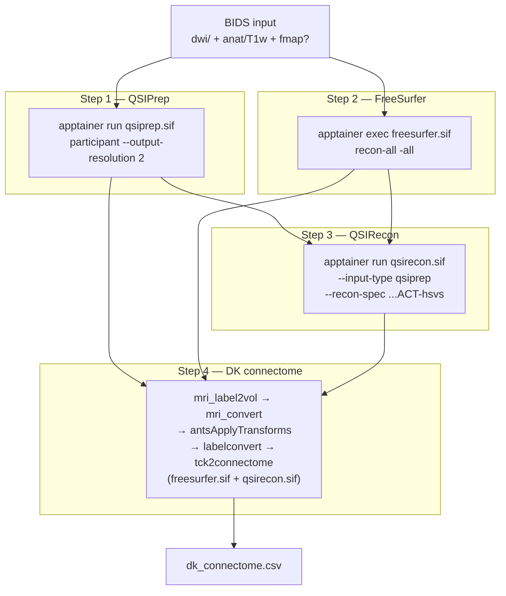
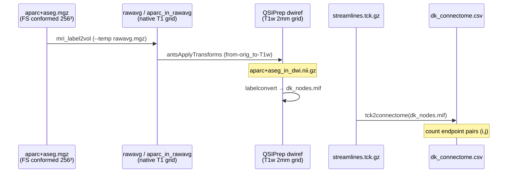

# DK Connectome Pipeline — Full Reference

This document explains the **end-to-end DWI pipeline** from raw BIDS data to a
**Desikan–Killiany (DK) connectivity matrix** (`dk_connectome.csv`), including
the commands run at each stage, the coordinate spaces involved, and how
FreeSurfer parcellation is aligned to QSIRecon tractography.

**Implementations (same logic, different orchestration):**

| Implementation | Location |
|------------------|----------|
| Bash + Slurm array | `dwi_pipeline/{submit,array,subject}.sh` |
| Snakemake + Slurm executor | `dwi_pipeline/dwi_py/` |

---

## What we are building

A **connectome** is a symmetric matrix where entry `M[i,j]` counts how many
white-matter streamlines connect brain region *i* to region *j*.

Our pipeline:

1. **Preprocess** diffusion MRI (QSIPrep).
2. **Parcellate** the brain with FreeSurfer (`aparc+aseg.mgz`).
3. **Reconstruct** streamlines with QSIRecon (MRtrix SS3T-ACT-HSVS).
4. **Align** FreeSurfer labels into QSIPrep space and **count** streamline
   endpoints per DK region (`tck2connectome`).

---

## High-level flow (sketch)

```
  Raw BIDS
  (DWI + T1w + optional fmap)
           │
           ├─────────────────────────────┐
           │                             │
           ▼                             ▼
    ┌─────────────┐              ┌──────────────┐
    │  Step 1     │              │  Step 2      │
    │  QSIPrep    │              │  FreeSurfer  │
    │             │              │  recon-all   │
    │  DWI → T1w  │              │  T1w → labels│
    └──────┬──────┘              └──────┬───────┘
           │                            │
           │   qsiprep_out/             │   freesurfer/sub-XXX/
           │   space-T1w derivatives    │   mri/aparc+aseg.mgz
           │                            │   (FS-conformed space)
           └────────────┬───────────────┘
                        ▼
                 ┌─────────────┐
                 │  Step 3     │
                 │  QSIRecon   │
                 │  tckgen     │
                 │  (T1w space)│
                 └──────┬──────┘
                        │
                        │  streamlines.tck.gz
                        │  (+ optional 4S156 connectivity.mat)
                        ▼
                 ┌─────────────┐
                 │  Step 4     │
                 │  DK step    │
                 │  warp labels│
                 │  → T1w grid │
                 │  tck2conn   │
                 └──────┬──────┘
                        ▼
              dk_connectome.csv
              (84 × 84, symmetric)
```



Steps 1 and 2 can run **in parallel** (both read BIDS). Step 3 needs Step 1
(and Step 2 for the HSVS spec). Step 4 needs Steps 2 and 3.

---

## Coordinate spaces (sketch)

Three frames matter. Everything that touches tractography or the DK matrix
ultimately lives in **QSIPrep T1w space**.

```
                    ┌─────────────────────────────────────┐
                    │   QSIPrep T1w-Native (tracking frame) │
                    │   desc-preproc_T1w @ 1 mm            │
                    │   dwiref / preproc_dwi @ 2 mm        │
                    │                                      │
                    │   ● streamlines.tck.gz               │
                    │   ● dk_nodes.mif (after Step 4)      │
                    │   ● 4S156 connectivity.mat           │
                    └────────────────▲────────────────────┘
                                     │
         Step 4b: antsApplyTransforms (from-orig_to-T1w; -r dwiref)
                                     │
                    ┌────────────────┴────────────────────┐
                    │   Native T1w (FreeSurfer rawavg)     │
                    │   rawavg.mgz — matches BIDS T1 grid  │
                    └────────────────▲────────────────────┘
                                     │
         Step 4a: mri_label2vol (--temp rawavg; --regheader aparc+aseg)
                                     │
                    ┌────────────────┴────────────────────┐
                    │   FreeSurfer conformed (label source)│
                    │   aparc+aseg.mgz @ 256³, 1 mm, LIA   │
                    └────────────────▲────────────────────┘
                                     │
              Step 2: recon-all on raw BIDS T1w (mri_convert --conform)
                                     │
                    ┌────────────────┴────────────────────┐
                    │   BIDS T1w (scanner-native)          │
                    └─────────────────────────────────────┘
```

| Image | Grid (sub-001 example) | Space name | Used for |
|-------|------------------------|------------|----------|
| BIDS `*_T1w.nii.gz` | 256×256×176, ~0.98 mm | BIDS anat | Input to QSIPrep anat + recon-all |
| `mri/rawavg.mgz` | same as BIDS T1w | FS native | Intermediate label grid after Step 4a |
| `*_desc-preproc_T1w.nii.gz` | 193×229×193, 1 mm, LPS | QSIPrep T1w | QSIRecon anat reference |
| `*_space-T1w_dwiref.nii.gz` | 80×98×85, 2 mm, LPS | QSIPrep T1w DWI grid | Tractography grid; DK warp target |
| `mri/aparc+aseg.mgz` | 256×256×256, 1 mm, LIA | FS conformed | Region labels (source) |
| `aparc+aseg_in_dwi.nii.gz` | same as dwiref | QSIPrep T1w | Labels aligned for connectome |

**Key rule:** `aparc+aseg.mgz` is **not** in native T1w space — it lives on
FreeSurfer's 256³ conformed grid (`orig.mgz`). QSIPrep's `from-orig_to-T1w`
transform maps **native** T1w → QSIPrep T1w. Step 4 therefore uses a
**two-hop** warp: `mri_label2vol` (conformed → native/rawavg), then
`antsApplyTransforms` (native → QSIPrep T1w/DWI grid). See
[FsAnat-to-NativeAnat](https://surfer.nmr.mgh.harvard.edu/fswiki/FsAnat-to-NativeAnat).

---

## Step 4 detail — how labels meet tracts (sketch)

We **never warp streamlines**. We warp the **parcellation** onto the tract
grid, then look up endpoint voxels.

```
  aparc+aseg.mgz          streamlines.tck.gz
  [FS conformed]          [QSIPrep T1w mm coords]
       │                         │
       │ mri_label2vol           │ (unchanged)
       │  --temp rawavg.mgz      │
       ▼                         │
  aparc+aseg_in_rawavg.mgz       │
       │                         │
       │ mri_convert             │
       ▼                         │
  aparc+aseg_in_rawavg.nii.gz    │
       │                         │
       │ antsApplyTransforms     │
       │  -r dwiref.nii.gz       │
       │  -t from-orig_to-T1w    │
       │  -n GenericLabel        │
       ▼                         │
  aparc+aseg_in_dwi.nii.gz        │
       │                         │
       │ labelconvert            │
       │  FS LUT → fs_default    │
       ▼                         │
  dk_nodes.mif (84 nodes) ◄──────┘
       │
       │ tck2connectome -symmetric -zero_diagonal
       ▼
  dk_connectome.csv
```



**Why two warps?**

`from-orig_to-T1w_mode-image_xfm.txt` maps **native/scanner T1w** into
QSIPrep's `space-T1w`. `aparc+aseg.mgz` is on FreeSurfer's **conformed**
256³ grid — different dimensions from both native T1w (256×256×176 for
sub-001) and QSIPrep T1w (193×229×193). Applying the QSIPrep xfm directly
to conformed labels skips the native frame the transform expects.

**Why `antsApplyTransforms` instead of `mri_vol2vol`?**

QSIPrep writes `from-orig_to-T1w_mode-image_xfm.txt` in **ITK text format**
(`#Insight Transform File V1.0`). FreeSurfer's `mri_vol2vol --lta` expects
true LTA, not ITK. ANTs reads ITK natively and supports `-n GenericLabel` for
integer label maps.

---

## Inputs

| Input | Role |
|-------|------|
| `data_bids/sub-XXX/` | BIDS dataset (`dwi/`, `anat/*T1w*`, optional `fmap/`) |
| `qsiprep.sif` | QSIPrep container |
| `freesurfer_7.4.1.sif` | Full FreeSurfer (not the trimmed FS inside FastSurfer) |
| `qsirecon.sif` | QSIRecon + ANTs + MRtrix3 (also used for Step 4) |
| `license.txt` | FreeSurfer license |
| `FreeSurferColorLUT.txt` | Host-side LUT for `labelconvert` |
| `templateflow/` | TemplateFlow cache for registrations |

---

## Step 1 — QSIPrep

**Purpose:** Denoise DWI, run SDC (TOPUP when fmap present), eddy correction,
register DWI to T1w, write `space-T1w` derivatives.

### Command (from `subject.sh::run_qsiprep`)

```bash
apptainer run --cleanenv --containall \
  -B "${BIDS_DIR}":/bids_input:ro \
  -B "${QSIPREP_OUT}":/output \
  -B "${WORK_QSIPREP}":/work \
  -B "${FS_LICENSE}":/opt/freesurfer/license.txt:ro \
  -B "${TEMPLATEFLOW_HOME}":/templateflow \
  --env "TEMPLATEFLOW_HOME=/templateflow" \
  "${CONTAINER_QSIPREP}" \
  /bids_input /output participant \
  --participant-label "${SUBJECT}" \
  --fs-license-file /opt/freesurfer/license.txt \
  --work-dir /work \
  --output-resolution 2 \
  --nthreads "${NTHREADS}" \
  --omp-nthreads "${OMP_NTHREADS}" \
  --skip-bids-validation
```

### SDC behaviour

| BIDS state | Flags added | Effect |
|------------|-------------|--------|
| `fmap/` present + `IntendedFor` | *(none)* | TOPUP / measured SDC |
| No fmap, default | *(none)* | No SDC |
| No fmap, `--syn` | `--use-syn-sdc warn` | SyN SDC |
| `--fmap-retry` | `--ignore fieldmaps --use-syn-sdc warn` | Ignore fmaps, force SyN |

### Representative internal commands (from logs)

```text
topup          # fieldmap-based SDC
eddy           # motion + eddy current correction
# BBR: DWI → T1w registration
# N4, brain extraction, resample to output-resolution
```

### Key outputs

```text
${RESULTS_ROOT}/qsiprep_single_run_output/
  sub-XXX/anat/sub-XXX_desc-preproc_T1w.nii.gz
  sub-XXX/ses-1/dwi/*_space-T1w_desc-preproc_dwi.nii.gz
  sub-XXX/ses-1/dwi/*_space-T1w_dwiref.nii.gz
  sub-XXX/ses-1/anat/*_from-orig_to-T1w_mode-image_xfm.txt   # ITK affine
  sub-XXX.html                                                # QC report
```

---

## Step 2 — FreeSurfer recon-all

**Purpose:** Cortical + subcortical parcellation → `aparc+aseg.mgz`.

**Input:** Raw BIDS T1w (not QSIPrep's preproc T1).

### Command (default: `recon-all`)

```bash
apptainer exec --cleanenv --containall \
  -B "${BIDS_DIR}":/bids:ro \
  -B "${RECON_OUT}":/sd \
  -B "${FS_LICENSE}":/.fs_license.txt:ro \
  "${CONTAINER_FREESURFER}" \
  bash -lc "
    export FS_LICENSE=/.fs_license.txt
    export SUBJECTS_DIR=/sd
    recon-all -all -s sub-${SUBJECT} \
      -i /bids/sub-${SUBJECT}/ses-1/anat/sub-${SUBJECT}_ses-1_T1w.nii.gz \
      -openmp ${NTHREADS}
  "
```

### Alternative: FastSurfer

```bash
/fastsurfer/run_fastsurfer.sh \
  --fs_license /fs_license/license.txt \
  --sid sub-${SUBJECT} --sd /sd \
  --t1 /bids/sub-${SUBJECT}/ses-1/anat/sub-${SUBJECT}_ses-1_T1w.nii.gz \
  --parallel --threads ${NTHREADS} --device cpu
```

### Key output

```text
${RESULTS_ROOT}/freesurfer/sub-XXX/mri/aparc+aseg.mgz
```

Idempotent: skipped if `aparc+aseg.mgz` already exists.

---

## Step 3 — QSIRecon

**Purpose:** SS3T CSD, HSVS 5TT (from FreeSurfer), ACT tractography, optional
atlas connectome. **All outputs in `space-T1w`.**

**Inputs:** QSIPrep derivatives (`--input-type qsiprep`) + FreeSurfer subjects
dir (`--fs-subjects-dir`) for HSVS spec.

### Command (from `subject.sh::run_qsirecon`)

```bash
apptainer run --cleanenv --containall \
  -B "${QSIPREP_OUT}":/qsiprep_input:ro \
  -B "${QSIRECON_OUT}":/output \
  -B "${WORK_QSIRECON}":/work \
  -B "${FS_SUBJECTS_DIR}":/freesurfer:ro \
  -B "${FS_LICENSE}":/opt/freesurfer/license.txt:ro \
  -B "${TEMPLATEFLOW_HOME}":/templateflow \
  --env "TEMPLATEFLOW_HOME=/templateflow" \
  "${CONTAINER_QSIRECON}" \
  /qsiprep_input /output participant \
  --input-type qsiprep \
  --recon-spec mrtrix_singleshell_ss3t_ACT-hsvs \
  --participant-label "${SUBJECT}" \
  --fs-license-file /opt/freesurfer/license.txt \
  --fs-subjects-dir /freesurfer \
  --work-dir /work \
  --nthreads "${NTHREADS}" \
  --omp-nthreads "${OMP_NTHREADS}" \
  --output-resolution 2 \
  --atlases 4S156Parcels
```

### How QSIRecon uses the two T1s

QSIRecon reads **QSIPrep's T1w** as the anatomical reference for DWI, FOD
maps, and tractography. It reads **FreeSurfer surfaces/labels** from
`freesurfer/sub-XXX/` and internally maps them into T1w space to build the
HSVS 5TT image for ACT. The tractogram coordinates are in QSIPrep T1w mm space.

### Representative internal MRtrix commands

```text
# SS3T CSD (inside recon spec workflow)
dwi2fod / ss3t_csd ...

# Tractography (from tckinfo on dwi_test2 sub-007)
tckgen -act <5tt_in_T1w.nii.gz> \
       -algorithm iFOD2 -backtrack -crop_at_gmwmi \
       -minlength 30 -maxlength 250 \
       -select 10000000 \
       <wm_mtnorm.mif> tracked.tck

# Atlas connectome (NOT DK — uses --atlases flag)
tck2connectome <streamlines.tck> <4S156_dseg.mif> connectivity.mat
```

### Key outputs

```text
${RESULTS_ROOT}/qsirecon_single_run_output/
  derivatives/qsirecon-MRtrix3_fork-SS3T_act-HSVS/sub-XXX/ses-1/dwi/
    *_space-T1w_model-ifod2_streamlines.tck.gz      # ~10M streamlines
    *_space-T1w_connectivity.mat                    # 4S156 (156 regions)
    *_model-sift2_streamlineweights.csv
  sub-XXX/anat/sub-XXX_space-fsnative_seg-hsvs_probseg.mif.gz
  sub-XXX/ses-1/dwi/*_space-T1w_seg-4S156Parcels_dseg.nii.gz
```

---

## Step 4 — DK connectome (post-hoc)

**Purpose:** Build an **84-node Desikan–Killiany** matrix from the QSIRecon
tractogram + FreeSurfer `aparc+aseg.mgz`.

**Containers:** Step 4a uses `freesurfer_7.4.1.sif` (`mri_label2vol` is not
shipped in the trimmed FreeSurfer inside `qsirecon.sif`). Steps 4b–4f run in
`qsirecon.sif` so MRtrix3 / ANTs versions match QSIRecon.

### Step 4a — FS conformed → native (`freesurfer.sif`)

```bash
apptainer exec --cleanenv --containall \
  -B "${FS_SUBJECTS_DIR}/sub-${SUBJECT}":/fs_subject:ro \
  -B "${DK_OUT}/sub-${SUBJECT}":/out \
  -B "${FS_LICENSE}":/.fs_license.txt:ro \
  "${CONTAINER_FREESURFER}" \
  bash -lc "
    export FS_LICENSE=/.fs_license.txt
    mri_label2vol --seg /fs_subject/mri/aparc+aseg.mgz \
      --temp /fs_subject/mri/rawavg.mgz \
      --o /out/aparc+aseg_in_rawavg.mgz \
      --regheader /fs_subject/mri/aparc+aseg.mgz
  "
```

### Step 4b–4f — native → QSIPrep T1w + connectome (`qsirecon.sif`)

```bash
apptainer exec --cleanenv --containall \
  -B "${FS_SUBJECTS_DIR}/sub-${SUBJECT}":/fs_subject:ro \
  -B "${QSIRECON_OUT}":/qsirecon:ro \
  -B "${QSIPREP_OUT}":/qsiprep:ro \
  -B "${DK_OUT}/sub-${SUBJECT}":/out \
  -B "${FS_LICENSE}":/opt/freesurfer/license.txt:ro \
  -B "${FS_LUT}":/opt/freesurfer/FreeSurferColorLUT.txt:ro \
  "${CONTAINER_QSIRECON}" \
  bash -lc ' ... see sub-commands below ... '
```

### Sub-commands inside `qsirecon.sif` (in order)

**4b. Convert native labels to NIfTI (QC copy of conformed labels optional)**

```bash
mri_convert /out/aparc+aseg_in_rawavg.mgz /out/aparc+aseg_in_rawavg.nii.gz
mri_convert /fs_subject/mri/aparc+aseg.mgz /out/aparc+aseg.nii.gz   # QC only
```

**4c. Warp native parcellation onto QSIPrep DWI grid**

```bash
antsApplyTransforms -d 3 \
  -i /out/aparc+aseg_in_rawavg.nii.gz \
  -r /qsiprep/sub-XXX/ses-1/dwi/*_space-T1w_dwiref.nii.gz \
  -t /qsiprep/sub-XXX/ses-1/anat/*_from-orig_to-T1w_mode-image_xfm.txt \
  -n GenericLabel \
  -o /out/aparc+aseg_in_dwi.nii.gz
```

**4d. Remap FreeSurfer IDs → DK nodes 1..84**

```bash
labelconvert -force /out/aparc+aseg_in_dwi.nii.gz \
  /opt/freesurfer/FreeSurferColorLUT.txt \
  /opt/mrtrix3-latest/share/mrtrix3/labelconvert/fs_default.txt \
  /out/dk_nodes.mif
```

**4e. Decompress tractogram if gzipped (MRtrix 3.0.4)**

```bash
gunzip -c /qsirecon/.../streamlines.tck.gz > /out/streamlines.tck
```

**4f. Space-alignment QC**

```bash
mrinfo  /out/dk_nodes.mif      | tee /out/dk_nodes.mrinfo.txt
tckinfo /out/streamlines.tck   | tee /out/tracks.tckinfo.txt
```

**4g. Build connectome**

```bash
tck2connectome -force \
  /out/streamlines.tck \
  /out/dk_nodes.mif \
  /out/dk_connectome.csv \
  -symmetric \
  -zero_diagonal \
  -out_assignments /out/dk_assignments.csv
```

Optional weighting (via config / env):

```bash
# Example extras (not enabled by default)
tck2connectome ... \
  -tck_weights_in sift2_weights.csv \
  -scale_invlength -scale_invnodevol
```

### Key outputs

```text
${RESULTS_ROOT}/dk_connectomes/sub-XXX/
  dk_connectome.csv           # 84×84 symmetric streamline counts
  dk_assignments.csv          # per-streamline (node_i, node_j)
  aparc+aseg.nii.gz           # FS labels in conformed space (QC)
  aparc+aseg_in_rawavg.mgz    # FS labels in native/rawavg space
  aparc+aseg_in_dwi.nii.gz    # FS labels in QSIPrep T1w space
  dk_nodes.mif                # MRtrix label image (84 nodes)
  dk_nodes.mrinfo.txt         # grid / transform QC
  tracks.tckinfo.txt          # tractography metadata QC
```

---

## Two connectomes, one tractogram

Both matrices come from the **same** `streamlines.tck.gz`. Only the
parcellation differs.

```
                    streamlines.tck.gz (10M, space-T1w)
                              │
              ┌───────────────┴───────────────┐
              ▼                               ▼
    4S156Parcels dseg.mif              dk_nodes.mif
    (QSIRecon --atlases)               (our Step 4 labelconvert)
    156 regions                        84 DK regions
              │                               │
              ▼                               ▼
    connectivity.mat                 dk_connectome.csv
    (QSIRecon native)                (post-hoc DK step)
```

| Matrix | Regions | Produced by | Atlas source |
|--------|---------|-------------|--------------|
| `*_connectivity.mat` | 156 (4S156) | QSIRecon `--atlases 4S156Parcels` | Built-in Schaefer+Tian atlas |
| `dk_connectome.csv` | 84 (DK) | Step 4 `tck2connectome` | FreeSurfer `aparc+aseg.mgz` |

The 4S156 atlas choice does **not** affect the DK connectome.

---

## Output directory layout (sketch)

```
${RESULTS_ROOT}/                          # e.g. .../CIDUR_BIDS/dwi_test2
├── qsiprep_single_run_output/
│   └── sub-XXX/
│       ├── anat/*_desc-preproc_T1w.nii.gz
│       └── ses-1/
│           ├── anat/*_from-orig_to-T1w_mode-image_xfm.txt
│           └── dwi/*_space-T1w_dwiref.nii.gz
│                    *_space-T1w_desc-preproc_dwi.nii.gz
├── freesurfer/
│   └── sub-XXX/mri/aparc+aseg.mgz
├── qsirecon_single_run_output/
│   └── derivatives/qsirecon-MRtrix3_fork-SS3T_act-HSVS/sub-XXX/
│       └── ses-1/dwi/*_streamlines.tck.gz
│                      *_connectivity.mat
└── dk_connectomes/
    └── sub-XXX/dk_connectome.csv
```

---

## Orchestration

### Bash pipeline (production)

```text
submit.sh
  │  builds subjects.txt, sets env vars, sbatch
  ▼
array.sh  (Slurm array: 1 subject per task)
  │  forwards flags (--syn, --fastsurfer, --no-dk, ...)
  ▼
subject.sh all SUBJECT_ID
  │  run_qsiprep → run_recon → run_qsirecon → run_dk_connectome
  ▼
outputs under ${RESULTS_ROOT}/
```

Example submission:

```bash
export BIDS_DIR=.../CIDUR_BIDS/data_bids
export RESULTS_ROOT=.../CIDUR_BIDS/dwi_test2
export QSIRECON_SPEC=mrtrix_singleshell_ss3t_ACT-hsvs
export QSIRECON_ATLASES=4S156Parcels
export RUN_RECON=1 RUN_DK_CONNECTOME=1

./dwi_pipeline/submit.sh
# or single subject:
bash dwi_pipeline/subject.sh all 001
```

Slurm overrides via `submit.sh`:

```bash
SBATCH_PARTITION=interactive SBATCH_TIME=12:00:00 SBATCH_JOB_NAME=dwi_test2 \
  ./dwi_pipeline/submit.sh
```

### Snakemake port (`dwi_py/`)

Same four rules, declarative DAG:

```text
Snakefile
  ├── rule qsiprep      → .flags/qsiprep.sub-XXX.done
  ├── rule recon        → freesurfer/sub-XXX/mri/aparc+aseg.mgz
  ├── rule qsirecon     → .flags/qsirecon.sub-XXX.done
  └── rule dk_connectome → dk_connectomes/sub-XXX/dk_connectome.csv

submit_snakemake.sh → snakemake --profile profiles/slurm
```

Rule files: `dwi_py/workflow/rules/{qsiprep,recon,qsirecon,dk_connectome}.smk`

---

## Stage toggles

| Flag / env | Default | Effect |
|------------|---------|--------|
| `RUN_RECON` / `--no-recon` | on | Gate FreeSurfer + HSVS |
| `RUN_QSIRECON` | on | Gate QSIRecon |
| `RUN_DK_CONNECTOME` / `--no-dk` | on | Gate Step 4 |
| `RECON_TOOL` / `--fastsurfer` | `freesurfer` | recon-all vs FastSurfer |
| `QSIRECON_SPEC` | `...ACT-hsvs` | Auto-degrades to `...ACT-fast` if no recon |
| `QSIRECON_ATLASES` | `4S156Parcels` | QSIRecon atlas connectome only |
| `DK_RESAMPLE_TO_DWI` | `1` | Warp aparc+aseg to dwiref (required) |
| `QSIPREP_USE_SYN_SDC` / `--syn` | off | SyN SDC when no fmap |

---

## Validation checklist

| Check | Good sign | Bad sign |
|-------|-----------|----------|
| QSIPrep SDC | `TOPUP-only` when fmap in BIDS | SDC skipped despite fmap |
| recon-all | `aparc+aseg.mgz` exists (~6 h) | Missing skull-strip atlas in container |
| QSIRecon | `finished successfully`, 10M streamlines | HSVS fails: no FS dir |
| DK `tck2connectome` | Few isolated nodes; sub-007: 0/84 | Many nodes with no streamlines |
| Reproducibility | Same isolated pattern across reruns | Random node dropout between runs |
| Space QC | `dk_nodes.mrinfo.txt` grid matches dwiref | Mismatch → misaligned connectome |

### Example metrics (`dwi_test2`)

| Subject | DK edges | Density | Isolated nodes | SDC |
|---------|----------|---------|----------------|-----|
| sub-001 | 2566 | 73.6% | 7 | TOPUP |
| sub-006 | 3219 | 92.3% | 2 | TOPUP |
| sub-007 | 3206 | 92.0% | 0 | TOPUP (after fmap promotion) |

---

## Reading the CSV outputs

### `dk_connectome.csv`

- Square **84 × 84** symmetric matrix.
- Row/column indices 1..84 map to MRtrix `fs_default.txt` DK nodes (lh cortex
  1–34, rh cortex 35–68, subcortical + brainstem 69–84).
- Values = **raw streamline counts** between node pairs (not SIFT2-weighted
  unless `-tck_weights_in` is added).
- Diagonal is zero (`-zero_diagonal`).

### `dk_assignments.csv`

Three columns per streamline: streamline index, endpoint-0 node, endpoint-1
node. Useful for QC overlays and custom weighting.

---

## FAQ

**Is the DK parcellation aligned to QSIPrep space?**  
Yes. Step 4a maps `aparc+aseg` from FS conformed space to native (`rawavg.mgz`
via `mri_label2vol`). Step 4c resamples that native label volume onto `dwiref`
with `antsApplyTransforms` and `from-orig_to-T1w` before `tck2connectome`.

**Is the tractography space the same as the DK connectome space?**  
Yes. Both use QSIPrep **T1w** coordinates. The tractogram stores mm endpoints;
`dk_nodes.mif` is on the same 2 mm grid.

**Why not use QSIRecon's built-in connectome for DK?**  
QSIRecon's `--atlases` flag only supports its shipped atlases (4S156, AAL,
etc.). DK from FreeSurfer `aparc+aseg` requires our post-hoc Step 4.

**Does 4S156 affect DK?**  
No. Same tractogram, different label map.

**Can Steps 1 and 2 run in parallel?**  
Yes. Both read BIDS independently. Step 3 waits for both; Step 4 waits for 2+3.

---

## Source files (for maintainers)

| Topic | File |
|-------|------|
| Bash implementation | `dwi_pipeline/subject.sh` |
| Slurm submission | `dwi_pipeline/submit.sh`, `array.sh` |
| Snakemake rules | `dwi_pipeline/dwi_py/workflow/rules/*.smk` |
| Snakemake config | `dwi_pipeline/dwi_py/config/config.yaml` |
| Slurm profile | `dwi_pipeline/dwi_py/profiles/slurm/config.yaml` |
| Pipeline overview | `dwi_pipeline/README.md` |

---

## References

- QSIPrep: https://qsiprep.readthedocs.io/
- QSIRecon: https://qsirecon.readthedocs.io/
- FreeSurfer recon-all: https://surfer.nmr.mgh.harvard.edu/
- MRtrix3 `tck2connectome`: https://mrtrix.readthedocs.io/
- ANTs `antsApplyTransforms`: https://antspyx.readthedocs.io/
