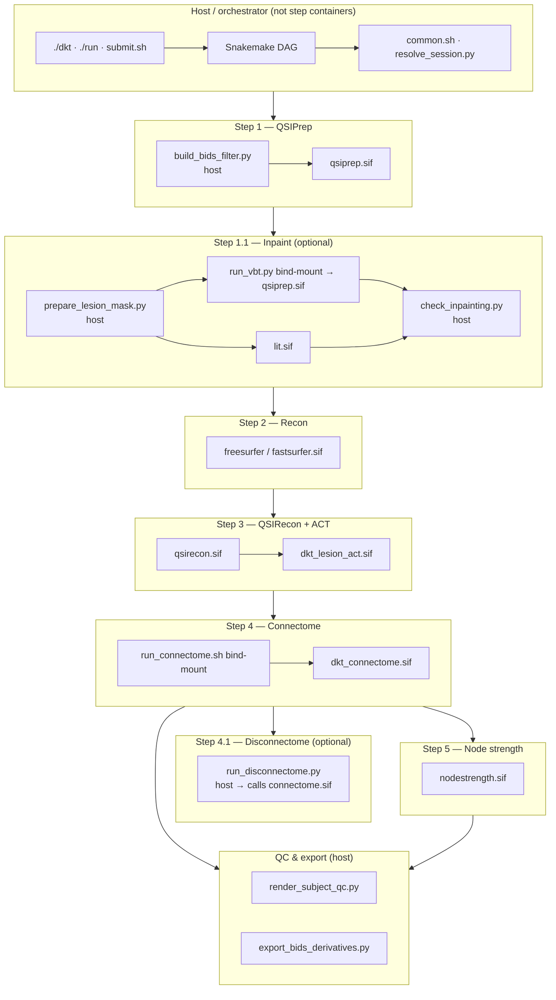

# Pipeline architecture

How the DKT Connectome is structured for **reproducibility**: which components run in Apptainer step images, which run on the host, and which use **hybrid** bind-mounted scripts.

The pipeline is **multi-container by design**. The BIDS App orchestrator (`phindagijimana321/dkt-connectome`) ships Snakemake and host glue; **compute** still runs in pinned step `.sif` files mounted at runtime.

---

## Layer overview



---

## Legend

| Symbol | Meaning |
|--------|---------|
| **Step container** | Apptainer `.sif` image (see [Containers](containers.md)) |
| **Host** | Python/shell on the login/compute node or inside the orchestrator image |
| **Bind-mount** | Repo script overlaid into a container at runtime — not a separate image |

---

## Step-by-step placement

| Step | Container | Host / hybrid |
|------|-----------|---------------|
| **Orchestration** | — | Snakemake, `./dkt`, `./run`, `preflight.sh`, `submit.sh` |
| **1 — QSIPrep** | `qsiprep_1.0.0.sif` | `build_bids_filter.py` |
| **1.1 — Inpaint** | `lit.sif` or `qsiprep.sif` + bind `run_vbt.py` | `prepare_lesion_mask.py`, `check_inpainting.py` |
| **2 — Recon** | `freesurfer` / `fastsurfer.sif` | — |
| **3 — QSIRecon** | `qsirecon_1.2.1.sif` | — |
| **3.1 — Lesion ACT** | `dkt_lesion_act.sif` | `prepare_lesion_mask.py` |
| **3.2 — Deep Atropos** | `dkt_deep_atropos*.sif` | optional dev bind-mounts (`ACT_BIND_MOUNT_DEV=1`) |
| **4 — Connectome** | `dkt_connectome.sif` | baked `run_connectome.sh` + DKT LUT; dev bind with `CONNECTOME_BIND_DEV=1` |
| **4 — SD-stream** | `qsirecon` + `connectome.sif` | provenance JSON (inline host Python) |
| **4.1 — Disconnectome** | baked in `dkt_connectome.sif` | host only when `DISCONNECTOME_BIND_DEV=1` |
| **5 — Node strength** | `nodestrength_0.1.0.sif` | — |
| **QC / export** | — | `render_*_qc.py`, `export_bids_derivatives.py` |
| **Group level** | — | `render_cohort_qc.py`, BIDS export via `./run … group` |

---

## Hybrid scripts (reproducibility notes)

**v0.3.0 default:** step scripts run from **baked** `.sif` images. Dev bind-mounts are opt-in (`CONNECTOME_BIND_DEV`, `VBT_BIND_DEV`, `DISCONNECTOME_BIND_DEV`, `ACT_BIND_MOUNT_DEV` — all default **off**).

| Script | Baked in | Dev override |
|--------|----------|--------------|
| `run_connectome.sh` | `dkt_connectome.sif` | `CONNECTOME_BIND_DEV=1` |
| `run_disconnectome.py` | `dkt_connectome.sif` | `DISCONNECTOME_BIND_DEV=1` |
| `run_vbt.py` | `dkt_vbt.sif` | `VBT_BIND_DEV=1` |
| Deep Atropos scripts | `dkt_deep_atropos*.sif` | `ACT_BIND_MOUNT_DEV=1` |

**Release pinning:** use `release_manifest.json` + `./dkt check --strict` after install. See [container digests](maintainer/container_digests.md).

---

## Deployment models

| Environment | Orchestrator | Step compute |
|-------------|--------------|--------------|
| **HPC (recommended)** | Host Snakemake + `./dkt` / `submit.sh` | Apptainer `.sif` from `DKT_CONTAINER_CACHE` |
| **Docker / cloud** | `phindagijimana321/dkt-connectome:<version>` | Same `.sif` files mounted into cache volume |
| **BIDS App contract** | `./run` entrypoint | Unchanged — `./dkt run …` is equivalent |

Install and verify:

```bash
./dkt install
./dkt check --with-dry-run
```

See [Installation](installation.md), [Containers](containers.md), and [Usage § Unified CLI](usage.md#unified-cli-dkt).

---

## Outside the shareable pipeline

Site-specific backfill scripts (`scripts/array_*`, `scripts/submit_*`, cohort verify utilities) sit beside the BIDS App path and are not required for external reproducibility.
