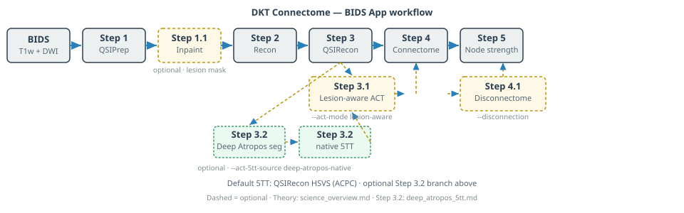

# DKT Connectome

**BIDS App** for **lesion-aware structural connectomics** — from raw diffusion MRI to DKT connectomes and optional disconnectome mapping.

The pipeline is **study-agnostic** (any BIDS DWI + T1w cohort). It was developed and validated in **TBI** settings where manual lesion masks and explicit distortion correction matter.

**Also on GitHub:** [README](https://github.com/phindagijimana/dkt_connectome/blob/main/README.md) (same quick start) · **Release:** [v0.3.0](https://github.com/phindagijimana/dkt_connectome/releases/tag/v0.3.0-step-sifs)

```{note} Recommended setup
Use **Linux + Apptainer** on a workstation or HPC (FreeSurfer license required). After `./dkt install`, run **`./dkt check --strict`** to verify pinned container digests from [`release_manifest.json`](https://github.com/phindagijimana/dkt_connectome/blob/main/dwi_pipeline/release_manifest.json). Docker is optional for the orchestrator only — see [Installation § Docker](installation.md).
```



---

## Start here

| If you want… | Read… |
|--------------|--------|
| **Install & first run** | [Installation](installation.md) → [Tutorial](tutorial.md) |
| **All CLI flags** | [Usage](usage.md) (`./dkt` / `./run`) |
| **Why** the workflow exists | [Science overview](science_overview.md) |
| **Pipeline stages** | [Pipeline steps](pipeline_steps.md) · [Architecture](architecture.md) |
| **Prepare BIDS** | [Preparing your data](preparing_data.md) |
| **Upgrade** | [Upgrading](upgrading.md) |
| **Methods & citations** | [Methods](methods/index.md) · [References](references.md) |
| **Problems** | [FAQ](faq.md) · [Troubleshooting](troubleshooting.md) |

```{note} Upstream tools
This pipeline **orchestrates** [QSIPrep](https://qsiprep.readthedocs.io/), [QSIRecon](https://qsirecon.readthedocs.io/), FreeSurfer/FastSurfer, MRtrix3, and neuroLIT. Cite the primary method papers — [References by step](references.md).
```

---

## Quick start

**Requirements:** Linux · Apptainer · Python 3.9+ · Snakemake ≥ 8 · [FreeSurfer license](installation.md#freesurfer-license-you-must-obtain-this)

After clone, always work from `dwi_pipeline/`:

```bash
git clone https://github.com/phindagijimana/dkt_connectome.git
cd dkt_connectome/dwi_pipeline
chmod +x dkt run install
export FS_LICENSE=/path/to/your/license.txt
export DKT_CONTAINER_CACHE=${DKT_CONTAINER_CACHE:-$HOME/.cache/dkt-connectome/containers}
export APPTAINER_TMPDIR=${APPTAINER_TMPDIR:-$HOME/.cache/dkt-connectome/apptainer_tmp}
mkdir -p "$DKT_CONTAINER_CACHE" "$APPTAINER_TMPDIR"
./dkt install
./dkt check --strict
bash scripts/download_ideas_sample.sh
./dkt run "$(pwd)/sample_data/ideas/bids" "$(pwd)/sample_data/ideas/results/sub-1_tutorial" participant \
  --participant-label 1 --session-filter ses-1 --fastsurfer --syn \
  --dwi-select config/dwi_select_ideas_b2500.json --dry-run
```

Download the sample only with `bash scripts/download_ideas_sample.sh` from `dwi_pipeline/`. `./dkt run` is the same command as `./run` (BIDS App).

| Command | Purpose |
|---------|---------|
| `./dkt install` | Pull step `.sif` images + write `config.local.yaml` |
| `./dkt check --strict` | Verify tools, license, and pinned container digests |
| `./dkt run …` | Run pipeline (same as `./run`) |
| `./dkt log …` | View logs under `RESULTS_ROOT/logs` |

**Sample data:** [IDEAS II (OpenNeuro ds007401)](datasets/ideas.md) — `bash scripts/download_ideas_sample.sh` from `dwi_pipeline/`.

**Docker** (optional; orchestrator only): see [Installation § Docker](installation.md).

### After your first subject (your own BIDS)

```bash
./dkt run /path/to/BIDS /path/to/out participant \
  --participant-label 01 --session-filter ses-1 --n-cpus 8 --fastsurfer --syn
```

HPC cohort (from the repo root, after the IDEAS dry-run above):

```bash
export BIDS_DIR=/path/to/BIDS
export RESULTS_ROOT=/path/to/results
bash dwi_pipeline/submit.sh
```

---

## Contact

<a id="contact"></a>

- **GitHub:** [github.com/phindagijimana/dkt_connectome](https://github.com/phindagijimana/dkt_connectome) · [open an issue](https://github.com/phindagijimana/dkt_connectome/issues)
- **Email:** [phindagiji@gmail.com](mailto:phindagiji@gmail.com)

For usage questions, also see [FAQ](faq.md) and [NeuroStars](https://neurostars.org/) (tag `qsiprep`, `qsirecon`, or link this repo).

---

## Help

- [FAQ](faq.md) · [Troubleshooting](troubleshooting.md)
