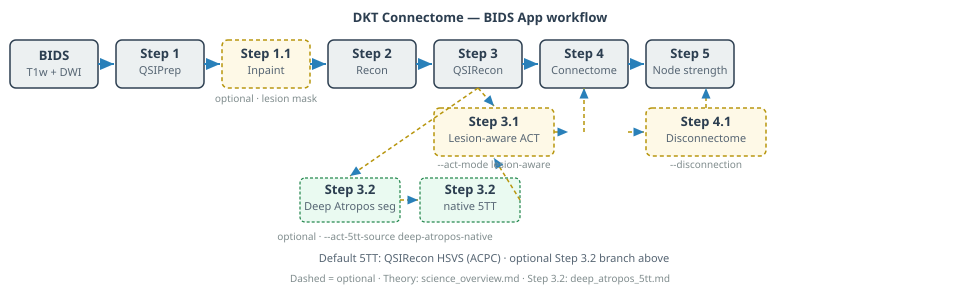

# DKT Connectome

**BIDS App** for **lesion-aware structural connectomics** — from raw diffusion MRI to DKT connectomes and optional disconnectome mapping.

The pipeline is **study-agnostic** (any BIDS DWI + T1w cohort). It was developed and validated in **TBI** settings where manual lesion masks and explicit distortion correction matter; see [How it works — science and theory](science_overview.md).

**Hosted site:** [dkt-connectome.readthedocs.io](https://dkt-connectome.readthedocs.io/en/latest/)



---

## Understand the science first

New here? Start with **why** the workflow is built this way — lesion inpainting, ACT-HSVS tractography, DKT parcellation, and optional disconnectome:

| Start here | Contents |
|------------|----------|
| **[How it works — science & theory](science_overview.md)** | Problem statement, end-to-end flow, physics/math summary, default choices |
| **[Methods overview](methods/index.md)** | One page per step with citations (QSIPrep-style) |
| **[Pipeline steps](pipeline_steps.md)** | Operational reference (inputs, outputs, flags) |
| **[Comparisons](comparisons.md)** | vs QSIPrep alone, MRtrix3_connectome, legacy root workflow |

!!! note "Upstream tools"
    This pipeline **orchestrates** [QSIPrep](https://qsiprep.readthedocs.io/), [QSIRecon](https://qsirecon.readthedocs.io/), FreeSurfer/FastSurfer, MRtrix3, and neuroLIT. It does not replace them. Cite the primary method papers — [References by step](references.md).

---

## Before your first run

**FreeSurfer license (required):** This pipeline does not ship a license. Each user registers at [FreeSurfer](https://surfer.nmr.mgh.harvard.edu/registration.html), saves `license.txt`, and exports:

```bash
export FS_LICENSE=/path/to/your/license.txt
```

Full steps: [Installation → FreeSurfer license](installation.md#freesurfer-license-you-must-obtain-this).

---

## Quick start

**New users:** [Tutorial](tutorial.md) with [IDEAS sample data](datasets/ideas.md) or bundled TBI test outputs.

```bash
cd dwi_pipeline
./run /path/to/BIDS /path/to/derivatives participant \
  --participant-label 009 \
  --session-filter ses-1 \
  --n-cpus 8
```

HPC / Slurm:

```bash
export BIDS_DIR=/path/to/BIDS
export RESULTS_ROOT=/path/to/results
bash dwi_pipeline/submit.sh
```

Install containers: [Installation](installation.md) · BIDS App spec: [BIDS App](bids_app.md)

---

## Help

- [FAQ](faq.md) · [Troubleshooting](troubleshooting.md)
- [GitHub Issues](https://github.com/phindagijimana/dkt_connectome/issues)
- [NeuroStars](https://neurostars.org/) (tag `qsiprep`, `qsirecon`, or link this repo)
