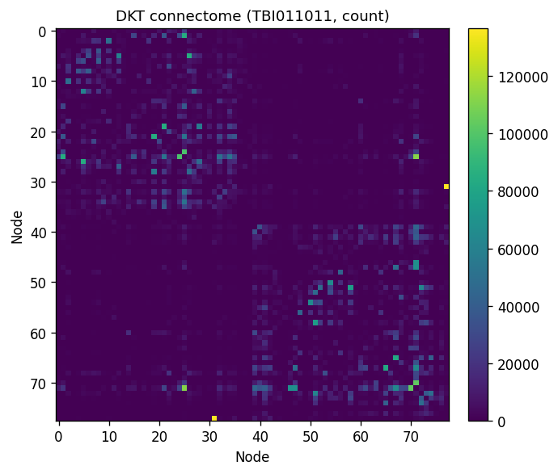
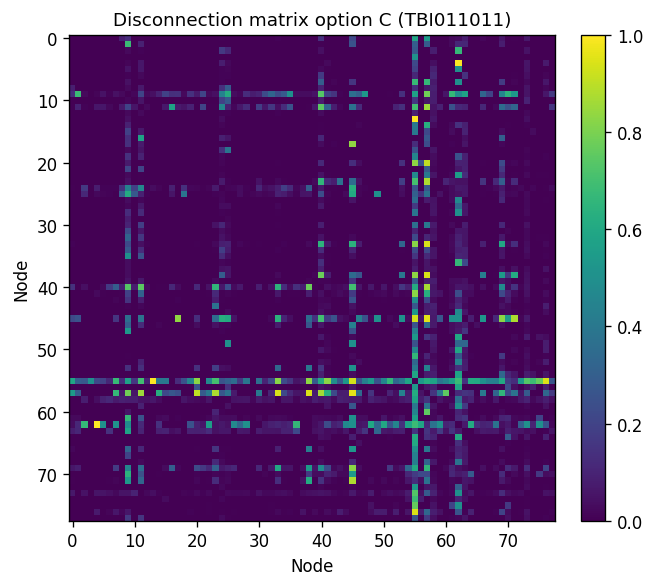

# Visual QC guide

What to inspect in pipeline HTML reports and where to find example outputs. Screenshots are best captured from your own `subject_qc.html` after a run; paths below use the bundled test subjects.

---

## Pipeline overview diagram


Solid boxes = default steps. Dashed boxes = optional (Step 1.5 when a lesion mask exists; Step 4.5 with `--disconnection`).

Theory for each step: [Methods](methods/index.md).

---

## Per-subject dashboard (`subject_qc.html`)

After `./run` or `subject.sh all`, open:

```text
RESULTS_ROOT/qc/sub-<ID>/subject_qc.html
```

### Step 1 — QSIPrep

| Panel | What to look for |
|-------|------------------|
| Motion plot | Spikes → consider exclusion or re-acquisition |
| SDC / TOPUP | Brain boundaries aligned between DWI and T1w |
| Brain mask | Complete coverage; no cropped cerebellum |
| b=0 vs b>0 | Reasonable SNR; no striping artifacts |

Embedded from QSIPrep reportlets under `qsiprep_single_run_output/sub-<ID>/`.



### Step 1.5 — Inpaint (if lesion mask)

| Panel | What to look for |
|-------|------------------|
| Before / after T1w | Lesion filled; surrounding anatomy unchanged |
| `inpainting_qc.json` | `outside_lesion_correlation` ≥ 0.995 |
| Preview PNGs | No obvious blurring outside mask |

### Step 2 — Recon

| Check | PASS |
|-------|------|
| FreeSurfer / FastSurfer tree exists | `freesurfer/sub-<ID>/` |
| Surfaces present (ACT-HSVS) | `surf/lh.white`, `surf/lh.pial` |
| DKT parcellation | `mri/aparc.DKTatlas+aseg.mgz` or FastSurfer equivalent |

Inspect with FreeView or FastSurfer QC tools if segmentation looks wrong around lesions.

### Step 3 — QSIRecon

| Panel | What to look for |
|-------|------------------|
| Tractography density | Streamlines cover major WM bundles |
| ACT termination | Endpoints in GM, not floating in CSF |
| Session HTML | QSIRecon report under `qsirecon_single_run_output/` |

### Step 4 — Connectome

| Artifact | Inspect |
|----------|---------|
| `parcellation.json` | 78 nodes (DKT); `empty_nodes` should be 0 or explained by lesion |
| `dkt_connectome.csv` | Symmetric; no all-zero rows except post-resection |
| `nodes.mif` | Overlay on `dwiref` — labels align with anatomy |

### Step 4.5 — Disconnectome (if enabled)

Open `connectomes/sub-<ID>/disconnectome/disconnectome_qc.html`:

| Panel | Meaning |
|-------|---------|
| Disconnection heatmap | Fractional loss D_ij per node pair |
| Options A / B / C comparison | Spared vs primary connectome |
| Lesion overlap | Lesion voxels vs DKT nodes on DWI grid |



Validated examples: [Validation](validation.md).

### Step 5 — Node strength

| Output | Inspect |
|--------|---------|
| `reports/sub-<ID>/report.pdf` | Clinical summary: asymmetry table, ENIGMA surface |
| `figures/` | PNG gallery behind the PDF |

---

## Cohort dashboards

```bash
./run BIDS OUT group
```

| File | Contents |
|------|----------|
| `OUT/cohort_qc.html` | All subjects, Steps 1–5 rollup |
| `OUT/disconnectome_cohort_qc.html` | Step 4.5 integrity across cohort |

---

## Example paths (test data)

If you ran the [Tutorial](tutorial.md) on bundled TBI subjects:

```text
dwi_pipeline/dwi_test_TBI/sub-TBI011011_fastsurfer_inpaint/qc/sub-TBI011011/subject_qc.html
dwi_pipeline/dwi_test_TBI/sub-TBI011011_fastsurfer_inpaint/connectomes/sub-TBI011011/disconnectome/disconnectome_qc.html
```

Open in a browser:

```bash
firefox dwi_pipeline/dwi_test_TBI/sub-TBI011011_fastsurfer_inpaint/qc/sub-TBI011011/subject_qc.html
```

---

## See also

- [QC dashboard](qc_dashboard.md) — how reports are generated
- [Disconnectome § Integrity QC](disconnectome.md#integrity-qc) — automated disconnectome checks
- [Outputs](outputs.md) — full file layout
